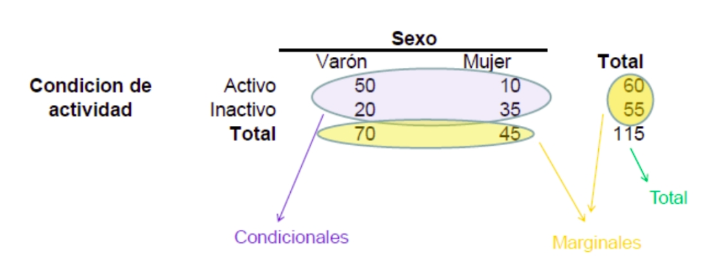
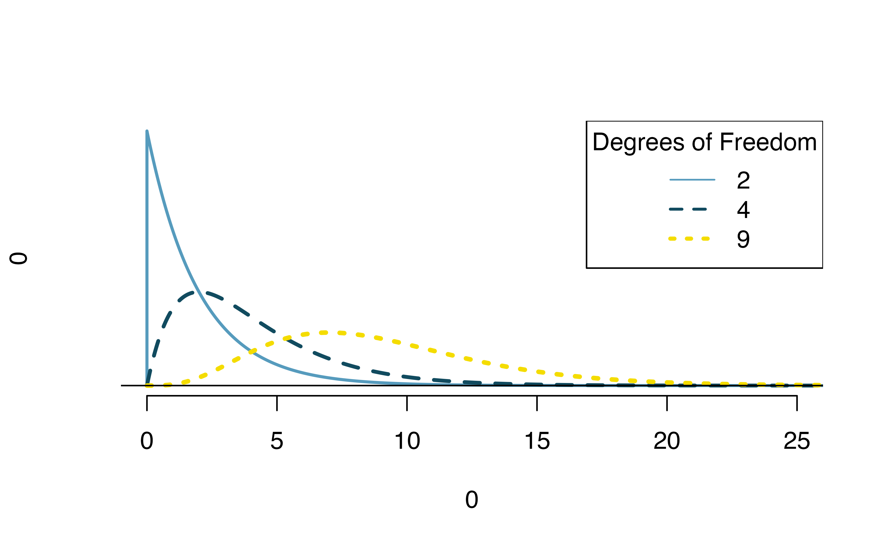

```{r setup, include=FALSE}
knitr::opts_chunk$set(echo=FALSE)
options(dplyr.summarise.inform = FALSE)
```

```{r message=FALSE, warning=FALSE, include=FALSE, paged.print=FALSE}
knitr::opts_chunk$set(echo=TRUE, message=FALSE, warning=FALSE, collapse=TRUE, highlight=TRUE, paged.print=FALSE, prompt=TRUE, strip.white=FALSE, tidy = TRUE)
```

# Introducción
Si recordamos lo que vimos al principio de este curso, una tabla de contigencia es simplemente una tabulación cruzada de dos variables. Nos brinda información sobre la relación que existe entre variables cualitativas, principalmente.

Constaba de los siguientes elementos:



- frecuencias condicionales (los conteos de casos que corresponden a la "intersección" de las categorías de las variable; por ejemplo, mujeres inactivas)
- frecuencias marginales (los conteos totales de cada variable "por separado")
- totales

Estos elemenos nos van a dar toda la información necesaria para poder cuantificar y evaluar la existencia (o no) de asociación entre dos variables.

# Asociación entre vos variables cualitativas
En general, cuando nos preguntamos si dos variables están asociadas podemos definir cuatro grandes preguntas que se desprenden de esta:

1. ¿Existe asociación entre ambas?
2. En caso de que exista, ¿cuál es su fuerza?
3. En caso de que exista, ¿cuál es su signo o dirección?
4. En caso de que exista, ¿cuál es su naturaleza o forma?

Se observa que cada pregunta es más "compleja" que la anterior y, a su vez, están relacionadas una con la otra: no puedo preguntarme por la fuerza o el signo de la asociación si no existe asociación. Si bien no ahondaremos sobre las preguntas 3 y 4 por ahora, sí podemos adelantar que son preguntas apropiadas para variables ordinales y cuantitativas^[El sentido o signo de la asociación entre las variables distribuidas conjuntamente. Por ejemplo, afirmando que cuando una se incrementa otra disminuye. Es claro que esto es posible con variables cuya escala de medición es al menos ordinal. La forma de la asociación supone que podemos conocer de qué manera varían ambas variables: de forma lineal, monotónica no lineal, no monotónica, etc.]. Dado que aquí trabajaremos con variables nominales (y alguna ordinal) nos centraremos en las preguntas 1 y 2: es decir por la existencia de asociación y por su fuerza. 

## Análisis de asociación
Vamos a construir una tabla de contingencia que relacione la pertenencia a la clase social (según el esquema de Erik Olin Wright) y el tiempo que pasó desde el ultimo control médico (`v139`). Pero antes de eso, tenemos que realizar algunos preprocesamientos.

```{r}
library(tidyverse)
df <- read_rds('./data/ENES_Personas_M1_EOW.rds')
```

Primero, agregamos la variable de clase a dos valores: trabajadores y no trabajadores.
```{r}
df <- df %>%
  mutate(
         class_eow_agg = if_else(class_eow == 'Trabajadores', 'Trabajadores', 'No trabajadores')
  )
```

Veamos el cruce, entonces:
```{r}
tab1 <- df %>%
    group_by(class_eow_agg, v139) %>%
    summarise(n = round(sum(f_calib3),0)) %>%
    mutate(prop = n/sum(n))
  
tab1 %>%
ggplot(aes(x=class_eow_agg, y=prop, fill=v139)) +
        geom_col() +
        geom_text(aes(label=round(prop, 2))) +
        labs(x="Clase EOW",
             y="Prop.",
             fill="Tiempo desde últ. ctrl. médico") +
        theme_minimal()
```

Pareciera que las mayores diferencias se concentran en la categoría "Menos de un año". Vamos, entonces a dicotomizar la variable de visitas al médico:
```{r}
df <- df %>%
  mutate(
         v139_agg = case_when(
           v139 == 'Menos de 1 año' ~ '0. Menos de 1 año', 
           v139 == 'De 1 a 3 años' ~ '1. 1 a 3 años',
           TRUE ~ '2. 3 años o más')
  )
```

Finalmente, vamos a realizar una modificación en la escala de la ponderación. En lugar de que "expanda" los casos al total de la población vamos a buscar que lo haga al total de casos de la encuesta (27.610) pero manteniendo la estructura de las calibraciones realizadas. Más adelante veremos por qué hacemos esta operación.
```{r}
df <- df %>%
  mutate(
         f_calib4 = f_calib3/sum(f_calib3)*nrow(df)
  )
```

Y repetimos el gráfico:
```{r}
tab2 <- df %>%
    group_by(class_eow_agg, v139_agg) %>%
    summarise(n = round(sum(f_calib4),0)) %>%
    mutate(prop = n/sum(n))
  
tab2 %>%
ggplot(aes(x=class_eow_agg, y=prop, fill=v139_agg)) +
        geom_col() + 
        geom_text(aes(label=round(prop, 2))) +
        labs(x="Clase EOW",
             y="Prop.",
             fill="Tiempo desde últ. ctrl. médico") +
        theme_minimal()
```

Si bien no esperaríamos que el tiempo desde la última consulta y los casos en cada categoría sea exactamente el mismo en las tres clases de preguntas, las proporciones parecen bien diferentes entre las diferentes clases. Parece haber una diferencia entre ambas variables: los trabajadores han ido al médico en el último año en menor proporción que los no trabajadores: 0.679 contra 0.781. ¿Es significativa esta diferencia? Esto nos lleva de nuevo al terreno de las pruebas de hipótesis.

Pero en este caso es más difícil entender cuál es el parámetro sobre el cual queremos realizar la inferencia. Para poder pensar esta cuestión, tenemos que introducir una noción (ya vista en Metodologías cuantitativas) que es la de frecuencia esperada.

## Frecuencias esperadas
Podemos calcular la cantidad de personas que caen en cada categoría de la variable tiempo desde la última consulta si la misma fuera **totalmente independiente** de la clase social. En general, el cómputo puede hacerse de una forma bien sencilla^[El fundamento de esta fórmula proviene de la definición de sucesos independientes en teoría de probabilidad. En efecto, dicha teoría dice que la probabilidad conjunta de ocurrencia de dos sucesos independientes es igual a la probabilidad del suceso 1 multiplicada por la probabilidad del suceso 2. Si queremos calcular los conteos y no las probabilidades debemos multiplicar por el total de la tabla.].

$$recuento\ esperado_{fila i, columna j} = \frac{n\ de\ fila\ i \times n\ columna\ j}{n\ total}$$

Es decir, que de esta forma obtenemos la distribución de los casos en las celdas si las variables fueran estadísticamente independientes. Afortunadamente, podemos realizar esta operación con un llamado a la función `chisq.test`. Enseguida volveremos sobre la función pero, por ahora, veamos las dos tablas:

```{r include=FALSE}
chi <- tab2 %>%
  select(-prop) %>%
  pivot_wider(names_from = class_eow_agg,
              values_from = n) %>%
  select(-v139_agg) %>%
  chisq.test()
```

Veamos las frecuencias observadas:
```{r}
chi$observed %>% as_tibble()
```
Veamos, ahora, las esperadas:
```{r}
chi$expected %>% as_tibble()
```
La idea será comparar estas tablas mediante una prueba de hipótesis. La idea es comparar nuestra distribución observada con las frecuencias esperadas (bajo supuesto de independencia) con las frecuencias observadas (las que obtuvimos en nuestra muestra).

# Test de chi cuadrado
Para esto vamos a utilizar el test de chi cuadrado. El mismo se calcula a partir de la siguiente fórmula:

$$\chi^2 = \sum_{j}\sum_{i} \frac{(frec\ observada - frec\ esperada)^2}{frec\ esperada} $$
1. Calcula para cada celda la diferencia entre frecuencia observada y esperada
```{r, echo=FALSE}
chi$observed %>% as_tibble() - chi$expected %>% as_tibble()
```
2. Eleva cada celda al cuadrado
```{r echo=FALSE}
(chi$observed %>% as_tibble() -
chi$expected %>% as_tibble())^2
```
3. Calcula la relación (en cada celda) con la frecuencia esperada
```{r echo=FALSE}
(chi$observed %>% as_tibble() -
chi$expected %>% as_tibble())^2 / chi$expected %>% as_tibble()
```
4. Suma a lo largo de todas las celdas.
```{r echo=FALSE}
sum((chi$observed %>% as_tibble() -
chi$expected %>% as_tibble())^2 / chi$expected %>% as_tibble())
```

Lógicamente, hay una función que nos permite resolver esto de forma más simple sin tener que andar haciendo los cálculos a mano. `chisq.test()` espera un objeto tabla o matriz. Es por eso que tenemos que hacer algunos pequeños cambios al formato de nuestra `tab2` original. Primero, eleminamos la columna prop. Luego, pivoteamos para que nos quede la variable clase en las columnas y por último, eliminamos la columna con las categorías de `v139_agg`.
```{r}
chi <- tab2 %>%
  select(-prop) %>% 
  pivot_wider(names_from = class_eow_agg,
              values_from = n) %>%
  select(-v139_agg) %>%
  chisq.test(., correct=FALSE)

chi
```

¿Este valor $\chi^2 = 352.22$ es grande o pequeño? Para ello tenemos que realizar una prueba de hipótesis sobre el mismo.

## Inferencia en chi cuadrado 
Si bien podríamos realizar un test de randomización, vamos a aprovechar para introducir otra ofrma de hacer pruebas de hipótesis: mediante modelos matemáticos. Es decir, mediante supuestos sobre la distribución muestral del estimador.

El estadístico chi-cuadrado tiene una distribución matemática llamada distribución (muy originalmente) chi-cuadrado. Un punto importante es que un parámetro fundamental de esta distribución son los llamados "grados de libertad". Los grados de libertad cambian la forma de la distribución de chi-cuadrado para adaptarse al problema en cuestión. 


(Imagen tomada de [@intro_stats])

En última instancia $\chi^2$ es una razón de cómo los recuentos observados varían de los recuentos esperados en comparación con los recuentos esperados. Bajo el supuesto de la hipótesis nula (que salud y clase social no están asociados) podemos plantear que $H_{0}: \chi^2 = 0$. Lo cual supone que en nuestro caso $\chi^2$ tiene una distribución con los siguientes grados de libertad: $df=(filas - 1) \times (columnas -1) = 2$. Esa distribución (bajo el supuesto de que $H_{0}$ es cierta) se vería más o menos así.

```{r echo=FALSE}
curve(dchisq(x, df = 2), from = 0, to = 250,
      main = ' Distribution de chi cuadrado (df = 2)',
      ylab = 'Density',
      lwd = 3, 
      col = 'steelblue'
      ) 
```

Entonces, el valor que obtuvimos en nuestra prueba anterior $\chi^2=352.22$ se encuentra bien a la derecha de esta distribución. Lo cual hace que se trate de una muestra muy poco probable si $H_{0}$ fuese cierta, es decir, si la frecuencia de visitas al médico y la clase no estuviesen asociadas.

Esto podemos verlo en el p-valor:
```{r}
chi
```
El p valor nos muestra la probabilidad de haber obtenido el resultado que hemos obtenido suponiendo que la hipótesis nula $H_{0}$ fuera cierta. Se suele decir que valores altos de p no permiten rechazar la $H_{0}$, mientras que valores bajos de p si permiten rechazar la $H_{0}$. Es un valor de probabilidad, por lo que oscila entre 0 y 1.

En una prueba estadística, se rechaza la hipótesis nula $H_{0}$ si el valor p asociado al resultado observado es igual o menor que un nivel de significación α  establecido arbitrariamente: convencionalmente 0,05 ó 0,01^[Existen numerosísimas discusiones sobre lo que signfica realmente el p-valor. Actualmente, hay todo un debate al respecto y sobre la utilidad o no entre la comunidad de estadísticos. Acá tienen una [charla sumamente interesante](http://lacion.rbind.io/talk/2019_pvalor/) al respecto.].

¿Cómo podemos interpretarlo en este caso?

## Algunas precauciones para el uso de Ji-Cuadrado 

- Las frecuencias esperadas no deben ser inferiores a 5 en cada casilla.

- No provee información sobre el orden de la asociación (es decir, no hay una variable dependiente ni una independiente).

- Se trata de una medida  muy dependiente del tamaño muestral (n).  Si se duplica el tamaño en cada una de las celdas, también lo hace el valor de Ji-cuadrado. Por ello, reescalamos los pesos en la variable `

### Actividad
Calculen el chi cuadrado de la misma tabla pero ponderada con los valores expandidos a la población. ¿Qué observan con el valor de $\chi^2$?
```{r}
### 
```

## Fuerza de la asociación entre dos variables
Medir el grado o la fuerza de la asociación supone construir una métrica que sea fácilmente interpretable y que pueda cuantificar de alguna forma la intensidad con la que dos variables están asociadas (muy fuerte/fuerte/moderada/débil/despreciable). A su vez, sería deseable que esta medida permitiera comparar distintas asociaciones estimadas en distintos cruces. 

Nos gustaría un estadístico que 

- esté normalizado (no depender del tamaño muestral)
- tenga un valor máximo.
- presente un valor de cero en caso de ausencia de asociación

¿Por qué no usar el valor absoluto de Chi-Cuadrado? No sirve porque el nivel de significación depende de n. Vamos a introducir un segundo coeficiente llamado "V de Cramer". 

$$V = \sqrt \frac{\chi^2}{n \times min(filas-1, columnas-1)}$$
V de Cramer es una normalización de $\chi^2$ por el tamaño de muestra ($n$) y el tamaño de la tabla ($min(filas-1,columnas-1)$). Tiene algunas propiedades interesantes:

- puede alcanzar 1 como valor máximo en tablas de cualquier tamaño (fxc)
- es simétrica (no distingue entre variables dependientes o independientes)
- puede calcularse tanto para variables nominales como ordinales
- es cero cuando no hay asociación
- dado que es una transformación de $\chi^2$ tiene la misma distribución muestral (bajo la hipótesis nula)

Dado que no se encuentra implementado en R de forma simple, hemos escrito un función muy simple para hacer el cálculo. La misma toma como input una tabla. 

La misma la generamos de la forma en que ya sabemos hacerlo: `group_by() + summarise()` y luego, aplicamos un `pivot_wider()` para pasarla del formato tidy-apilado a un formato de filas y columnas más similar a una tabla de contingencia clásica. 
```{r}
cramerv <- function(table){
  chi <-  chisq.test(table, correct=FALSE)
  n <- sum(chi$observed)
  c <- ncol(table)
  r <- nrow(table)
  m <- min(c-1, r-1)
  
  cv <- sqrt((chi$statistic / n) / m)
  
  results <- list(
    vcramer = cv,
    pvalue = chi$p.value,
    observed = chi$observed,
    expected = chi$expected
  )
  cat('Cramers V=', cv, '\n')
  cat('Chi squared=', chi$statistic, '\n')
  cat('p-value=', chi$p.value, '\n')
  
  return(results)

}

vdc <- tab2 %>%
  select(-prop) %>%
  pivot_wider(names_from = class_eow_agg,
              values_from = n) %>%
  select(-v139_agg) %>%
  cramerv()
```

En términos generales, podemos decir que se trata de una asociación débil entre estas dos variables.

# Referencias
<div id="refs"></div>