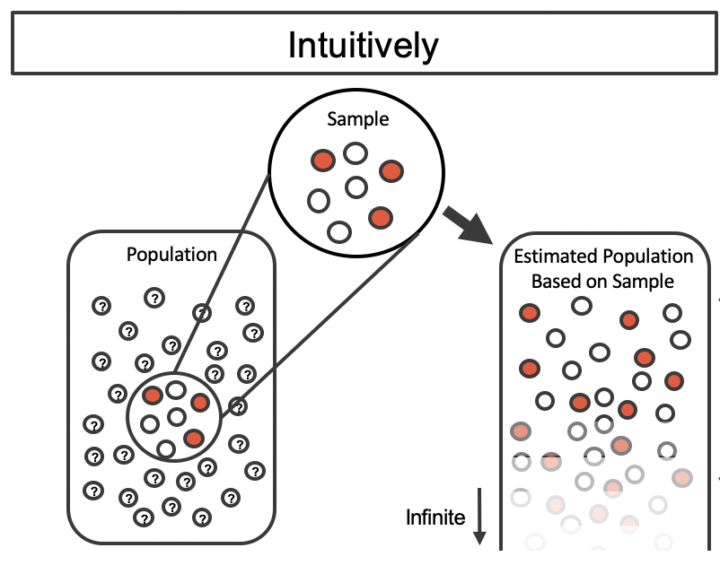
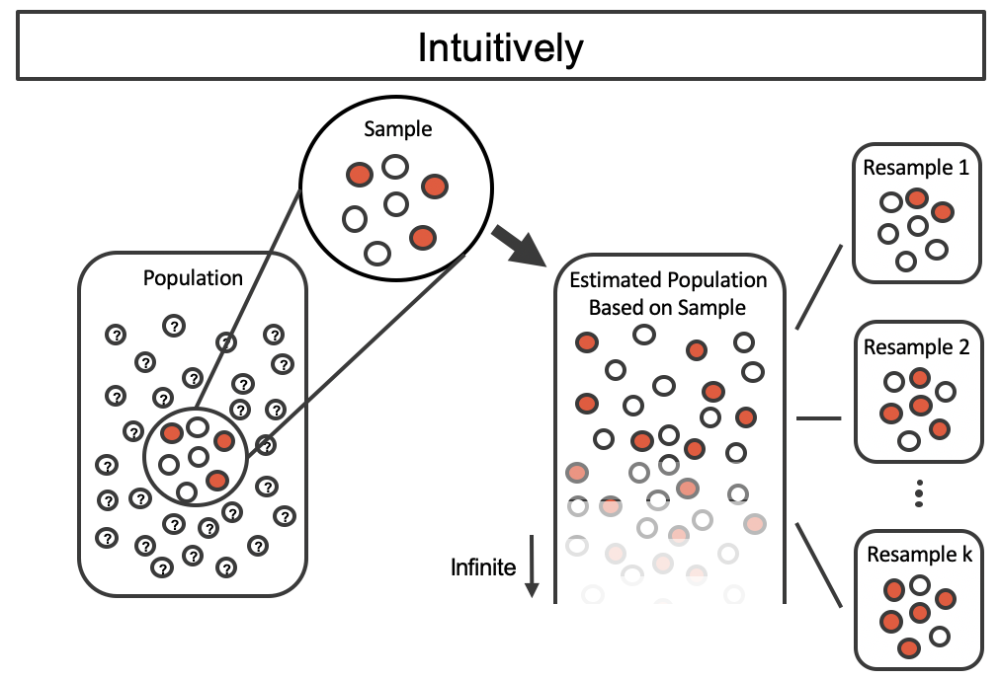
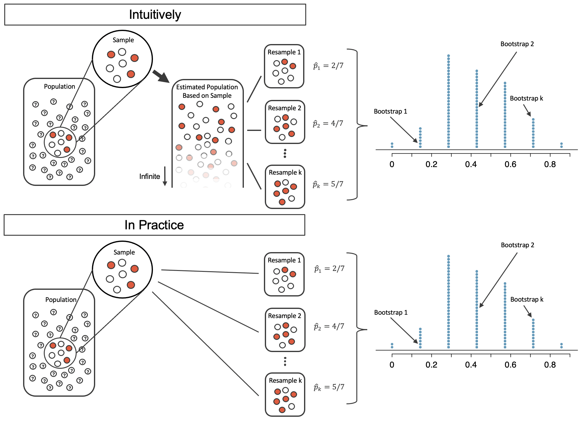

```{r setup, include=FALSE}
knitr::opts_chunk$set(echo=FALSE)
options(dplyr.summarise.inform = FALSE)
```

```{r message=FALSE, warning=FALSE, include=FALSE, paged.print=FALSE}
knitr::opts_chunk$set(echo=TRUE, message=FALSE, warning=FALSE, collapse=TRUE, highlight=TRUE, paged.print=FALSE, prompt=TRUE, strip.white=FALSE, tidy = TRUE)
```


# Introducción
Hasta aquí habíamos venido trabajando no haciendo demasiadas diferencias entre censos y muestras. Estábamos en el terreno de la estadística descriptiva. No obstante, como hemos discutido, la diferencia entre censo y muestra no es nada trivial.

Al trabajar con muestras de una población (como por ejemplo, la ENES) debemos introducir el problema del llamado "error muestral". El error mue


# Estimación de intervalos de confianza mediante boostrap
## Una proporción simple

Vamos a empezar con un caso simple. Queremos estimar el peso de los trabajadores (según la clasficación de Erik Olin Wright). Y queremos construir un intervalo de confianza: un rango de valores posibles dentro del cual esperaríamos, con cierta probabilidad, encontrar el valor del parámetro. El intervalo de confianza se basa, como vimos, en la llamada "distribución muestral del estimador", es decir, una distribución que nos indica cómo un estadístic (en nuestro caso, una proporción en la muestra) varía alrededor del parámetro (en este caso, la proporción de la población) cuando se extraen muestras diferentes de esa población y se calculan el estadístico para cada una de esas muestras.

La idea es medir la variabilidad del estadístico (proporción, aquí) extrayendo un muestra de la población y calculándolo; luego, otra; luego, otra y así sucesviamente. Luego, tendríamos una idea de la varabilidad de nuestra estimación original. En términos generales, diremos que si la variación entre estas diferentes muestras es grande, entonces es pobabile que nuestra estimación original esté lejos dl valor real y, por ende, el rango de variación (el intervalo) será más grande.

Ahora bien, en el mundo real los datos muestrales (las muestras) son caras y difíciles de extrear. Por ello, tomar muestras repetidas de una población suele ser imposible. Por ello, en lugar de extraer muchas muestras de la población podemos plantear otro enfoque: muchas muestras de la muestra. 

El gran problema es que realizar esa cuantificación es difícil. Pero para ciertos estadísticos (medias, proporciones, varianzas, etc.) conocemos la forma que las distribuciones muestrales tiene. Sin embargo, en muchos casos este problema no es simple. En ciertos estadísticos, por ejemplo. O en el caso de diseños muestrales más complejos que el muestreo aleatorio simple, este problema no es nada trivial.

El procedimiento bootstrap va a intentar resolver este problema -¿cómo es que cada muestra varía respecto de la población?- a partir de un enfoque computacional. De hecho, es un enfoque los suficientemente flexible para ser aplicado a casi cualquier estadístico. Por ende, proporciona un método claramente eficaz para construir intervalos de confianza para casi cualquier parámetro de una población. 

En este apartado, nos centraremos en el bootstrapping para estimar una sola proporción. Nuestro objetivo con bootstrapping será producir una estimación de intervalo (un rango de valores plausibles) para el parámetro de población.

> Recordemos: un **paramáetro** es el valor verdadero de la población; la fórmula que aplicamos para estimar el valor en una muestra se llama **estadístico** o **estimador** y la "salida" de aplicar un estimador es una **estimación**.

Hoy vamos a trabajar con la Encuesta Nacional sobre Estructura Social, llevada adelante por el PISAC. Pueden encontrar más información [aquí](https://www.argentina.gob.ar/ciencia/pisac/bases-de-datos).

Carguemos los datos:

```{r message=FALSE}
library(tidyverse)
library(tictoc)
df <- read_rds('./data/ENES_Personas_M1_EOW.rds')
```

Veamos el peso de los trabajadores (ocupados y desocupados) sobre la población total en el GBA:

```{r}
gba <- df %>%
  filter(region == 'Gran Buenos Aires (CABA y 24 partidos de Buenos Aires)')

gba %>%
  group_by(class_eow) %>%
  summarise(n=sum(f_calib3)) %>%
  mutate(prop = n/sum(n))
```

## Ponderación

¿Hay algo que llama la atención en este código?

`summarise(n=sum(f_calib3))` 

Puede verse que no utilizamos el `n=n()`. Es decir, no estamos haciendo un conteo de filas. Estamos haciendo una suma de una variable: `f_calib3`. Esto es una variable de ponderación. Estamos PONDERANDO los datos.

¿Qué es PONDERAR? Es asignarle a cada unidad de muestreo su peso muestral, es decir, el valor que indica el número de unidades de la población que representa cada individuo o caso de la base de datos. 

El peso muestral es calculado por el/la muestrista en base a las características de la población, al tipo de diseño de la muestra y a las limitaciones que puedan surgir en la etapa de recolección de datos (situaciones de no respuesta total o parcial) que puedan afectar el diseño muestral original. Por ello, cuando se trabaja con datos secundarios el peso muestral ya se encuentra definido y sólo hay que tener la variable de ponderación en cuenta para el procesamiento de los mismos.

```{r}
gba %>%
  filter(region == 'Gran Buenos Aires (CABA y 24 partidos de Buenos Aires)') %>%
  summarise(n=sum(f_calib3))
```

Esto trae como resultado el segundo punto: el total ya no es 4.843 personas; sino de 12.158.534 . Esto se debe a que se trata de una expansión: cada caso representa un número dado de personas. Si sumamos todas, deberíamos llegar a la población total (urbana, en este caso).

```{r}
gba %>%
  group_by(class_eow) %>%
  summarise(n=sum(f_calib3)) %>%
  mutate(prop = n/sum(n)) %>%
  filter(class_eow == 'Trabajadores')
```

## Estimando el intervalo de confianza

Ahora bien, solo nos interesa por ahora la proporción de trabajadores en nuestra muestra. Vamos a llamarla $\hat p_{t}$. Pero lo que a nosotros nos interesa es poder decir algo de la proporción de los trabajadores en la población, vamos a llamarla $p_{t}$. Vamos, entonces, a intentar estimar $p_{t}$ a partir de $\hat p_{t}$.

Aquí $\hat p_{t} = 0.3981$

Tenemos, ahora, que lograr construir información sobre la variabilidad del estimador. No hay ninguna razón para creer que $p_{t}$ es exactamente 0.3712 pero tampoco para creer que está demasiado lejos. Vamos a remuestrear con reemplazo sobre nuestro dataset original (esto es el bootstraping) para aproximar la variabilidad de los posibles valores de $\hat p_{t}$.

La idea general que se encuentra en los procedimientos de boostrap es poder estimar la variabilidad de las diferentes muestras tomadas de una población. Por supuesto que no tiene demasiado sentido tomar muchas muestras de una población real: en general, los recursos y el tiempo son escasos. Y, en todo caso, si se dispone de recursos para semejante tarea, es preferible extraer una sola muestra de mayor tamaño. Una sola muestra de mayor tamaño será más útil (en términos generales) que dos muestras pequeñas. 

Lo que vamos a hacer con boostrap es tratar de entender cómo se comportan las muestras bajo una estimación de la población. O sea, vamos a considerar a la muestra que tenemos (en este caso la ENES) *COMO SI FUERA* la población. O, al menos, como una buena version en miniatura de la población.

Veamos (las imágenes y la explicación están adaptadas de [@intro_stats] [este libro](https://openintro-ims.netlify.app/foundations-bootstrapping.html)):

Usamos nuestra muestra (ENES) para estimar la población desconocida. De esta población estimada vamos a extraer diferentes muestras para aproximarnos a la variablidad de nuestro parámetro (la proporción de trabajadores en el GBA).



Como vamos a estar tomando muestras repetidas de la población estimada, podemos observar cómo varía cada una: podemos tener una aproximación a la variablidad a lo largo de las muestras ~ una aproximación a ese concepto elusivo de "distribución muestral de un estimador". Como cada una de las muestras está extraida de esta población estimada, su variabilidad se debe enteramente al proceso de selección muestral.


Luego, podemos agregar cada una de las remuestras bootstrap (en este caso, usando una proporción). Esto nos hace visible de forma "directa" una aproximación a la variabilidad de $\hat p_{t}$ a lo largo de las muestras.

En la práctica es muy difícil que las computadoras trabajen con una población infinita (con la misma dstribución proporcional que en la muestra). Sin embargo, existe un método físico y computacional que produce una distribución de bootstrap equivalente de la proporción de la muestra de una manera computacionalmente eficiente.

Consideremos los datos observados como una bolsa de canicas, 3 de las cuales son rojas (los trabajadores) y 4 son blancas (no trabajadores). Al sacar las canicas de la bolsa con reemplazo, representamos exactamente el mismo proceso de muestreo que se hizo con la población estimada infinitamente grande.



Pasando en limpio, para implmentar bootstrap tenemos que:

1. Obtener una muestra aleatoria con reemplazo de la distribución empírica de tamaño $N$ (la muestra, bah)
2. Calcular el estadístico de interés sobre esa remuestra
3. Repetir este proceso $B$ veces
4. Del proceso previo se obtienen $B$ estimaciones bootstrap del estadístico de interés (digamos una proporción). La idea consiste en aproximar la distribución muestral del estadístico a partir de la distribución bootstrap

En nuestro caso, cada bolilla va a estar constituida por una persona de las 27.610 del dataset (pero ponderadas...). Bueno, vamos a implementar esta idea. 


## Bootstrap para una proporción -Implementación en la ENES

En general, una simulación no es suficiente para aproximarnos a la variablidad de la distribución muestral, por eso, en general vamos a hacer alrededor de 1000 simulaciones.

El siguiente código implementa bootstrap para calcular la proporción de trabajadores sobre el total de la población en el Gran Buenos Aires:

```{r}
reps <- 2000 # Seteamos la cantidad de repeticiones
props <- tibble() # Generamos un dataframe dónde vamos a guardar los resultados 
set.seed(123) # Fijamos la semilla aleatoria para poder replicar resultados

for (i in 1:reps){ # Loop que itera a través de las reps repeticiones
  # Extraemos una muestra aleatoria
  boot <- gba %>%
            select(nocues, f_calib3, class_eow) %>%
            sample_n(
                size=nrow(gba), 
                weight = f_calib3, 
                replace = TRUE
                )  
  
  # Calculamos la proporción que nos interesa
  p <- boot %>% 
          group_by(class_eow) %>%
          summarise(n=sum(f_calib3)) %>%
          mutate(prop=n/sum(n)) %>%
          ungroup() %>%
          mutate(boot_id = i) %>%
          select(boot_id, everything()) 
  
  # Guardamos la proporción p en props
  props  <- props %>% bind_rows(p)
}
```


Veamos el primer bloque de código:

```
  boot <- gba %>%
            select(nocues, f_calib3, class_eow) %>%
            sample_n(
                size=nrow(gba), 
                weight = f_calib3, 
                replace = TRUE
                )  
```

Aquí, en primer lugar se seleccionan las columnas que se van a usar. Luego, se utiliza la función `sample_n()` ^[Esta función puede llegar a ser reemplazada por `slice_sample()` que realiza la misma tarea. De hecho, en la documentación de tidyverse `sample_n()` figura como "superseeded", lo cual implica que la idea es que esta función no será mejorada en futuros desarrollos y es probable que en algún momento quede deprecada. No obstante, la usaremos porque nos servirá para el próximo ejemplo.] que es la que realiza la selección de los casos. Esta función toma varios argumentos, pero vamos a centrarnos en tres: 

- `size = nrow(gba)`: define el tamaño de la muestra (en este caso, como marca el método bootstrap el tamaño será del mismo tamaño que la muestra original del GBA)
- `weight = f_calib3`: recordemos que nos encontramos ante una muestra ponderada; esto implica que los pesos nos aproximan a la importancia que cada caso tiene en la población; por eso, remuestramos con ese peso
- `replace = TRUE`: le pedimos que haga muestreo con reposición

El segundo bloque de código

```
  p <- boot %>% 
          group_by(class_eow) %>%
          summarise(n=sum(f_calib3)) %>%
          mutate(prop=n/sum(n)) %>%
          ungroup() %>%
          mutate(boot_id = i) %>%
          select(boot_id, everything())

```

genera un objeto que toma como input la muestra anterior y calcula una tabla con las proporciones. Luego, agrega un identificador de la remuestra (`boot_id`).

El último bloque
```
  props  <- props %>% bind_rows(p)
```
simplemente guarda los resultados de la tabla (`p`) en el objeto `props`, usando `bind_rows()`

Todo eso entra en un `for` loop que es una forma que tienen los lenguajes de iterar sobre colecciones de elementos. Por ejemplo:

```{r}
for (i in 1:10){
  print(i ** 2)
}
```
Hemos recorrido el vector 1:10 y elevamos cada elemento al cuadrado. No vamos a entrar en detalle con esto ahora. Vamos a ir usándolo a lo largo del trayecto. No obstante [aquí](https://es.r4ds.hadley.nz/iteraci%C3%B3n.html) pueden encontrar información al respecto de los diferentes tipos de loops [@rds_es].

A partir de ahora podemos realizar la estimación mediante el "método de quantiles". Simplemente, el intervalo quedará definido como la cantidad de caso entre dos cuantiles que representarán el nivel de confianza.

```{r}
props %>%
  filter(class_eow=='Trabajadores') %>%
  summarise(`Minimo` = min(prop),
            `Lim. sup (0.025)` = quantile(prop, probs=0.025),
            `Estimación` = median(prop),
            `Lim inf (0.975)` = quantile(prop, probs=0.975),
            `Máximo` = max(prop))
```

```{r}
props %>%
  filter(class_eow=='Trabajadores') %>%
  ggplot(aes(x=prop)) +
    geom_histogram() +
    geom_vline(xintercept = 0.3751405, color='red') +
    geom_vline(xintercept = 0.4088504, color='red') +
    theme_minimal()
```
Los datos originales se boostrapearon 2.000 veces. Cada simulación crea una muestra de los datos originales donde la probabilidad de una complicación. El primer percentil (5) de la distribución de bootstrap es 0.3751 y el percentil 95 es 0.4089. El resultado es: estamos seguros de que, en la población de GBA el verdadero porcentaje de trabajadores está entre 37.51% y 40.89%.

Queremos ahora, realizar la misma estimación pero para el total de las regiones. Lo cierto es que el proceso de boostrap debe respetar (en la medida de lo posible) el diseño muestral original. En el caso de la ENES, sabemos que existió algún tipo de esratificación de radios por región:

> Los radios fueron estratificados según la región/provincia, el tamaño poblacional del aglomerado y el departamento (esto último sólo en los aglomerados de más de 100 000 habitantes). [@argentina_xxi]

Por esto, vamos a modificar ligeramente el código para poder aproximarnos a este diseño muestral. 

```{r}
reps <- 2000
props_region <- tibble()
set.seed(258)

for (i in 1:reps){
  boot <- df %>%
        select(nocues,region, f_calib3, class_eow) %>%
        group_by(region) %>%
        mutate(n_sample = n()) %>%
        sample_n(
              size=n_sample, 
              weight = f_calib3, 
              replace = TRUE
                )  %>%
        ungroup()
  
  p <- boot %>%
        group_by(class_eow) %>%
        summarise(n=sum(f_calib3)) %>%
        mutate(prop=n/sum(n)) %>%
        ungroup() %>%
        mutate(boot_id = i) %>%
        select(boot_id, everything())
  
  props_region  <- props_region %>% bind_rows(p)
}
```

El código es igual, salvo que hemos modificado dos líneas:

- en el primer bloque agregamos un 
```
group_by(region) %>% 
mutate(n_sample=n())
``` 
que aplica la función de muestreo a cada región y agrega una columna con el tamaño muestral de cada región.

Veamos ahora los resultados

```{r}
props_region %>%
  filter(class_eow=='Trabajadores') %>%
  summarise(lim_inf = quantile(prop, probs=0.025),
            lim_sup = quantile(prop, probs=0.975))
```

Vemos que en el total del país, y con un nivel de confianza del 95%, en la población urbana de argentina hacia 2014, la proporción de trabajadores se enocntraba entre 0.3497 y 0.3657

¿Y qué pasa si queremos obtener una estimación para cada una de las regiones?

```{r}
reps <- 2000
props_region_1 <- tibble()
set.seed(258)

for (i in 1:reps){
  boot <- df %>%
        select(nocues,region, f_calib3, class_eow) %>%
        group_by(region) %>%
        mutate(n_sample = n()) %>%
        sample_n(
              size=n_sample, 
              weight = f_calib3, 
              replace = TRUE
                )  %>%
        ungroup()
  
  p <- boot %>%
        group_by(region, class_eow) %>%
        summarise(n=sum(f_calib3)) %>%
        mutate(prop=n/sum(n)) %>%
        ungroup() %>%
        mutate(boot_id = i) %>%
        select(boot_id, everything()) 
  
  props_region_1  <- props_region_1 %>% bind_rows(p)
}
```

Podemos graficar la salida para que sea más fácil de comparar:

```{r}
props_region_1 %>%
  filter(class_eow=='Trabajadores') %>%
  group_by(region) %>%
  summarise(lim_inf = quantile(prop, probs=0.025),
            estimate = quantile(prop, probs=0.5),
            lim_sup = quantile(prop, probs=0.975)) %>%
  ggplot(aes(x=region, y=estimate)) +
    geom_line(show.legend=FALSE) + 
    geom_pointrange(aes(ymin=lim_inf, ymax=lim_sup)) + 
    theme_minimal() +
    coord_flip()
``` 

Por último, en el objeto `prop_region_1` tenemos todas las categorías de clase. Por lo cual, podemos ver los intervalos de confianza de todas las clases para cada región:

```{r}
props_region_1 %>%
  filter(class_eow != 'Inactivo, desocupado o menor') %>%
  group_by(region, class_eow) %>%
  summarise(lim_inf = quantile(prop, probs=0.025),
            estimate = quantile(prop, probs=0.5),
            lim_sup = quantile(prop, probs=0.975)) %>%
  ggplot(aes(x=region, y=estimate, color=region)) +
    geom_line(show.legend = FALSE) + 
    geom_pointrange(aes(ymin=lim_inf, ymax=lim_sup), show.legend = FALSE) + 
    theme_minimal() +
    coord_flip() +
    facet_wrap(~class_eow, scales="free_x")

```

## Una diferencia de proporciones
Ahora bien, podemos pensar en construir un intervalo de confianza para una diferencia de proporciones. O en realidad para cualquier estimador que nos interese. Supongamos que queremos investigar la pregunta sobre la diferencia entre la proporción de que forman parte de la pequeña burguesía.

```{r}
df %>%
  group_by(v109, class_eow) %>%
  summarise(n=sum(f_calib3)) %>% 
  mutate(prop = n/sum(n)) %>%
  filter(class_eow=='Pequeña burguesía' & v109 != 'Otro')
```

¿Esa diferencia es relevante? Aquí entramos en el terreno de las pruebas de hipótesis. 
En el esquema conceptual "clásico" deberíamos plantear primero una hipótesis nula

$$H_{0} = P_{h,pb} - P_{m,pb} = 0 \\
H_{A} = P_{h,pb} - P_{m,pb} \neq 0
$$

Pero podemos usando bootstrap dar una vuelta de rosca a las pruebas de hipótesis clásicas y pensar en construir un intervalo de confianza para la diferencia entre la proporción de hombres pertenecientes a la pequeña burguesía $\hat p_{h,t}$ y mujeres pertenecientes a la pequeña burguesía $\hat p_{pb,t}$. 

El procedimiento va a ser el mismo que el anterior: vamos a resamplear de la distribución original y nuestro estadístico ahora va a ser una diferncia de proporciones.

```{r}
reps <- 2000
props_region_pb <- tibble()
set.seed(258)

for (i in 1:reps){
  boot <- df %>%
        select(nocues, region, f_calib3, v109, class_eow) %>%
        group_by(region) %>%
        mutate(n_sample = n()) %>%
        sample_n(
              size=n_sample, 
              weight = f_calib3, 
              replace = TRUE
                )  %>%
        ungroup()
  
  p <- boot %>%
        group_by(v109, class_eow) %>%
        summarise(n=sum(f_calib3)) %>%
        mutate(prop=n/sum(n)) %>%
        ungroup() %>%
        filter(class_eow=='Pequeña burguesía' & v109 != 'Otro') %>%
        select(v109, prop) %>%
        pivot_wider(names_from = v109,
              values_from = prop) %>%
        mutate(diff = `Varón` - `Mujer`) %>%
        select(diff) %>%
        mutate(boot_id = i) %>%
        select(boot_id, everything()) 
  
  props_region_pb  <- props_region_pb %>% bind_rows(p)
}
```
Calculamos los percentiles, nuevamente...

```{r}
props_region_pb %>%
  summarise(lim_inf = quantile(diff, probs=0.025),
            estimate = median(diff),
            lim_sup = quantile(diff, probs=0.975))

```

¿Qué pueden decir de estos resultados?

Podemos graficarlos, también...

```{r}
props_region_pb %>%
  ggplot(aes(x=diff)) +
    geom_histogram() +
    geom_vline(xintercept = 0.02384493, color='red') +
    geom_vline(xintercept = 0.04857566, color='red') +
    theme_minimal()
```


# Síntesis

- Una **estimación puntual** proporciona un único valor (estimación) para un parámetro. Sin embargo, siempre hay algún grado de error muestral en la estimación. El siguiente paso lógico sería proporcionar un rango plausible de valores para el parámetro.

- Es rango plausible de valores para el parámetro de población se llama **intervalo de confianza**. Usar una única estimación puntual es como pescar en un lago turbio con una lanza, y usar un intervalo de confianza es como pescar con una red. Podemos lanzar una lanza donde vimos un pez, pero probablemente fallaremos. En cambio, si tiramos una red en esa zona, tenemos muchas posibilidades de atrapar el pez.

- Podemos tratar de estimar esos intervalos de confianza (de casi cualquier estimador) usando técnicas de remuestreo, particularmente **bootstrap**.

# References
<div id="refs"></div>