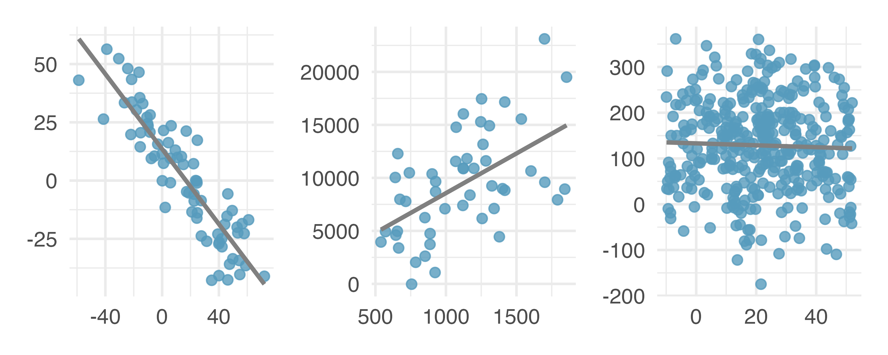
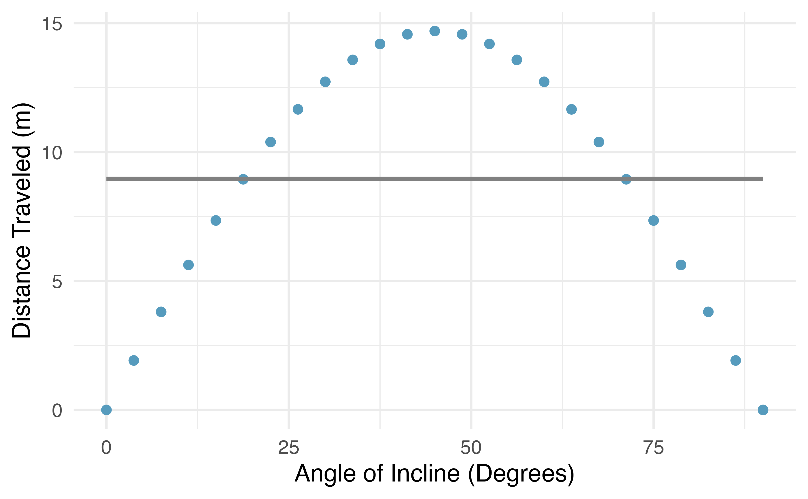
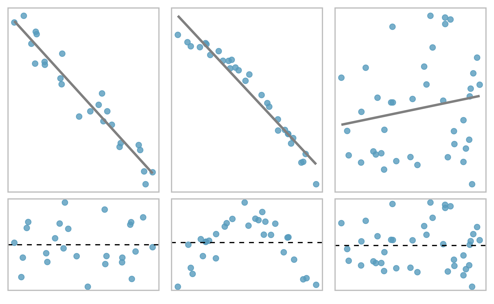
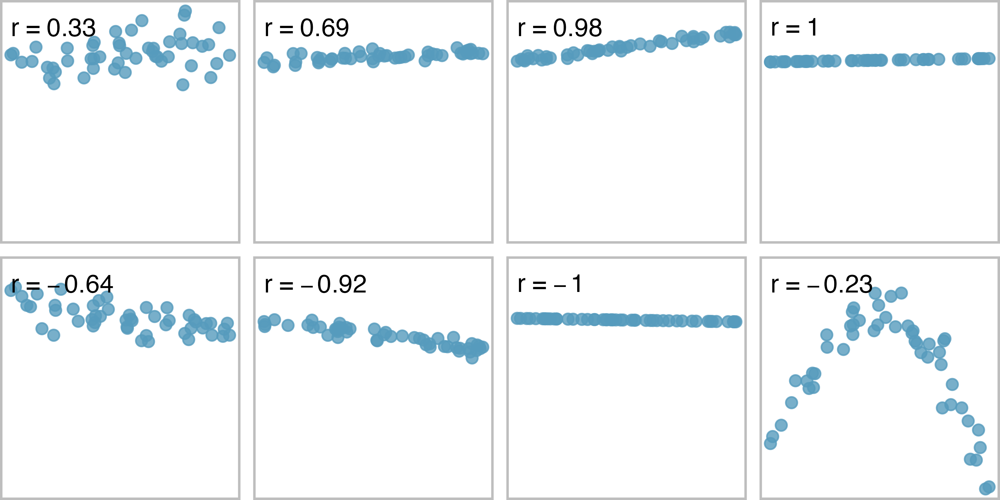
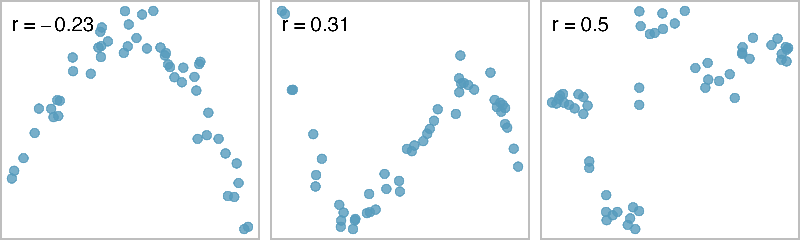
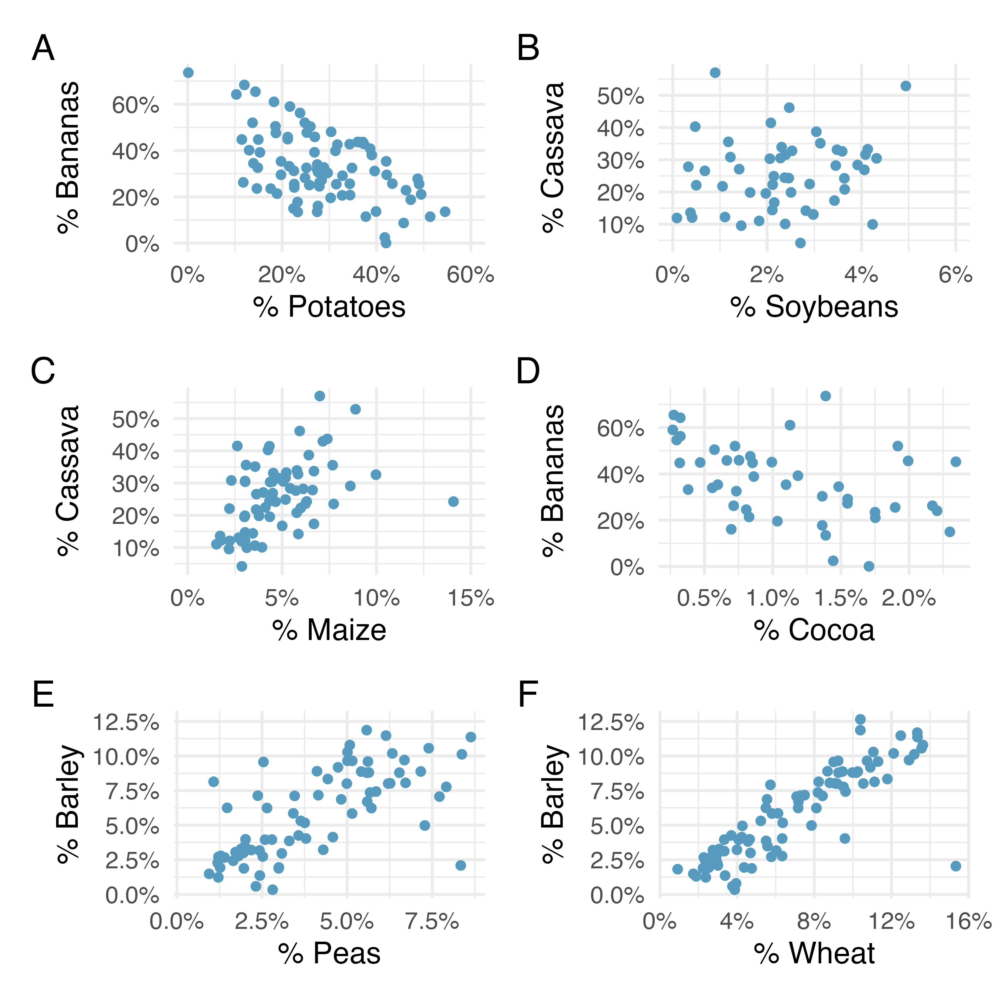
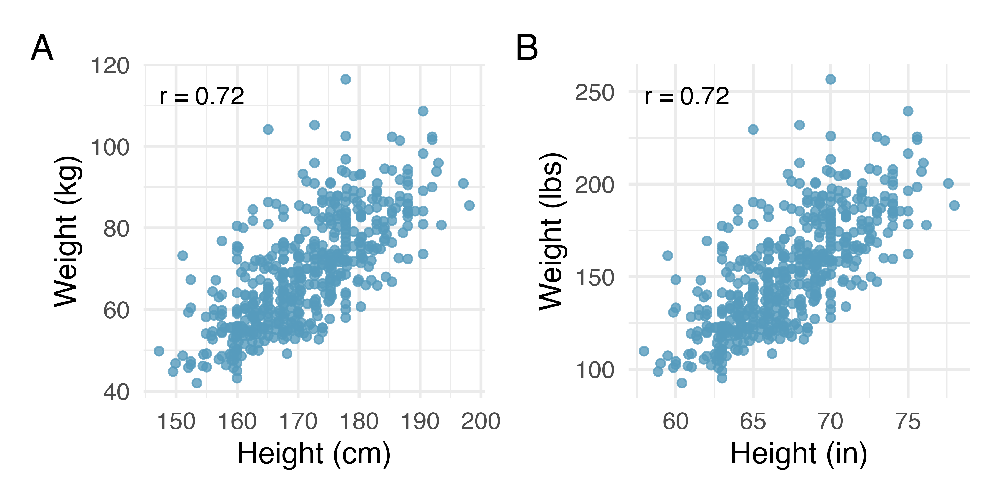

```{r setup, include=FALSE}
knitr::opts_chunk$set(echo=FALSE)
library(tidyverse)
```

```{r message=FALSE, warning=FALSE, include=FALSE, paged.print=FALSE}
knitr::opts_chunk$set(echo=TRUE, message=FALSE, warning=FALSE, collapse=TRUE, highlight=TRUE, paged.print=FALSE, prompt=TRUE, strip.white=FALSE, tidy = TRUE)
```

***
Este texto se basa en los siguientes materiales:

- Capítulo 7 del libro [Introduction to Modern Statistics](https://openintro-ims.netlify.app/index.html) de Mine Çetinkaya-Rundel y Johanna Hardin 
- Capítulo 4 del libro [Statistical Rethinking](https://xcelab.net/rm/statistical-rethinking/) de Richard McElreath
- Capitulo 3 del libro [Introduction to Statistical Learning](https://www.statlearning.com/) de Gareth James, Daniela Witten, Trevor Hastie y Rob Tibshirani


***

## Introducción
La regresión lineal es una técnica estadística muy poderosa. Muches estamos algo familiarizades con los modelos de regresión solo por leer las noticias. Hemos visto alguna vez un gráfico de dispersión. Los modelos lineales se pueden utilizar para varias tareas. Probablemente, las dos más importantes sean

- evaluar si existe una relación lineal entre una variable numérica en el eje horizontal y el promedio de la variable numérica en el eje vertical
- hacer predicciones (seguramente vamos a discutir bastante alrededor de este término) de la variable dependiente


## De ajustes, residuos y correlacion
Al considerar la regresión lineal, es útil pensar profundamente en el proceso de ajuste de línea. Vamos a definir la forma de un modelo lineal, exploramos los criterios de lo que hace un buen ajuste e introducimos una nueva métrica llamda "correlación lineal".

### Ajustando una línea a los datos
El gráfico siguiente muestra dos variables. Podemos modelar esa relación entre ambas de forma **perfecta** con una línea recta. La ecuación de esa recta es

$$y = 5 + 64.96 X$$


```{r echo=FALSE}
set.seed(1)
data = tibble(x = 1:13+ runif(13),
              y = 5 + 64.96 * x)

data %>%
ggplot(aes(x,y)) +
        geom_line(color="black") + 
        geom_point(color="blue") +
        theme_minimal()
```

¿Qué quiere decir esa idea de **relación perfecta**? Básicamente que podemos predecir **sin error** el valor de $y$ conociendo el valor de $X$. Obviamente, esto es un ejemplo de juguete y estas relaciones perfectas no existen casi en ninguna situación de la vida real. Por ejemplo, si tomamos el ingreso familiar de una persona ($X$) este valor seguramente proporcione una buena cantidad de información útil sobre el monto que un banco le ofrecerá a esta persona si quisiera acceder a cierto tipo de instrumentos crediticios. Sin embargo, si quisiéramos hacer una predicción del monto prestado en base $X$ esa predicción no va a ser perfecta. ¿Por qué?

La regresión lineal es un método estadístico que se usa para ajustar una línea a los datos donde la relación entre dos variables, $X$ e $y$ puede ser modelada como si fuera una línea recta tolerando algún grado de error.

$$ y = \beta{0} + \beta{1}X + \epsilon$$
- $\beta{0}$ representa el intercepto o la ordenada al origen. ¿Cómo podemos interpretar este valor? Como el valor que asume $y$ cuando $X = 0$.

- $\beta_{1}$ es la pendiente de la recta, es decir, cuánto aumenta $y$ cuando $X$ aumenta una unidad

- $\epsilon$ representa el error está representado por

En general, estos valores se calculan en base a los datos. Si los datos observados son una muestra aleatoria de una población objetivo sobre la que estamos interesados en hacer inferencias, estos valores se consideran estimaciones puntuales para los parámetros de la población. Más adelante vamos a trabajar sobre cómo hacer inferencias sobre los parámetros de un modelo lineal.

Cuando usamos $X$ para predecir $y$, solemos llamarla variable predictora y a $y$ variable dependiente, output o variable resultado. 
Es raro que todos los datos caigan perfectamente en una línea recta. En cambio, es más común que los datos aparezcan como una nube de puntos, como los ejemplos que se muestran en el gráfico siguiente.




En cada caso, los datos caen alrededor de una línea recta, incluso si ninguna de las observaciones cae exactamente sobre la línea. La primera gráfica muestra una relación lineal descendente relativamente fuerte, donde la variabilidad restante en los datos alrededor de la línea es menor en relación con la fuerza de la relación entre $X$ y $y$.

La segunda gráfica muestra una relación hacia arriba (positiva) que, aunque evidente, no es tan fuerte como la primera. 

El último gráfico muestra una relación negativa (a la baja) muy débil en los datos, tan leve que apenas podemos notarlo. 

En cada gráfico podríamos preguntarnos, ¿deberíamos mover la línea un poco hacia arriba o hacia abajo? ¿Deberíamos inclinarla más o menos? La primera pregunta nos remite a $\beta_{0}$. La segunda, a $\beta_{1}$. Dado que cada una controla un aspecto de una recta, entonces, estas cuestiones nos plantean la existencia de una cierta incertidumbre con respecto a nuestras estimaciones de los parámetros del modelo. Vamos a ir avanzando sobre esto.

También hay casos en los que ajustar una línea recta a los datos, incluso si existe una relación clara entre las variables, no es útil. No funciona. Uno de estos casos se muestra en la figura siguiente. x



Se vé una relación perfecta entre las variables, aunque la misma no es lineal. ¿Qué tipo de relación se les ocurre que podría funcionar aquí? Por ahora vamos a centrarnos en los modelos lineales.

### Usando regresión lineal para predecir el peso de una población

Vamos a trabajar con un dataset que proviene del [siguiente repositorio](https://github.com/rmcelreath/rethinking). Son datos de un censo parcial censales parciales de un área de Botswana y, específicamente, de la etnia !Kung San. Son datos compilados a partir de e entrevistas realizadas por Nancy Howell a fines de la década de 1960. Los datasets completos (para les antropólogues que les interese) pueden ser recuperados desde [acá](https://tspace.library.utoronto.ca/handle/1807/10395).

Vamos a trabajar con un recorte de estos datos, particularmente, con datos de edad, sexo, altura y peso.

```{r echo=TRUE}
df <- read_delim('https://raw.githubusercontent.com/rmcelreath/rethinking/master/data/Howell1.csv', delim=";")

df <- df %>%
  mutate(male = as.factor(case_when(
          male == 0 ~ 'No',
          TRUE ~ 'Yes'
  )))
```
Hagamos un breve análisis descriptivo de estas cuatro variables.

```{r}
summary(df)
```
Tenemos 544 filas, correspondientes a 544 individios. De cada individuo tenemos el registro de su altura (`height`), peso (`weight`), edad (`age`) y si es masculino o no (`male`). Hagamos un gráfico de dispersión del peso y la altura.

```{r}
df %>%
        ggplot(aes(x=height, y=weight)) + 
                geom_point() + 
                theme_minimal()
```

¿Qué pueden decir de esta relación?

Ahora bien, por ahora, vamos a restringirnos a la población adulta (mayores de 18 años). Básicamente, porque la edad y la altura están muy correlacionadas entre si hasta finalizada la adolescencia.

```{r}
df %>%
        filter(age >= 18) %>%
        ggplot(aes(x=height, y=weight)) + 
                geom_point() + 
                theme_minimal()
```

Acá vemos que, si bien la relación entre ambas no es perfectamente lineal, la información sobre el peso de una persona ayuda a predecir la altura de la misma. Queremos, entonces, de alguna forma explicar el peso utilizando la altura. Para eso, vamos a realizar una regresión lineal.

```{r}
df_mayores <- df %>%
        filter(age >= 18)


df_mayores %>%
  ggplot(aes(x=height, y=weight)) + 
                geom_point() + 
                geom_smooth(method='lm', color = 'red', se = FALSE) +
                theme_minimal()
```

La ecuación para esta línea es:

$$\hat{wei} =  52.3162 + 0.6294 \times height$$

El sombrerito arriba de $wei$ significa que es una estimación y no el valor observado. Podemos usar la ecuación de esta recta para hacer predicciones. Por ejemplo, una persona que mide 1.80 mts (180 cm) va a pesar...

```{r include=FALSE}
lm1 <- lm(weight~height, data=df_mayores)
```


$$\hat{wei} = -52.32 + 0.63 \times height = -52.3162 + 0.6294 \times 180 = 60.98$$

La estimación puede verse como un **promedio**: la ecuación predice que las personas con una altutra total de 180 cm tendrán un peso de unos 61 kilogramos. A falta de más información sobre una persona de 180 cm, la predicción del peso en función de la **altura promedio** parece razonable.

Puede haber otras variables que podrían ayudarnos a predecir el peso de una persona de la etnia !Kung San. Tal vez la relación sea diferente entre hombres y no hombres; o quizás sea diferente para diferentes áreas geográficas. El gráfico siguiente muestra la relación entre la altura y el peso de las personas !Kung San separando por la variable `male`.  

```{r}
df_mayores %>%
  ggplot(aes(x=height, y=weight, color=male)) + 
                geom_point() + 
                theme_minimal()
```

Los hombres (representados por los puntitos azules) parecen ser más altos y más "pesados". 

El gráfico siguiente muestra la misma relación teniendo en cuenta su edad. Es más difícil saber si la edad cambia la relación entre peso y altura.

```{r}
df_mayores %>%
  ggplot(aes(x=height, y=weight, color=age)) + 
                geom_point() + 
                scale_color_viridis_c() +
                theme_minimal()
```

***
Traten de replicar este mismo gráfico con les menores de 18 años.

```{r}
###
```
***

### Residuos
Los residuos son la variación restante en los datos después de tener en cuenta el ajuste del modelo:

$$ Datos\ observados = Modelo\ ajustado + Residuos $$
Vamos a poder calcular para cada observación un residuo. En el gráfico siguiente vemos tres que calculamos para la recta de regresión de nuestro dataset. Si una observación está por encima de la línea de regresión, entonces su residuo, la distancia vertical desde la observación hasta la línea, es positiva. Las observaciones debajo de la línea tienen residuos negativos. Uno de los objetivos de elegir el modelo lineal correcto es que estos residuos sean lo más pequeños posible.


```{r include=FALSE}
df_mayores$predicted <- predict(lm1)
df_mayores$resid <- residuals(lm1)
```


```{r}
df_mayores %>%
  ggplot(aes(x=height, y=weight)) + 
                geom_smooth(method = "lm", se = FALSE, color = "lightgrey") +
                geom_segment(aes(xend = height, yend = predicted), alpha = .2) +  # alpha to fade lines
                geom_point(aes(color = (resid))) +
                scale_color_viridis_c() +
                theme_minimal()
```

En este gráfico tenemos mucha información: los datos observados, la recta de regresión, los residuos y el valor de los residuos. Cuanto más amarillo es el color de los puntitos, más positiva será la diferencia entre el valor observado y el valor predicho por el modelo. Es decir, el modelo "sub-estima" la observación. A la inversa, cuanto más azul sea el color del puntito, más negativa será la diferencia entre ambos. Es decir, el modelo "sobre-estima".

¿Cuál es el punto más sobre-estimado?

---
Residuos: la diferencia entre lo observado y lo predicho

El residuo de la i-ésima observación $(x_{i}, y_{i})$ es la diferencia entre el valor observado ($y_{i}$) y el valor que predice el modelo ($\hat{y_{i}}$):

$$\epsilon_{i} = y_{i} - \hat{y_{i}}$$
Veamos el punto de máximo residuo:

```{r}
df_mayores[which.max(df_mayores$resid),"height"]
```

¿Cómo lo calculamos?


Primero, calculamos el valor predicho: 
$$\hat{wei} = 52.3162 + 0.6294 \times height = 52.3162 + 0.6294 \times 139.7 = 35.61$$

Luego, computamos la diferencia entre el valor observado y el predicho:
$$\epsilon = \hat{wei} - wei = 50.3 - 35.61 = 14.7$$

¿Cómo interpretamos ese valor?
---

Los residuos son útiles para evaluar qué tan bien se ajusta ("fitea") un modelo lineal a un conjunto de datos. Es común representarlos en un gráfico como el que sigue.

```{r}
df_mayores %>%
  ggplot(aes(x=predicted, y=resid)) +
    geom_point() +
    geom_hline(yintercept=0, linetype='dashed') +
    theme_minimal() +
    labs(x='Valores predichos de height',
         y="Residuos")
```


A menudo los mostramos en un diagrama de dispersión como el anterior. Los residuos en el eje y se grafican con el valor predicho por el modelo en el eje horizontal. Crear un residual es algo así como volcar el gráfico de dispersión para que la línea de regresión sea horizontal, como lo indica la línea discontinua. ¿Cuál sería el valor de máximo residuo?

Uno de los propósitos de las residual plots identificar características o patrones que aún aparecen en los datos después de ajustar un modelo. La siguiente muestra tres diagramas de dispersión con modelos lineales en la primera fila y diagramas residuales en la segunda fila. ¿Pueden identificar algún patrón que quede en los residuos?



En el primer conjunto de datos (primera columna), los residuos no muestran patrones obvios. Los residuos parecen estar dispersos al azar alrededor de la línea discontinua que representa 0.

El segundo conjunto de datos muestra un patrón bien claro en los residuos. Hay cierta curvatura en el gráfico de dispersión, que es más evidente en el gráfico residual. No deberíamos usar una línea recta para modelar estos datos. En su lugar, se debe usar una técnica más avanzada para modelar la relación curva, como cierto tipo de transformaciones de variables que vamos a trabajar más adelante.

El último gráfico muestra muy poca tendencia al alza y los residuos tampoco muestran patrones evidentes. Es razonable tratar de ajustar un modelo lineal a los datos. Sin embargo, no está claro si hay evidencia de que el parámetro de pendiente sea diferente de cero. La estimación puntual del parámetro de pendiente $\beta_{1}$ no es cero, pero podríamos preguntarnos si esto podría deberse al azar. Esto nos lleva a la cuestión de la inferencia sobre los parámetros de un modelo lineal. Volveremos sobre esto en unas 5 o 6 clases.


### Describiendo relaciones lineales con correlaciones

Hemos visto gráficos con relaciones lineales fuertes y otras con relaciones lineales muy débiles. Sería útil si pudiéramos cuantificar la fuerza de estas relaciones lineales con alguna métrica o estadístico.

#### Correlación: fuerza de una relación lineal.

El coefiiente de correlación lineal (R de Pearson) siempre toma valores entre -1 y 1 y describe la fuerza y dirección de la relación lineal entre dos variables. Denotamos la correlación por $r$.

El valor $r$ no tiene unidades y no se verá afectado por un cambio lineal en las unidades (por ejemplo, pasar de pulgadas a centímetros).

Podemos calcular la correlación usando una fórmula, tal como lo hicimos con la media muestral y la desviación estándar. 

$$ r_{xy} = \frac{\sum_{i=1}^n (x_{i} - \overline{x}_{i})(y_{i} - \overline{y}_{i})}{\sqrt{\sum_{i=1}^n (x_{i} - \overline{x}_{i})^2} \sqrt{\sum_{i=1}^n (y_{i} - \overline{y}_{i})^2}}$$


La fórmula del R de Pearson es es bastante compleja, como podrán ver. Al igual que con otras estadísticas, generalmente realizamos los cálculos en una computadora o calculadora.




La anterior muestra ocho parcelas y sus correlaciones correspondientes. Solo cuando la relación es perfectamente lineal, la correlación es -1 o 1. Si la relación es fuerte y positiva, la correlación será cercana a +1. Si es fuerte y negativo, estará cerca de -1. Si no existe una relación lineal aparente entre las variables, entonces la correlación será cercana a cero.




La correlación pretende cuantificar la fuerza de una tendencia lineal. Las tendencias no lineales, incluso cuando son fuertes, a veces producen correlaciones que no reflejan la fuerza de la relación. Como se ven en la figura anterior.

Los siguientes diagramas de dispersión muestran las relaciones entre los rendimientos de varios cultivos en los países. En las gráficas, cada punto representa un país diferente. Las variables x e y representan la proporción del rendimiento total en los últimos 50 años que se debe a ese tipo de cultivo.

Ordenen los seis diagramas de dispersión de la relación lineal negativa más fuerte a la positiva más fuerte.



Un aspecto importante del coeficiente $r$ es que no tiene unidades. Es decir, a diferencia de la pendiente de una línea (volveremos sobre esto la semana que viene) que nos dice cuánto aumenta $y$ cuando $X$ aumenta una unidad, en $r$  no hay unidades asociadas con la correlación de $X$ e $y$. La Figura siguiente muestra la relación entre pesos y alturas de 507 individuos físicamente activos. 

En el gráfico A, el peso se mide en kilogramos (kg) y la altura en centímetros (cm). En el gráfico B, el peso se ha convertido a libras (lbs) y la altura a pulgadas (in). El coeficiente de correlación ($r=0.72$
) es el mismo en ambos gráficos. Tampoco ha cambiado la forma de la relación.El único cambio visual en el gráfico es el etiquetado del eje de los puntos.




### Implementando una regresión lineal simple

Hasta aquí la aproximación conceputal a una regresión lineal simple. Vamos a ver ahora el código para implementarla en R. La función que vamos a usar se llama `lm()` por linear models. Pueden consultar la ayuda de la función para más detalles pero aquí por ahora vamos a continuar con nuestro ejemplo de pesos y alturas. 

Vamos a usar `height` como variable predictora ($X$) y `weight` como variable dependiente ($y$). La sintaxis básica de `lm()` es la siguiente: `lm(x~y, data)`, donde `x` es la variable independiente e `y` la dependiente y `data` la tibble o dataframe con datos.

En nuestro caso, vamos a guardar los resultados en un objeto llamado `lm_1`.
 
```{r}
lm_1 <- lm(weight~height, data=df_mayores)
```

Podemos ver que `lm_1` es una lista. Por ahora, pidamos un resumen del objeto:

```{r}
summary(lm_1)
```

También acá hay bastante información por ahora centremos la mirada en la columna de `Estimate`. Puede verse que los valores son los mismos que mencionamos al inicio de la clase. `Intecept` se corresponde con $\beta_{0} = 52.31$ y `height`, con $\beta_{1} = 0.63$. 

Podemos usar la función `names()` para averiguar qué otra información se almacenan en  `lm_1`. 


```{r}
names(lm_1)
```

Vemos que están los coeficientes de modelo, los residuos, etc... Contiene mucha información que vamos a ir trabajando a lo largo de las clases. Aunque podemos extraer estas objetos por su nombre `lm_1$coficients`es más seguro usar el extractor funciones como `coef()` para acceder a ellas.

```{r}
coef(lm_1)
```
La función `predict()` puede ser usada para hacer predicciones sobre nuevos datos a partir de la ecuación de la recta que se genera en `lm_1`. Así, si yo quisiera predecir el valor del peso para una persona de 180 cm. (como hicimos más arriba a mano) podríamos escribir:

```{r}
predict(lm_1, data.frame(height = 180)) 
```

Como pudemos ver, `lm_1` tiene un vector llamado `fitted.values`: son los valores predichos por el modelo. También podemos generarlos mediante predict:

```{r}
predict(lm_1, df_mayores) %>%
  head()
```

De esta forma, podemos generar una columna en el dataframe orignal:

```{r}
df_mayores <- df_mayores %>%
  mutate(predicted = predict(lm_1, df_mayores))
```

Por último, podemos calcular los coeficientes de correlación de Pearson $r$ de la siguiente forma:

```{r}
df_mayores %>%
  select(height, weight) %>%
  cor(method="pearson")
```

Esto nos devuelve la matriz de correlaciones. Es una matriz cuadrada (tiene la misma cantidad de filas que de columnas). En este caso como tiene solamente dos variables, es una matriz 2x2. En cada celda tenemos la correlación de pearson ($r$) para la variable en fila y la variable en la columna. De esta forma, para los mayores de 18 años $r=0.754$.


***

### Actividades

#### Conceptuales

- Cada uno de los gráficos de dispersión que se muestran a continuación tiene una línea de regresión impuesta. Si tuviéramos que construir una gráfica de residuos (residos versus $X$) para cada uno, describa con palabras cómo se verían cada una.


- Para cada uno de las seis gráficas, identifique la fuerza de la relación (p. ej., débil, moderada o fuerte) en los datos y si sería razonable ajustar un modelo lineal.


- Los dos diagramas de dispersión a continuación muestran la relación entre el promedio general del curso y dos exámenes parciales (Examen 1 y Examen 2) registrados para 233 estudiantes durante varios años para un curso de estadística en una universidad.


#### Prácticos
- Calcular los residuos de la regresión anterior

```{r}
###
```

- Hacer un residual plot. Recuerden, los residuos van en el eje $y$ y los valores predichos según el modelo de la variable dependiente van en el eje $y$

```{r}
###
```

- Ahora tomen los menores de 18 años y realicen un gráfico de dispersión entre `heigth` (como variable independiente) y `weight` como dependiente. ¿Qué pueden decir al respecto? ¿Cómo se imaginan que sería el valor del $r$ en relación a los que surgen de los mayores de 18 años . Calcúlenlos.

```{r}
###
```

- Estimen una regresión lineal entre las mismas variables. ¿Cómo son los $\beta_{1}$ en relación los de la regresión con los mayores de 18 años?

```{r}
###
```


- ¿Qué puede decir de los residuos?


***