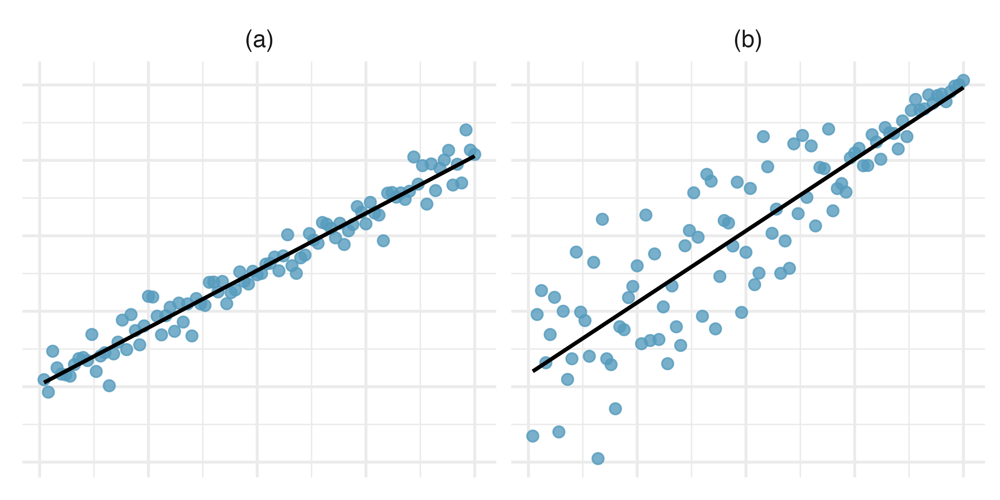
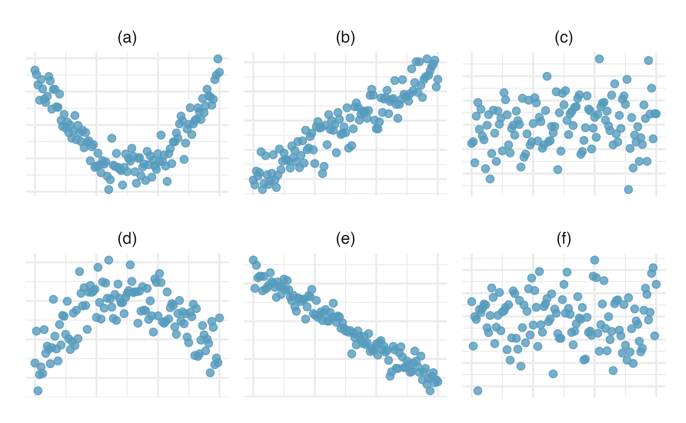
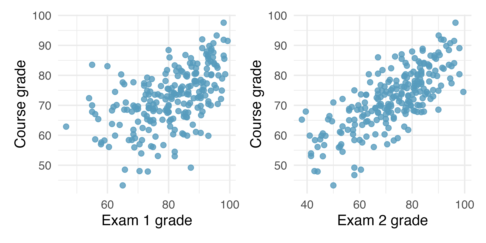

## Conceptuales

- Cada uno de los gráficos de dispersión que se muestran a continuación tiene una línea de regresión impuesta. Si tuviéramos que construir una gráfica de residuos (residos versus $X$) para cada uno, describa con palabras cómo se verían cada una.



- Para cada uno de las seis gráficas, identifique la fuerza de la relación (p. ej., débil, moderada o fuerte) en los datos y si sería razonable ajustar un modelo lineal.



- Los dos diagramas de dispersión a continuación muestran la relación entre el promedio general del curso y dos exámenes parciales (Examen 1 y Examen 2) registrados para 233 estudiantes durante varios años para un curso de estadística en una universidad.


- ¿Cuál de los dos exámenes tiene una mayor correlación con la nota final?
- ¿Se te ocurre una explicación de por qué se produce esta relación?


## Prácticos
- Calcular los residuos de la regresión que vimos en clase (`weight~height`). Agregarlos como columna en el dataset original.

```{r}
###
```

- Hacer un residual plot. Recuerden, los residuos van en el eje $y$ y los valores predichos según el modelo de la variable dependiente van en el eje $x$

```{r}
###
```

- Ahora tomen los menores de 18 años y realicen un gráfico de dispersión entre `heigth` (como variable independiente) y `weight` como dependiente. ¿Qué pueden decir al respecto? ¿Cómo se imaginan que sería el valor del $r$ en relación a los que surgen de los mayores de 18 años . Calcúlenlos.

```{r}
###
```

- Estimen una regresión lineal entre las mismas variables. ¿Cómo son los $\bteta_{1}$ en relación los de la regresión con los mayores de 18 años?

```{r}
###
```

- ¿Qué pueden decir de los residuos?

```{r}
###
```