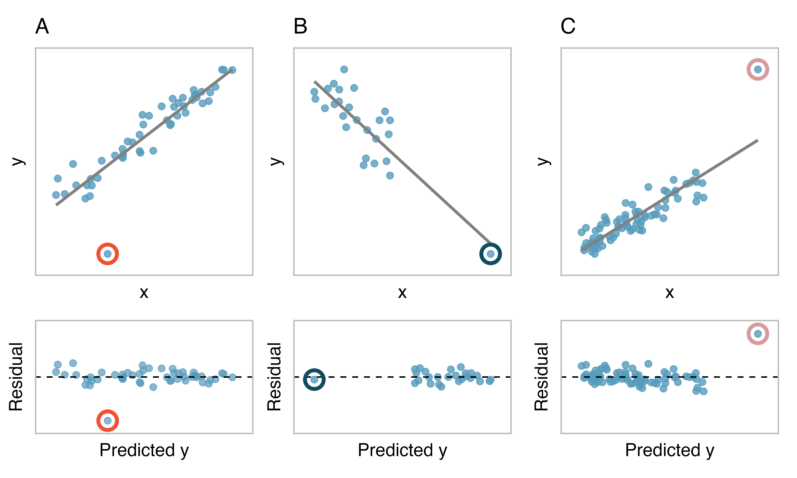
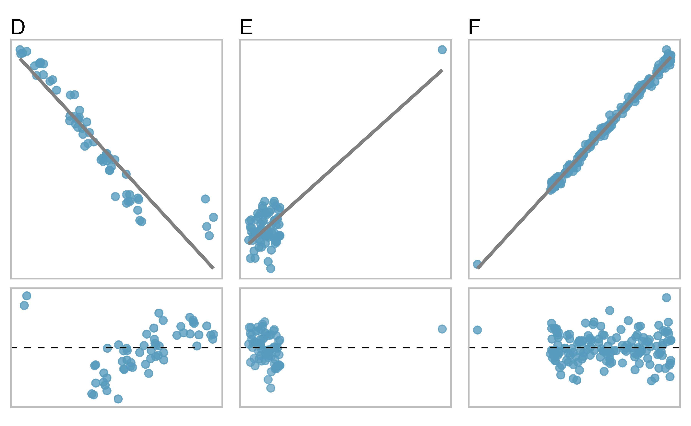

```{r setup, include=FALSE}
knitr::opts_chunk$set(echo=FALSE)
library(tidyverse)
library(quantreg)
library(broom)
```

```{r message=FALSE, warning=FALSE, include=FALSE, paged.print=FALSE}
knitr::opts_chunk$set(echo=TRUE, message=FALSE, warning=FALSE, collapse=TRUE, highlight=TRUE, paged.print=FALSE, prompt=TRUE, strip.white=FALSE, tidy = TRUE)
```

***

Este texto se basa en los siguientes materiales:

- Capítulo 7 del libro [Introduction to Modern Statistics](https://openintro-ims.netlify.app/index.html) de Mine Çetinkaya-Rundel y Johanna Hardin 
- Capítulo 4 del libro [Statistical Rethinking](https://xcelab.net/rm/statistical-rethinking/) de Richard McElreath
- Capitulo 3 del libro [Introduction to Statistical Learning](https://www.statlearning.com/) de Gareth James, Daniela Witten, Trevor Hastie y Rob Tibshirani

***

## Introducción
Hasta acá hemos venido trabajando ajustando "a ojo" líneas de regresión y tratando de interpretar algunas propiedades. Pero dado que por una nube de puntos pueden pasar infinitas líneas ¿cómo elegimos (o más precisamente, ¿cómo estimamos?) los parámetros de esa recta ($(\beta_{0}, \beta_{1})$? En esta clase vamos a trabajar sobre el método de Mínimos Cuadrados Ordinarios (MCO) como un enfoque para este problema.

Volvamos (hoy, por última vez) a nuestros datos sobre la etnia !Kung San.

```{r message=FALSE, warning=FALSE}
df <- read_delim('https://raw.githubusercontent.com/rmcelreath/rethinking/master/data/Howell1.csv', delim=";")

df <- df %>%
  mutate(male = as.factor(case_when(
          male == 0 ~ 'No',
          TRUE ~ 'Yes'
  )))

df_mayores <- df %>%
                filter(age >= 18)

df_mayores %>%
        ggplot(aes(x=height, y=weight)) +
                geom_point() +
                geom_smooth(method='lm', se=FALSE) +
                theme_minimal()
```

## Una medida objetiva para encontrar la mejor línea
Comenzamos pensando en qué significa eso de "la mejor línea". En términos matemáticos, queremos una línea que tenga residuos pequeños. Pero, más allá de las razones matemáticas, quisiéramos que también tenga sentido en términos intuitivos, que sea interpretable: que los residuos sean pequeños quiere decir que los puntos estén lo más cerca posible de la recta. 

Otra manera de pensarlo -quizás más gráfica- es que queremos elegir la línea que pasa lo más cerca de todos los puntos. Una primera opción es minimizar la suma de las magnitudes residuales (de sus valores absolutos sin signos):

$$|\epsilon_{1}| + |\epsilon_{2}| + ... + |\epsilon_{n}|$$
que podríamos realizar sin problemas con un poco de código en R.

Sin embargo, una elección más habitual es minimizar la suma de los cuadrados de los residuos:

$$\epsilon_{1}^2 + \epsilon_{2}^2 + ... + \epsilon_{n}^2$$


La línea que minimiza este criterio de mínimos cuadrados se representa como la línea continua en la figura anterior y comúnmente se denomina línea de mínimos cuadrados. Podemos pensar en cuatro posibles razones para elegir la opción de mínimos cuadrados en lugar de tratar de minimizar la suma de las magnitudes residuales sin elevar al cuadrado:

- Es el método más utilizado.
- El cálculo de la línea de mínimos cuadrados es ampliamente compatible con el software estadístico.
- En muchas aplicaciones, un residual dos veces más grande que otro residual es más del doble de malo. Por ejemplo, estar equivocado en 4 suele ser más del doble de malo que estar equivocado en 2. Elevar al cuadrado los residuos da cuenta de esta discrepancia.
- Los análisis que vinculan el modelo con la inferencia sobre una población son más directos cuando la línea se ajusta por mínimos cuadrados.

Las dos primeras razones son en gran parte por tradición y conveniencia; las razones tercera y cuarta explican por qué el criterio de mínimos cuadrados suele ser más útil cuando se trabaja con datos reales. Obviamente, existen situaciones (que no vamos a cubrir por ahora) en las que la suma de los absolutos de los desvíos pueden ser bastante más útiles.


### La recta de mínimos cuadrados
Para los datos de Botswana podemos escribir ahora la ecuacion de regresión:

$$\hat{wei} =  -52.3162 + 0.6294 \times height$$

La idea, entonces, es poder "predecir" el peso utilizando la altura. Los parámetros de la recta ($\beta_{0}, \beta_{1}$) son estimados mediante los datos ($wei, height$). En la práctica, esta estimación se hace usando una computadora. Pero también podría hacerse (de la misma manera que otras estimaciones, como la media de una muestra), usando una computadora o una calculadora.

El software estadístico generalmente se usa para calcular la línea de mínimos cuadrados y el resultado típico generado como resultado del ajuste de los modelos de regresión se parece al que se muestra en la tabla siguiente. Por ahora nos centraremos en la primera columna de la salida, que enumera $\beta_{0}$ y  $\beta_{1}$. 

Más adelante vamos a profundizar en las columnas restantes que nos brindan información sobre qué tan exactos y precisos son estos valores de intersección y pendiente que se calculan a partir de una muestra de 352 personas al estimar los parámetros de intersección y pendiente para la población.

```{r}
lm <- lm(weight ~ height, data=df_mayores)

tidy(lm)
```

El resultado del modelo nos dice que el intercepto es aproximadamente -52.32 y la pendiente es aproximadamente 0.629.

Pero, ¿qué significan estos valores? La interpretación de los parámetros en un modelo de regresión suele ser uno de los pasos más importantes del análisis.

Interpretar el parámetro de pendiente es útil en casi cualquier aplicación. Por cada cm. (es importante prestar atención a la escala de la variable) adicional de altura (`height`), esperaríamos que una persona de esta etnia tenga 0.629 kg. más. Nótese que a mayor altura corresponde mayor peso porque el coeficiente es positivo en el modelo. Debemos ser cautelosos en esta interpretación: si bien existe una asociación real, no podemos interpretar una conexión causal entre las variables porque estos datos son observacionales. 

---

**Para pensar tranquiles...**

¿Qué queremos decir con que son datos "observacionales"? ¿Y por qué no podemos inferir causalidad de este tipo de datos? ¿Qué tipo de datos necesitaríamos para poder inferir causalidad?

---

El intercepto estimado es negativo. En este caso, no tiene demasiado valor de interpretación, en tanto, no podemos afirmar que existe un peso negativo. Pero existen situaciones en las que es posible interpretar este parámetro como el promedio de la variable dependiente si la independiente fuese cero.

---

**Interpretación de parámetros estimados por mínimos cuadrados.**

La pendiente describe la diferencia estimada en el resultado promedio pronosticado de $y$ si la variable predictora $X$  pasó a ser una unidad más grande. El intercepto describe el resultado promedio de $y$ si $X=0$ y el modelo lineal es válido hasta el cero. En muchas situaciones (como en este caso) la variable $X$ no puede tener valor cero.

---

Una forma alternativa de calcular los valores de la intersección y la pendiente de una línea de mínimos cuadrados es haciendo cuentas a mano mediante fórmulas. Si bien los estadísticos en ejercicio y los científicos de datos no suelen utilizar los cálculos manuales, es útil pensar de esta forma una primera vez sobre la línea de mínimos cuadrados y el modelado en general. 

Estas fórmulas se basan en el método de mínimos cuadrados. Si les interesa alguna nota histórica al respecto pueden consultar este [link en Wikipedia](https://es.wikipedia.org/wiki/M%C3%ADnimos_cuadrados). La historia del método es interesante y está en el centro de una pelea entre Gauss y Legendre (dos matemáticos) respecto de la autoría del mismo.

Habíamos dicho que la recta de regresión es la que "pasa más cerca por todos los puntos". Ahora, ¿cómo definimos esa idea general? Una primera cosa que tenemos que hacer es definir una medida que resuma es "más cerca". Podríamos pensar en los residuos: efectivamente, si calculamos el residuo para cada observación y lo sumamos podríamos tener una medida "promedio" del error de la recta, es decir qué tan cerca o lejos pasa por todos los puntos:

$$\sum_{i=1}^n e_{i} = \sum_{i=1}^ny_{i} - \hat{y}_{i}$$

Ahora, esta medida tiene un problema: ya vimos a "ojo" en el gráfico anterior que las diferencias se "cancelan": algunas veces es positiva y otras negativas. Es más, su media será o estará muy próxima a cero. Por este motivo, como en otras ocasiones en lo que interesa es medir la magnitud de la desviación, tenemos que recurrir a un método que impida que los negativos se anulen con los positivos, así que calculamos estas diferencias elevadas al cuadrado, según la fórmula siguiente:

$$RSS = \sum_{i=1}^n e^2_{i} = \sum_{i=1}^n (y_{i} - \hat{y}_{i})^2$$

Ya sabemos de dónde viene el método de los mínimos cuadrados: buscamos la recta de regresión que nos proporcione un valor lo menor posible de la **suma de los cuadrados de los residuos (RSS)**. Para calcular los coeficientes de la recta de regresión solo tendremos que ampliar un poco la ecuación anterior, sustituyendo el valor estimado de $y$ por los términos de la ecuación de la recta de regresión:

$$\sum_{i=1}^n e^2_{i} = \sum_{i=1}^n (y_{i} - \hat{y}_{i})^2 = \sum_{i=1}^n (y_{i} - \beta_{0} + \beta_{1} X_{i})^2 $$
y encontrar los valores de $\beta_{0}$ y $\beta_{1}$ que minimicen la función. A partir de aquí la cosa  es más o menos estándar: solo tenemos que igualar a cero las [derivadas](https://es.wikipedia.org/wiki/Derivada) de la ecuación anterior (tranquilos, vamos a ahorrarnos la jerga matemática dura) para obtener el valor de $\beta_{1}$:

$$\beta_{1} = \frac{s_{xy}}{s^2_{x}}$$
Donde tenemos en el numerador la covarianza de las dos variables y, en el denominador, la varianza de la variable independiente. A partir de aquí, el cálculo de $\beta_{0}$ es simple:

$$\beta_{0} = \overline{y} - \beta_{1} \overline{X}$$

```{r}
df_mayores %>%
  select(height, weight) %>%
  summarise(across(everything(), 
                   .fns = list(Mean = mean, Var = var),
                   .names = "{col}_{fn}"
    )) %>%
  bind_cols(
    df_mayores %>%
      select(height, weight) %>%
      summarise(Cov = cov(height, weight))
  )

```

Entonces, podemos reemplazar los valores en las ecuaciones anteriores:

$$\beta_{1} = \frac{s_{xy}}{s^2_{x}} = \frac{37.72983}{7.74232^2} = \frac{37.72983}{59.94371} = 0.629421$$

$$\beta_{0} = \overline{y} - \beta_{1} \overline{X} = 44.99049 - 0.629421  \times 154.5971 = -52.31617$$

Si quisiéramos hacer las cuentas en código...

$\beta_{1}$:
```{r}
b1 <- cov(df_mayores$height, df_mayores$weight) / var(df_mayores$height)
b1
```

$\beta_{0}$:
```{r}
mean(df_mayores$weight) - mean(df_mayores$height) * b1
```


### Las extrapolaciones pueden ser engañosas
Los modelos lineales se pueden utilizar para aproximar la relación entre dos variables. Sin embargo, como cualquier modelo, tienen limitaciones. La regresión lineal es simplemente una hipótesis simplificadora. La verdad es casi siempre mucho más compleja que una simple línea. Por ejemplo, no sabemos cómo se comportarán los datos fuera de nuestra ventana limitada.

La aplicación de una estimación del modelo a valores fuera del ámbito de los datos originales se denomina _extrapolación_. Generalmente, un modelo lineal es solo una aproximación de la relación real entre dos variables. Si _extrapolamos_ estamos haciendo una apuesta poco fiable de que la relación lineal aproximada será válida en lugares donde no ha sido analizada.

---

**Actividad breve**
Por ejemplo, ¿qué predicción haría nuestro modelo sobre el peso de una persona que mide 50 cm. (une niñe)?
Pueden tomar 5 minutos para calcularlo.

---

### Describir la fuerza de un ajuste
Evaluamos la fuerza de la relación lineal entre dos variables anteriormente usando la correlación, $r$. Sin embargo, es más común explicar la fuerza de un ajuste lineal usando $R^2$, llamado R-cuadrado. Si estamos trabajando con un modelo lineal, va a ser sumamente útil poder describir qué tan cerca se agrupan los datos alrededor del ajuste lineal.

Por ejemplo, volvamos a nuestros datos de altura y peso. La varianza de la variable dependiente (`weight`) es aproximadamente $s^2_{weight} = 41.68908$. Sin embargo, si aplicamos la recta de regresión por mínimos cuadrados, entonces, el modelo reduce la incerteza (podemos pensar a las medidas de dispersión como una aproximación a esa incerteza) que tenemos en predecir el peso de una persona (porque ya conocemos su altura). La variabilidad en los residuos describe qué parte de la incerteza (de la variabilidad) total seguimos teniendo una vez que entrenamos el modelo. 

Podemos calcular ese valor de la siguiente forma, calculando la varianza de los residuos:

```{r}
var(residuals(lm))
```

Es decir, elevamos los residuos al cuadrado y calculamos su media: $S^2_{res} = 17.94113$

En resumen, hubo una reducción de

$$\frac{41.68908 - 17.94113}{41.68908} = 0.56964 \approx 0.57$$

aproximadmante el 57% de la variación de la variable dependiente (`wei`) al usar información sobre la `height` y modelando su relación de forma lineal. Resulta que $R^2$ corresponde exactamente al valor al cuadrado de la correlación:

```{r}
cor(df_mayores$height, df_mayores$weight)
```

```{r}
cor(df_mayores$height, df_mayores$weight)**2
```

$$ r = 0.7547479 → R^2 = 0.5696444$$

A $R^2$ también se le llama **coeficiente de determinación**.

---

**Coeficiente de determinación $R^2$: proporción de la variabilidad en la variable resultado explicada por el modelo.**

Ya que $r$ siempre está entre -1 y 1, $R^2$ siempre estará entre 0 y 1. Esta métrica se llama coeficiente de determinación y mide la proporción de variación en la variable de resultado $y$, que puede ser explicado por el modelo lineal con predictor $X$.

---

Más generalmente, $R^2$ se puede calcular como una relación entre la variabilidad alrededor de la línea dividida la variabilidad total.


---

**Sumas de cuadrados para medir la variabilidad en $y$**

Podemos medir la variabilidad en los valores de $y$ en función de cuán lejos de su media $\overline{y}$ tienden a caer.

Definimos este valor como la suma total de cuadrados (SST), calculada usando la siguiente fórmula, donde $y_{i}$ representa a cada valor de $y$ (es decir, cada registro de $y$ en el dataset) y $\overline{y}$ representa la media de todos los valores de $y$ en el dataset.

$$SST = (y_{1} - \overline{y})^2 + (y_{2} - \overline{y})^2 + ... + (y_{n} - \overline{y})^2 = \sum_{i=1}^n (y_{i} - \overline{y})^2$$

La variabilidad que resta en los valores de $y$ conociendo $X$ se puede medir por la suma de los errores al cuadrado, o la suma de los residuos al cuadrado (SSE), calculada usando la fórmula a continuación, donde $\hat{y_{i}}$ representa el valor predicho de $y_{i}$ (es decir el valor predicho en cada caso del dataset) usando la recta de regresión.

$$SSE =  (y_{1} - \hat{y_{1}})^2 + (y_{2} - \hat{y_{2}})^2 + ... + (y_{n} - \hat{y_{n}})^2 \\
= e^2_{1} + e^2_{2} + ... + e^2_{n} \\
= \sum_{i=1}^n (y_{i} - \hat{y_{i}})^2$$


El coeficiente de determinación puede ser calculado como:

$$R^2 = \frac{SST - SSE}{SST} = 1 - \frac{SSE}{SST} $$

---

## Predictores categóricos con dos niveles
Las variables categóricas también son útiles para predecir resultados. Aquí consideramos un predictor categórico con dos niveles (recuerde que un nivel es lo mismo que una categoría). Tenemos un predictor cualitativo en este dataset: la variable `male`.

El gráfico siguiente muestra la distribución de los pesos según `male`, junto con la recta de regresión.

```{r}
df_mayores %>%
  ggplot(aes(x=male, y=weight)) + 
    geom_point() +
      geom_smooth(aes(x=as.integer(male), y=weight), method='lm', se=FALSE, color='red') +
    theme_minimal()
```

Para incorporar la variable `sex` en una ecuación de regresión, debemos convertir las categorías en una forma numérica. Lo haremos usando una variable indicadora llamada `male`, que toma valor 1 cuando el registro es varón y 0 cuando es mujer. Usando esta variable indicadora, el modelo lineal se puede escribir como

$$\hat{wei}_{i} = \beta_{0} + \beta_{1} \times male_{i}$$


Si estimamos los parámetros de la recta...

```{r}
lm_2 <- lm(weight~male, data=df_mayores)

tidy(lm_2)
```

La ecuación quedaría escrita

$$\hat{wei}_{i} = 41.81 + 6.778 \times male_{i}$$
El intercepto ($\beta_{0}$) en este caso es el peso promedio cuando `male==0`; es decir, el peso promedio cuando el caso NO es varón. 

La pendiente ($\beta_{1}$) puede ser interpreatada de la siguiente manera: si el caso es varón entonces, debemos sumarle al promedio del peso 6.778 kg. Es decir, que los varones son en promedio 6.77kg. más pasados que les no varones.


---
  
**Interpretación de las estimaciones del modelo para predictores categóricos**

El intercepto estimado es el valor de la variable de resultado para la primera categoría (es decir, la categoría correspondiente a un valor de indicador de 0). La pendiente estimada es el cambio promedio en la variable de resultado entre las dos categorías.

---

Es importante entender que las interpretaciones de la intersección y la pendiente no cambian cuando se modelan variables categóricas con dos niveles. 

---

**Encontrando al $R^2$**

Esta es una salida típica de regresión. ¿Dónde está el $R^2$?
```{r}
summary(lm)
```

---

## Valores atípicos en regresión lineal
Un punto importante, como podrán intuir en un modelo de regresión, es la existencia de valores atípicos o outliers. En esta sección, identificamos criterios para determinar qué valores atípicos son importantes e influyentes. En el contexto de una regresión lineal los valores atípicos pueden ser pensados como observaciones que caen muy lejos de la nube de puntos. Estos puntos son especialmente importantes porque pueden tener una fuerte influencia en la recta de mínimos cuadrados.

**Ejemplo 1**
Hay tres gráficos que se muestran en la figura siguiente junto con la línea de mínimos cuadrados correspondiente y gráficos residuales. Para cada par de gráficos de dispersión y gráficos residuales, identifique los valores atípicos y observe cómo influyen en la línea de mínimos cuadrados. Recuerde que un valor atípico es cualquier punto que no parece pertenecer a la gran mayoría de los otros puntos.



- A: Hay un valor atípico lejos de los otros puntos, aunque solo parece influir ligeramente en la línea.
- B: Hay un valor atípico a la derecha, aunque está bastante cerca de la línea de mínimos cuadrados, lo que sugiere que no fue muy influyente.
- C: Hay un punto lejos de la nube, y este valor atípico parece atraer la línea de mínimos cuadrados a la derecha; examine cómo la línea alrededor de la nube primaria no parece encajar muy bien.


**Ejemplo 2**
Hay tres gráficos más abajo junto con la línea de mínimos cuadrados y gráficos residuales. Como hizo en el ejercicio anterior, para cada par de diagrama de dispersión y diagrama de residuos, identifique los valores atípicos y observe cómo influyen en la línea de mínimos cuadrados. Recuerde que un valor atípico es cualquier punto que no parece pertenecer a la gran mayoría de los otros puntos.



- D: Hay una nube primaria y luego una pequeña nube secundaria de cuatro valores atípicos. La nube secundaria parece estar influyendo en la línea con cierta fuerza, lo que hace que la línea de mínimos cuadrados encaje mal en casi todas partes. Puede haber una explicación interesante para las nubes duales, que es algo que podría investigarse.
- E: No hay una tendencia obvia en la nube principal de puntos y el valor atípico de la derecha parece controlar en gran medida (y de manera problemática) la pendiente de la línea de mínimos cuadrados.
- F: Hay un valor atípico lejos de la nube. Sin embargo, cae bastante cerca de la línea de mínimos cuadrados y no parece ser muy influyente.

Si miran las gráficas de residuos en las dos figuras anteriores probablemente encuentren en los paneles C, D y E, que hay algunas observaciones que están alejadas de los puntos restantes a lo largo del eje $X$ y tampoco caen en la trayectoria de la tendencia en el resto de los datos. En estos casos, los valores atípicos influyeron en la pendiente de las líneas de mínimos cuadrados. En el gráfico E, la mayor parte de los datos no muestran una tendencia clara, pero si ajustamos una línea a estos datos, imponemos una tendencia donde en realidad no la hay.

---

**Leverage ("palanca")**

Los puntos que caen horizontalmente alejándose del centro de la nube tienden a tirar más fuerte de la línea, por lo que los llamamos puntos con alto apalancamiento o puntos de apalancamiento.

---

Los puntos que caen horizontalmente lejos de la recta de regresión son puntos de **alto apalancamiento**; estos puntos pueden influir fuertemente en la pendiente de la línea de mínimos cuadrados. Si alguno de estos puntos de alto apalancamiento parece efectivamente tener mucha influencia en la pendiente (como en los paneles C, D y E), entonces lo llamamos un **punto influyente**. Por lo general, podemos decir que un punto es influyente si, si hubiéramos ajustado la línea sin él, el punto influyente habría estado inusualmente lejos de la línea de mínimos cuadrados.

---

**Tipos de outliers (valores atípico)**

Un punto (o un grupo de puntos) que sobresale del resto de los datos se denomina valor atípico. Los valores atípicos que se alejan horizontalmente del centro de la nube de puntos se denominan puntos de apalancamiento. Los valores atípicos que influyen en la pendiente de la línea se denominan puntos influyentes.

---

Es tentador proceder a eliminar los valores atípicos sin demasiada más reflexión que mirar un boxplot. En general, no es una buena idea haerlo sin una buena razón. Los modelos que ignoran casos excepcionales (e interesantes) a menudo funcionan mal. Por ejemplo, si una empresa financiera ignorara las oscilaciones más grandes del mercado, los "valores atípicos", pronto quebraría debido a inversiones mal pensadas.


## Resumen 
Hemos trabajado sobre ciertos matices del modelo lineal. Hemos aprendido a crear un modelo lineal con variables explicativas que son numéricas y categóricas. 

Los residuos en un modelo lineal son una métrica importante que se utiliza para comprender qué tan bien se ajusta un modelo; los puntos de alto apalancamiento, los puntos influyentes y otros tipos de valores atípicos pueden afectar el ajuste de un modelo. La correlación de Pearson es una medida de la fuerza y la dirección de la relación lineal de dos variables, sin especificar qué variable es la explicativa y cuál es el resultado. 