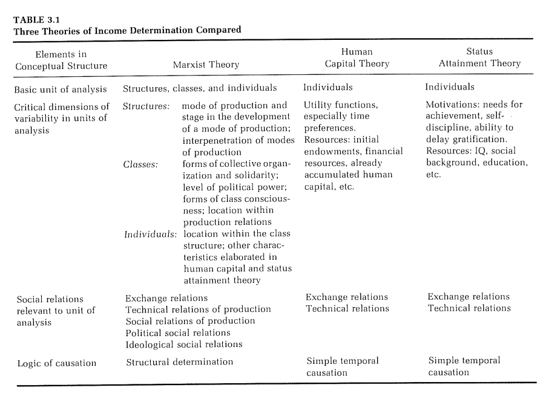

```{r setup, include=FALSE}
knitr::opts_chunk$set(echo=FALSE)
library(tidyverse)
library(broom)
```

```{r message=FALSE, warning=FALSE, include=FALSE, paged.print=FALSE}
knitr::opts_chunk$set(echo=TRUE, message=FALSE, warning=FALSE, collapse=TRUE, highlight=TRUE, paged.print=FALSE, prompt=TRUE, strip.white=FALSE, tidy = TRUE)
```

***
Este texto se basa en los siguientes materiales:

- Capítulo 7 del libro [Introduction to Modern Statistics](https://openintro-ims.netlify.app/index.html) de Mine Çetinkaya-Rundel y Johanna Hardin 
- Capítulos 5 del libro [Class Structure and Income Determination](https://drive.google.com/file/d/1_uzxqlkOmx_AG6T1uqILvNZIK9hIS4mN/view?usp=sharing) de Erik Olin Wright.
- Capitulo 3 del libro [Introduction to Statistical Learning](https://www.statlearning.com/) de Gareth James, Daniela Witten, Trevor Hastie y Rob Tibshirani

***

## Introducción: regresión múltiple para investigar la determinación de ingresos
Sobre lo que estuvimos viendo acerca de una regresión lineal simple, ahora vamos a trabajar con una familia de modelos que se llaman "regresión lineal múltiple"; es decir que vamos a tener dos o más variables predictoras. Al considerar cómo interactúan las diferentes variables explicativas, podemos descubrir relaciones complicadas entre las variables predictoras y la variable de respuesta. Un desafío para trabajar con varias variables es que a veces es difícil saber cuáles variables son las más importantes para incluir en el modelo. La construcción de modelos es un tema extenso y complicado. Aquí vamos a dar una breve introducción al tema a partir del uso del R2.
 
La regresión múltiple extiende la idea de la regresión variable de predictor único al caso que todavía tiene una respuesta pero muchos predictores (denotados $X_{1}, X_{2}, ..., X_{p}$). El método está motivado por escenarios en los que muchas variables pueden conectarse simultáneamente a una misma variable resultado.

En este caso, vamos a trabajar con problema bien clásico en las ciencias sociales: el proceso de determinación de ingresos. ¿Cuáles son las variables y los procesos que gobiernan la determinación de las remuneraciones que perciben los distintos sectores de una sociedad?

Van a poder encontrar un muy interesante resúmen teórico en el libro de E. O. Wright citado al principio. Aquí nos vamos a centrar en la cuestión de ciertas diferencias metodológicas entre tres grandes cuerpos teóricos:

- el marxismo
- la teoría del capital humano
- la teoría del "logro"

El cuadro siguiente resume las principales diferencias entre las tres posturas teóricas.



Aquí nos vamos a centrar en tres cuestiones. La primera tiene que ver con las diferencias entre las unidades de análisi: mientras que en la teoría marxista hay al menos tres -estructuras, clases e individuos-, las teorías del capital humano y del "logro" solamente cuentan a los individuos como unidades fundamentales. 

Al mismo tiempo, si observamos un poco los mecanismos de "causalidad" (nótense las comillas que ponemos a propósito) puede verse que mientras que las teorías "liberales" solo trabajan con mecanismos de causación "temporales"; en el esquema marxista (en parte debido a las diferentes unidades de análisis que juegan) vemos diferentes mecanismos de causación estructural. 

Por último, en el mecanismo de determinación de ingresos también hay diferentes campos de relaciones sociales en juego. En las teorías liberales consideran solamente cierto campo de las relaciones técnicas de producción (aquellas que determinan los procesos de trabajo calificados o no, la productividad del capital, etc.) y las relaciones de mercado (el mercado de trabajo, el "mercado" educativo, etc.). En cambio, las teorías marxistas consideran un campo más amplio de relaciones socialas: relaciones técnicas, de intercambio, relaciones de propiedad y producción, relaciones políticas, etc.

Sobre esta base, E. O. Wright va a proponer unas cuantas hipótesis acerca de las diferentes formas de determinación de ingresos en las diferentes clases. No nos vamos a detener por ahora con eso...


## Analizando de ingresos con la ENES
Hoy vamos a trabajar nuevamente con la Encuesta Nacional sobre Estructura Social, llevada adelante por el PISAC. Pueden encontrar más información [aquí](https://www.argentina.gob.ar/ciencia/pisac/bases-de-datos).

```{r}
df <- read_rds('./data/ENES_Personas_M1_EOW.rds')
```


## Variables dummies y predictores categóricos

Vamos a empezar entrenando una regresión lineal simple con una variable dummie dicotómica respecto al género. Como sabemos la ENES indaga sobre dos categorías de género (masculino y femenino) y una tercera categoría (otros). Dado que esta última presenta valores de frecuencias muy bajos, la vamos a dicotomizar.

```{r}
df <- df %>% 
   mutate(v109 = case_when(
                  v109=='Varón' ~ 'Masculino',
                  TRUE ~ 'No masculino'))

```


Hagamos la regresión:

```{r}
lm1 <- df %>% filter(estado=='Ocupado') %>% lm(v213b ~ v109, data=.)
tidy(lm1)
```

La ecuación de esta regresión sería:

$$\hat{ingr\_ocup\_ppal} = 6873.1 + -1787.8 \times genero $$

¿Cómo interpretamos esta regresión? La variable `v109` toma dos valores:

$$
 genero_{i} =
  \begin{cases}
    0       & \quad \text{si } _{i} \text{ es masculino}\\
    1       & \quad \text{si } _{i} \text{ es no masculino}
  \end{cases}
$$

Una pendiente de -1787.8 significa que las personas "no masculinas" ganan (en promedio) $1788 menos que las personas masculinas. ¿Por qué?

Ahora queremos usar otra variable categórica pero que tiene más categorías. Probemos, entonces, hacer una regresión entre  el ingreso total de la ocupación principal (`v213b`) y el nivel educativo (`nivel_ed`). Aquí estaríamos poniendo a prueba, de alguna manera,  lo que la economía neoclásica (y particularmente, la teoría del "capital humano") consideran el "retorno" a la educación.

Primero, y recordemos que la variable `nivel_ed` en la ENES tiene demasiadas categorías, vamos a agruparla en tres niveles:

- bajo: hasta primario completo
- medio hasta secundario completo
- alto: mayor a secundario completo

```{r}
df <- df %>%
   mutate(nivel_ed_agg = case_when(
     nivel_ed == 'Menores de 5 años' | 
       nivel_ed == 'Sin instrucción (incluye nunca asistió o sólo asistió a sala de 5)' |
       nivel_ed == 'Primaria/EGB incompleto' | nivel_ed == 'Primaria/EGB completo' | 
       nivel_ed == 'Educación especial' | nivel_ed == 'NS/NR'~ '0_Bajo',
     
     nivel_ed == 'Secundario/Polimodal incompleto' | 
       nivel_ed == 'Secundario/Polimodal completo' ~ '1_Medio',
     
     nivel_ed == 'Terciario incompleto' | nivel_ed == 'Terciario completo' | nivel_ed == 'Universitario incompleto' | nivel_ed == 'Universitario completo' ~ '2_Alto'
   )
   )
```


Corramos, ahora, la regresión (solamente para los ocupados):

```{r}
lm <- df %>% filter(estado=='Ocupado') %>% lm(v213b~nivel_ed_agg, data=.)
tidy(lm)
```

Como podemos ver el output de la regresión anterior muestra dos filas para dos categorías de la variable `nivel_ed_agg`. Cada fila representa la diferencia relativa para cada una de esas categorías. Sin embargo, falta una categoría: `nivel_ed_agg0_Bajo`. A esa categoría se llama "categoría de referencia" y representa el nivel por defecto contra el cual todos los otros niveles son comparados.

Podemos escribir la ecuación como si fuera un modelo de regresión (de hecho, lo es) con dos predictores

$$\hat{ingr\_ocup\_ppal} = 4535.3 + 1302.7 \times educ\_medio + 3367.7 \times nivel\_ed\_agg\_alto$$

Usamos la notación $variable_{\ nivel}$ para representar variables dummies cuando la variable categórica toma un valor particular. Por ejemplo, $nivel\_ed\_agg_{alto}$ va a tomar un valor 1 cuando el nivel educativo sea alto y cero en caso contrario. Igualmente, $nivel\_ed\_agg_{medio}$ va a tomar valor 1 cuando el registro presente un nivel educativo medio y cero si tomara cualquier otro valor.

Ahora bien, ¿cómo usamos e interpretamos este esquema de codificación? Veamos un ejemplo: vamos a calcular el ingreso promedio (usando nuestro modelo) para personas de nivel educativo bajo. Cuando el $nivel\_ed\_agg$ toma un valor "bajo", las dos variables indicadoras o dummies del modelo lineal, se setean en cero.

$$\hat{ingr\_ocup\_ppal} = 4535.3 + 1302.7 \times 0 + 3367.7 \times 0 \\
 \hat{ingr\_ocup\_ppal} = 4535.3$$

El ingreso promedio de las personas con nivel educativo bajo es de $4535.3. Esta categoría no tiene un coeficiente propio (porque no entra como variable dummy) y es la categoría de referencia, entonces, los coeficientes del resto de las categorías se "borran".

Ahora, computemos el ingreso de una persona con nivel educativo medio. Se aplica la misma lógica; solamente que ahora, el coeficente que se va a cero es el de $nivel\_ed\_agg_{alto}$

$$\hat{ingr\_ocup\_ppal} = 4535.3 + 1302.7 \times 1 + 3367.7 \times 0 \\
 \hat{ingr\_ocup\_ppal} = 5838$$
 
 El ingreso medio de la ocupación principal de las personas con nivel educativo medio es de $5961.3.
 

---

**Actividad**

Calculen el ingreso medio de las personas con nivel educativo alto

---


### Predictores con varias categorías.

Al ajustar un modelo de regresión con una variable categórica que tiene $k$ niveles o categorías donde
$k > 2$, el software proporcionará $k - 1$ de esos coeficientes. El último nivel (el que no tiene un coeficiente=) es el nivel de referencia. Los coeficientes de los demás niveles se consideran relativos a este nivel de referencia.

En este modelo, no parece haber nada demasiado contraintuitivo. Los coeficientes de los dos niveles $alto$ y $medio$ son positivos. Lo cual implica que ambos ganan más que el nivel educativo $bajo$. Y, de hecho, el coeficiente de $nivel\_ed\_agg_{alto}$ es casi 2.5 veces mayor que el de $nivel\_ed\_agg_{medio}$. Ahora bien, ¿qué otras variables podrían estar influyendo en esta relación?

## Muchos predictores en un modelo
El mundo es complejo (lo cual no quiere decir que sea ininteligible). Y los procesos de determinación del ingreso, lo son en gran medida. Pueden leer los capítulos 3 y 5 del [libro de E.O. Wright](https://drive.google.com/drive/u/0/my-drive) para un panorama más preciso que el que hemos precisado antes acerca de las diferentes teorías vinculadas al proceso de determinación de ingresos. Teniendo en cuenta este hecho, parece útil poder considerar varias variables en un modelo estadístico. 

Esta es la estrategia utilizada en la regresión múltiple. Si bien nos mantenemos cautelosos a la hora de hacer interpretaciones causales utilizando regresión múltiple en datos observacionales, dichos modelos son un primer paso común para obtener información o proporcionar alguna evidencia de una conexión causal. Por ejemplo, podemos pensar que el género, la edad, el nivel educativo y la clase social son variables que se encuentran asociadas al proceso de determinación de ingresos. A su vez, sabemos que los hogares de tamaño "grande" en general, están asociados a menores ingresos. Comencemos por estas, entonces. 

En primer lugar, vamos a agrupar un poco la variable de clase social. Si recordamos, el criterio de E. O. Wright identificaba dos clases sociales fundamentales, una clase "intermedia" y varias posiciones contradictorias de clase. Vamos a agrupar en cuatro categorías: trabajadores, empleadores, pequeña burguesía y mangers/supervisores. Una vez más, vamos a trabajar solaente con las personas ocupadas.

```{r}
df <- df %>%
  mutate(class_eow_agg = case_when(
         class_eow == 'Managers' | class_eow == 'Supervisores' ~  'Managers/superv.',
         class_eow == 'Trabajadores' ~ 'Trabajadores',
         class_eow == 'Pequeña burguesía' ~ 'Pequeña burguesía',
         class_eow == 'Inactivo, desocupado o menor' ~ 'Inactivo, desocupado o menor',
         class_eow == 'Empleadores' ~ 'Empleadores'
  ))
```


Suele ser útil, antes de estimar el modelo, escribir la ecuación correspondiente

$$
\hat{ingr\_ocup\_ppal} = \beta_{0}+ \\
                         \beta_{1} \times t\_hogar + \\
                         \beta_{2} \times edad + \\
                         \beta_{3} \times genero_{no\_masc} + \\
                         \beta_{4} \times niv\_ed\_agg_{medio} + \\
                         \beta_{5} \times niv\_ed\_agg_{alto} + \\
                         \beta_{6} \times clase\_eow\_agg_{manag\_superv} + \\
                         \beta_{7} \times clase\_eow\_agg_{peq\_burg} + \\
                         \beta_{8} \times clase\_eow\_agg_{trabaj}
$$

Esta ecuación representa un enfoque holístico para modelar todas las variables simultáneamente. Observen que hay dos coeficientes para `niv_ed_agg` y tres coeficientes para `class_eow_agg`, ya que ambas son variables categóricas de 2 y 3 niveles, respectivamente.

Calculamos $\beta_{0}, \beta_{1}, ..., \beta_{8}$ de la misma manera que hicimos en el caso de un modelo con un solo predictor. Seleccionamos valores que minimizan la suma de los cuadrados de los residuos:

$$SSE = e_{1}^2 + e_{2}^2 + ... + e_{12135}^2 = \sum_{i=1}^{12135} e_{i}^2 = \sum_{i=1}^{12135} (y_{i} -\hat{y_{i}})^2$$

dónde $y_{i}$ y $\hat{y_{i}}$ representan los ingresos de la ocupación principal y sus valores predichos  según el modelo, respectivamente. Se calculan 12.135 residuales, uno para cada observación de personas ocupadas. Es importante tener en cuenta que estos valores son estadísticos muestrales y, en el caso de que los datos observados sean una muestra aleatoria de una población objetivo sobre la que estamos interesados en hacer inferencias, son estimaciones de los parámetros de la población.. Discutiremos la inferencia basada en modelos lineales más adelante, por ahora nos centraremos en calcular estadísticas de muestra.

Por lo general, usamos una computadora para minimizar la suma de los cuadrados y calcular las estimaciones puntuales:

```{r}
lm2 <- df %>% filter(estado == 'Ocupado') %>% lm(v213b ~ t_hogar +  v108 + v109 + nivel_ed_agg + class_eow_agg, data=.)

tidy(lm2)
```


Si contamos el número de coeficientes predictores, obtenemos el número efectivo de predictores en el modelo; hay 8 predictores "efectivos". Es importante notar que los predictores categóricos cuentan de forma diferente: la variable `v109` (género) supone introducir un predictor efectivo, dado que es dicotómica. En cambio, `nivel_ed_agg` y `clase_eow_agg` introducen dos y 3 predictores efectivos, respectivamente: uno  cada uno de los dos niveles que se muestran en el modelo. En general, un predictor categórico con $p$ diferentes niveles estarán representados por $p - 1$ términos en un modelo de regresión múltiple. Calculamos un coeficiente de pendiente de 0,74 para la quiebra en la Sección 8.1, mientras que aquí el coeficiente es de 0,39. ¿Por qué hay una diferencia entre los valores de los coeficientes entre los modelos con predictor único y múltiple?

Si examináramos los datos cuidadosamente, veríamos algunas diferencias con el caso de la regresión lineal simple. Por ejemplo, cuando modelamos la relación del entre el ingreso laboral y el género (al principio de la clase) vimos que el $\beta_{1}$ (la pendiente) era de \$-1787.8. Ahora, en este nuevo modelo más completo pasó a ser \$-2181.8. ¿Por qué hay una diferencia entre los valores de los coeficientes entre los modelos con predictor único y múltiple?

En nuestro primer modelo (simple) no pudimos controlar otras variables que pueden estar afectando el ingreso como por ejemplo, el nivel educativo o la clase social y muchas otras. Ese modelo original se construyó "en un vacío" y no consideró el contexto completo de todas las otras muchas variables y determinaciones que afectan el nivel de ingresos de una persona. Cuando incluimos otras variables, se reduce ese sesgo subyacente e involuntario. Por supuesto, el sesgo aún puede existir debido a otras variables de confusión.

---

**Para discutir...**

¿Qué variables relevantes podríamos estar dejando afuera de este modelo?

---

**Actividad**
- Cuántas variables conceptuales hay en este modelo?
- Armar la ecuación completa del modelo
- Interpretar el coeficiente de la variable `t_hogar` (tamaño del hogar) 
- Calcular el residual de la primera observacion del dataset

---


---

### Regresión lineal múltiple
Un modelo de regresión lineal múltiple es un modelo lineal con muchos predictores. En general, podemos escribir el modelo como

$$\hat{y_{i}} =  \beta_{0} + \beta_{1} X_{1} + \beta_{2} X_{2} + ... + \beta_{k} X_{k}$$

donde hay $k$ predictores. Siempre vamos a calcular los $\beta_{i}$ mediante algún software.

---

---

**Actividades**

- Interprete el coeficiente asociado a la variable edad (`v108`) y a la variable tamaño del hogar (`t_hogar`).
- Computar el residuo de la primera observación del dataset usando el modelo completo

---


## R2 ajustado
Ya hemos usamos R2 en el contexto de una regresión simple para determinar la cantidad de variabilidad en la respuesta explicada por el modelo:

$$R^2 = 1 - \frac{variabilidad\ en\ residuos}{variabilidad\ en\ variable\ dependiente} = 1 - \frac{Var(e_{i})}{Var(y_{i})}$$

donde $e_{i}$ representa los residuos del modelo e $y_{i}$ los valores observados. Esta relación sigue siendo válida en el marco de regresión múltiple, pero una pequeña mejora puede hacerla aún más informativa al comparar modelos.

Esta estrategia para estimar R2 es aceptable cuando hay una sola variable. Sin embargo, se vuelve menos útil cuando hay muchas variables. El R2 "común" es una estimación sesgada de la cantidad de variabilidad explicada por el modelo cuando se aplica a un modelo con más de un predictor. Para obtener una mejor estimación, usamos el R2 ajustado.


---

### Fórmula para R2 ajustado

$$R^2 = 1 - \frac{s^2_{residuos} / (n-k-1)}{s^2_{var\_depend} / (n-1)} \\
      = 1 - \frac{s^2_{residuos}}{s^2_{var\_depend}} \times \frac{n-1}{n-k-1}$$
      
      
dónde $n$ es el número de observaciones utilizadas para ajustar el modelo y $k$ es el número de variables predictoras en el modelo. Recuerden que un predictor categórico con $p$ niveles o categorías va a agregar $p − 1$ varables al modelo.  

---

Dado que $k$ nunca es negativo, el R2 ajustado siempre será más pequeño, a menudo un poco más pequeño, que el R2 no ajustado. El razonamiento está en los grados de libertad asociados con cada varianza, que es igual a $n − k − 1$ en el contexto de la regresión múltiple. Si tuviéramos que hacer predicciones para nuevos datos usando nuestro modelo actual, encontraríamos que el R2 tendería a ser un poco demasiado optimista, mientras que el ajustado R2 fórmula ayuda a corregir este sesgo.


---

**Actividad**

Supongamos que agregamos otro predictor al modelo, pero la varianza de los errores $Var(e_{i})$ no baja. ¿Qué pasaría con el R2 sin ajustar? ¿Qué pasaría con el R2 ajustado?


---

También podríamos haber usado el R2 ajustado cuando trabajamos con una regresión de un solo predictor. Sin embargo, cuando sólo hay $k = 1$ predictores, R2 ajustado suele estar muy cerca del R2 sin ajustar, por lo que este matiz no suele ser importante cuando el modelo solo tiene un predictor.
