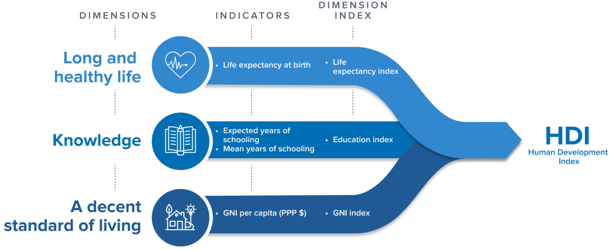

```{r setup, include=FALSE}
knitr::opts_chunk$set(echo=FALSE)
library(tidyverse)
library(broom)
library(leaps)
library(car)
```

```{r message=FALSE, warning=FALSE, include=FALSE, paged.print=FALSE}
knitr::opts_chunk$set(echo=TRUE, message=FALSE, warning=FALSE, collapse=TRUE, highlight=TRUE, paged.print=FALSE, prompt=TRUE, strip.white=FALSE, tidy = TRUE)
```

## Introducción
Vamos a trabajar con dos set de datos. El primero, es un dataset (`.wb_bank_data_2019.csv`) con información construida por el Banco Mundial acerca de la distribución de la población ocupada según grandes sectores de actividad y categoría ocupacional:

- `SL.AGR.EMPL.ZS`: % total el empleo en agricultura: consistente en las actividades de agricultura, silvicultura, caza y pesca  
- `SL.IND.EMPL.ZS`: % total de empleo en industria:  en actividades de minas y canteras, manufacturas, construcción y energía, gas y agua.
- `SL.SERV.EMPL.ZS` % total de empleo el servicios comprende comercio al por mayor y menor y restaurantes y hoteles, transporte, almacenamiento y comunicaciones, finanzas, seguros, servicios inmobiliarios y a las empresas y servicios personales, sociales y comunales.
- `SL.FAM.WORK.ZS`: % total de trabajadores familiares
- `SL.EMP.MPYR.ZS`: % total de empleadores  
- `SL.EMP.SELF.ZS`: % total de independientes (cuenta propias)
- `SL.EMP.WORK.ZS`: % total de trabajadores asalariados


El segundo (`HDI_HDR2020_040722.csv`) son las componentes del Human Development Index (HDI) elaborado por UNDP para el período 1992-2019. El HDI es un promedio a nivel país de cuatro variables fundamentales:



En el dataset va a encontrarlas llamadas de la siguiente forma:
- `le_2019`: expectativa de vida al nacer de la población
- `eys_2019`: años "esperados" de escolaridad de la población
- `mys_2019`: años promedios de escolaridad
- `gnipc_2019`: producto bruto interno per cápita
- `hdi_2019`: HDI para el país

En ambos datasets van a encontrar los códigos de país (`iso3c`) y las etiquetas de país (`country`)

## Preprocesamiento
### Consigna 1.
Cargue los dos datasets. ¿Cuál es la estructura de los datos? ¿Qué formato tienen? ¿Cuál es la unidad de análisis y cuáles las variables? ¿Cuál es el alcance temporal y geográfico?

```{r}
###
```

### Consigna 2.
Seleccione del dataset del HDI solamente las columnas que corresponden al año 2019.
```{r}
###
```


### Consigna 3. 
Con el dataset recortado, realice un join para tener todas las variables en una sola tabla. ¿Qué variable debería usar para vincular ambas tablas?

```{r}
###
```


## Análisis descriptivo
### Consigna 4. 
'¿Qué relacion existe (si es que existe) entre el HDI y la proporción de población asalariada? ¿Y entre el HDI y la proporción de población?

## Modelo de regresión lineal múltiple
### Consigna 5
Queremos construir información sobre la relación entre el PBI per cápita (`gnipc_2019`) y variables relativas a la educación, a la salud y al grado de desarrollo capitalista del país. Entrenar una regresión lineal múltiple con las variables que considere relevantes. 
```{r}
###
```


## Análisis de supuestos del modelo
### Consigna 6.
Chequeen los residuos del modelo. ¿Qué herramienta gráfica pueden usar para eso? ¿Son aleatorios?
```{r}
###
```

### Consigna 7.
Realicen un histograma de los residuos. ¿Qué forma tienen?
```{r}
###
```

### Consigna 8.
¿Parece que la condición de variabilidad constante del modelo es respectada? ¿Por qué?
```{r}
###
```

## Análisis de resultados
### Consigna 9. 
¿Cuál es el ajuste del modelo?
```{r}
###
```

### Consigna 10. 
¿Cómo interpreta los resultados del modelo? ¿Cuál es, en su opinion, la variable más importante? 
```{r}
###
```


```{r}
hdi <- read_csv('../clase4/data/HDI_HDR2020_040722.csv')
        
hdi <- hdi %>%
        select(iso3c, country, contains("_2019"))

df <- read_csv('../clase4/data/wb_bank_data_2019.csv') %>%
     pivot_wider(id_cols = c(iso3c, iso2c, country), names_from = indicatorID, values_from = value)


hdi <- hdi  %>%
    left_join(df) %>%
        drop_na() %>%
        mutate(rel_salariales = SL.EMP.WORK.ZS + SL.EMP.MPYR.ZS)

hdi_model <- hdi %>%
                select(iso3c, country, hdi_2019:gnipc_2019, SL.AGR.EMPL.ZS, SL.SRV.EMPL.ZS, rel_salariales)

```


```{r}
model_scaled <- hdi_model %>% 
        mutate(across(hdi_2019:rel_salariales, scale)) %>%
        lm(gnipc_2019 ~ . -iso3c -country -hdi_2019, data=.)

model_unscaled <- hdi_model %>% 
        lm(gnipc_2019 ~ . -iso3c -country -hdi_2019, data=.)
```


```{r}
summary(model_scaled)
```

