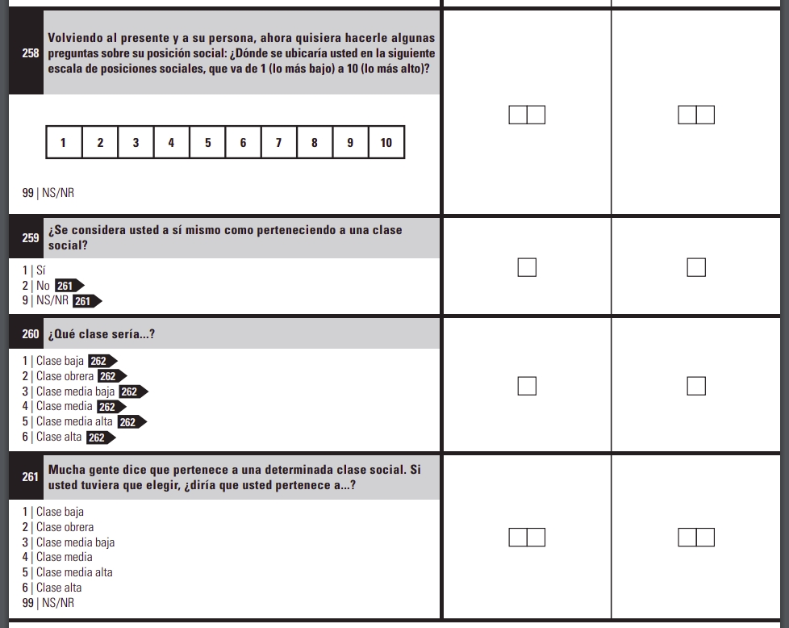

```{r setup, include=FALSE}
knitr::opts_chunk$set(echo = TRUE)
```

```{r message=FALSE, warning=FALSE, include=FALSE, paged.print=FALSE}
knitr::opts_chunk$set(echo=TRUE, message=FALSE, warning=FALSE, collapse=TRUE, highlight=TRUE, paged.print=FALSE, prompt=TRUE, strip.white=FALSE, tidy = TRUE)
```


```{r}
library(tidyverse)
library(broom)
library(car)
```
## Introducción 
La idea de este notebook es hacer un ejercicio integrador de los diferentes temas que estuvimos viendo de regresión logística. Para ello, vamos a seguir trabajando con la base de la ENES y nos vamos a seguir preguntando por la autopercepción de clase. La propuesta es que avancen en las siguientes consignas.

Veamos la forma en que está abordada el problema de la autopercepción de clase:



### ¿Cómo se pregunta acerca de la autopercepción?


### Cargamos los datos
```{r}
psh_cony <- read_rds('./data/ENES_psh_cony.rds')
```

Tal y como hicimos la semana pasada, tenemos que recodificar las variables de percecpión de clase `MS_v260` y `MS_v261` a una sola variable que vamos a llamar `percep_clase` y luego a esta, dicotomizarla. A su vez, vamos a tratar de replicar el esquema que utilizó Rodolfo Elbert en [este artículo](https://www.jstor.org/stable/j.ctv1gn3t2q.8#metadata_info_tab_contents). Allí, realizó una desagregación de los trabajadores por cuenta propia en dos categorías: 

- informales: aquellos TCP que trabajan en tareas no calificadas y operativas
- pequeña burguesía formal: aquellos TCP que trabajan en tareas profesionales y técnicas

Dado que de esta forma, quedan muy pocos casos en la cateogría "Pequeña burguesía", la vamos a unificar con la categoría de "Empleadores" bajo el rótulo: "Clases propietarias".

```{r}
psh_cony <- psh_cony %>%
  mutate(
    v109 = if_else(v109 == 'Varón', 'Masculino', 'No masculino'),
    percep_clase = case_when(
           !is.na(MS_v260) ~ MS_v260,
           is.na(MS_v260) ~ MS_v261
           )
    )

psh_cony <- psh_cony %>%
  mutate(
    salud = case_when(
      v134a %in% c("Obra social", "Prepaga", "Prepaga a través de Obra Social") ~ 'Tiene cobertura',
      TRUE ~  'No tiene cobertura'
      ),
    
    percep_obrera = as.factor(case_when(
            percep_clase == 'Clase baja' | percep_clase == 'Clase obrera' ~ 'Obrera',
            is.na(percep_clase) ~ NA_character_,
            TRUE ~ 'Media y alta')),
    
    percep_obrera_orig = as.factor(case_when(
            MS_v260 == 'Clase baja' | MS_v260 == 'Clase obrera' ~ 'Obrera',
            is.na(MS_v260) ~ NA_character_,
            TRUE ~ 'No obrera')),
    CNO_calif_agg = case_when(
           CNO_calif == 'Profesional' | CNO_calif == 'Técnica' ~ 'Prof./técn',
           CNO_calif == 'Operativa' | CNO_calif == 'No calificada' ~ 'Op./no calif.',
         ),
    nivel_ed_agg = case_when(
                  nivel_ed == 'Menores de 5 años' | 
                  nivel_ed == 'Sin instrucción (incluye nunca asistió o sólo asistió a sala de 5)' |
                  nivel_ed == 'Primaria/EGB incompleto' | 
                  nivel_ed == 'Primaria/EGB completo' |
                  nivel_ed == 'Educación especial' | nivel_ed == 'NS/NR'~ '0_Bajo',
     
                nivel_ed == 'Secundario/Polimodal incompleto' | 
                nivel_ed == 'Secundario/Polimodal completo' ~ '1_Medio',
    
                nivel_ed == 'Terciario incompleto' | 
                nivel_ed == 'Terciario completo' |
                nivel_ed == 'Universitario incompleto' | 
                nivel_ed == 'Universitario completo' ~ '2_Alto'),
         
         class_eow_agg = case_when(
         EOW_class == 'Managers' | EOW_class == 'Supervisores' ~ 'Manag./superv.',
         EOW_class == 'Trabajadores' ~ 'Trabajadores',
         EOW_class == 'Pequeña burguesía' & CNO_calif_agg == 'Prof./técn' ~ 'Propietarias',
         EOW_class == 'Pequeña burguesía' & CNO_calif_agg == 'Op./no calif.' ~ 'TCP informales',
         
         EOW_class == 'Empleadores' ~ 'Propietarias'),
   )

```


### ¿Hay consistencia entre la autopercepción medida como "una escalera" (pregunta 258) y la autopercepción de clase? ¿Cómo abordarían este problema técnicamente? ¿Cómo podrían plantearlo en términos de una regresión logística?

Primero dicotomizamos la variable `MS_v258`
```{r}
psh_cony <- psh_cony %>%
  mutate(percep_escalera = as.factor(case_when(MS_v258 %in% c(6:10) ~ '0_Alta',
                                     is.na(MS_v258) ~ NA_character_,
                                     TRUE ~ '1_Baja'))
         )
```

Luego, podemos intentar una regresión logística tomando como variable dependiente la "percepcion_escalera" y como independiente la percepción obrera.

```{r}
glm1 <- psh_cony %>%
          glm(percep_escalera ~percep_obrera, data=., family='binomial')

summary(glm1)
```

### ¿Qué otras variables podrían estar influyendo en la "percepción escalera"? Piensen al menos 3 variables concpetuales (una de las cuales debe ser cuantitativa) y estimen otro modelo de regresión logística.

```{r}
glm2 <- psh_cony %>%
          glm(percep_escalera ~ class_eow_agg + v109 + v111 + v108, data=., family='binomial')

summary(glm2)
```

### Interpreten el modelo.
#### ¿Qué relación existe entre las variables independientes y la variable dependiente?
```{r}
###
```

#### Piensen dos perfiles hipotéticos de personas (en función de las variables que definieron) y simulen las probabilidades de percibirse como escala "baja". Por ejemplo: una persona de posición de clase objetiva trabajadora, de nivel educativo bajo, masculino, PSH del hogar y de 25 años.

Pista: Van a tener que usar la función `predict`. Revisen el notebook de la semana pasada
```{r}

tibble(class_eow_agg = "Trabajadores",
       v109 = "Masculino",
       v111 =  "PSH",
       v108 = 25) %>%
        predict(glm2, ., type="response")


```

#### ¿Qué relación existe entre la edad y la autopercepción en escalera?
Pista: elijan un perfil y hagan variar la edad a lo largo de ese perfil. Luego, van a tener que usar de nuevo `predict`.
```{r}

tibble(class_eow_agg = rep("Trabajadores", 62),
       v109 = rep("Masculino", 62),
       v111 =  rep("PSH", 62),
       v108 = 14:75) %>%
        mutate(proba = predict(glm2, ., type="response")) %>%
        ggplot() + 
                geom_line(aes(x=v108, y=proba)) + 
                ylim(0,1)+
                theme_minimal()

```


```{r}

class_eow_agg <-  c("Manag./superv.", "Trabajadores", "Propietarias", "TCP informales")
v109 <- c("Masculino", "No masculino")
v111 <- c("PSH", "Cónyuge")
v108 <- 14:75

expand_grid(class_eow_agg, v109, v111, v108) %>%
        mutate(proba = predict(glm2, ., type="response"))

```


### ¿Es "mejor" este modelo que el que estimamos la clase anterior? Introducción a la evaluación de modelos de regresión logística

Esta pregunta nos lleva a pensar, entre otras cosas, en términos del "ajuste" del modelo. Esto supone que vamos a tener que comparar las predicciones del modelo con los valores observados respecto a la percepción de clase en escalera y a la percepción de clase obrera. Pero el problema que tenemos acá es que los valores observados son cualitativos y discretos, mientras que el modelo nos devuelve probabilidades (o sea, un valor continuo y numérico).

Entonces, de alguna forma, tenemos que transformar el output del modelo (cuantitativo) a una categoría. Pero dado que la regresión logística nos devuelve la probabilidad de ocurrencia del fenómeno ($P(y=1 | X)$) podemos establecer un criterio. En nuestro caso, si la probabilidad de que la persona tenga una percepción escalera "alta" es mayor a 0.5, vamos a considerar que tiene una percepcion "alta"; en cambio, si la probabilidad es 0.5 o menos vamos a considerar que tiene una probabilidad no alta o "baja". 

Vamos a crear una tibble que tenga 

- los valores de las probabildades predichas por el modelo
- las clases predichas por el modelo (calculando con la regla anterior)
- los valores observados

```{r}
eval_model <- tibble(
  y_probs = predict(glm2, psh_cony, 'response'), #probabildades predichas por el modelo
  y_preds = if_else(y_probs >= 0.5, '0_Alta', '1_Baja'), # valores predichos
  y_obs = psh_cony$percep_escalera # valores observados
) %>%
  drop_na()

eval_model
```

Una forma natural de evaluar un modelo de regresión logística (y cualquier modelo que haga predicciones de variables cualitativas) es cuantifiar la cantidad de casos "bien clasificados" es decir, los casos en que el modelo y realidad coinciden. 

Para esto, suele ser muy útil hacer una tabulación cruzada entre ambas variables (valores observados y predichos). A la misma se la llama "matriz de confusión".

```{r}
eval_model %>%
  group_by(y_obs, y_preds) %>%
  summarise(n=n()) %>%
  pivot_wider(id_cols=y_obs,
              values_from=n,
              names_from=y_preds) 
```

En general, cada casilla de esta matriz tiene un nombre:

- TP (verdaderos positivos): el modelo y realidad clasifican a los casos como "positivos" (en nuestro caso, son 1219)
- TN (verdaderos negativos): modelo y realidad coinciden que los casos son negativos (aquí son 3586)
- FP (falsos positivos): El valor real es negativo, y el modelo predijo  que el resultado es positivo. La persona no se percibe como "baja" sin embargo, el modelo nos dice de manera incorrecta que sí. En nuestro caso, serían ¿cuántos?
- FN  (falsos negativos): el valor real es positivo, y el modelo prueba predijo  que el resultado es negativo. La persona se percibe como "baja" sin embargo, el modelo nos dice de manera incorrecta que no se percibe como tal. Esto es lo que en estadística se conoce como error tipo II. ¿Cuántos son en nuestro caso?

Entonces, los casos correctamente clasificados o "accuracy" se calculan como:

$$Acc = \frac{TP + TN}{TP + TN + FP + FN} = \frac{3586+1219}{3586+1219 + 4633 + 1585} = \frac{4805}{11026} = 0.4359$$


Podemos calcular esto bien rápido haciendo:

```{r}
mean(eval_model$y_obs == eval_model$y_preds )
```

Pero también podemos pensar en otras dos métricas (entre muchas otras):

- **Precision:** Es la proporción de verdaderos positivos dividido entre todos los resultados positivos (tanto verdaderos positivos, como falsos positivos). En forma práctica es  el porcentaje de casos positivos detectados.

$$Prec = \frac{TP}{TP + FP}$$

- **Recall:** También se conoce como Tasa de Verdaderos Positivos (True Positive Rate) ó TP. Es la proporción de casos positivos que fueron correctamente identificadas por el algoritmo.

$$Recall = \frac{TP}{TP + FN}$$

### Calcular precision y recall para este modelo
```{r}
###
```


### Repitan el modelo que entrenamos la semana pasada (con percepción obrera como variable dependiente) y comparen e interpreten la accuracy de cada modelo
```{r}
glm3 <- psh_cony %>%
    filter(estado == 'Ocupado') %>%
    glm(percep_obrera ~ class_eow_agg + v109 + v111 + v108 + nivel_ed_agg , data=., family='binomial')

tidy(glm3)
```

```{r}
eval_model_obrera <- tibble(
  y_probs = predict(glm3, psh_cony, 'response'), #probabildades predichas por el modelo
  y_preds = if_else(y_probs > 0.5, 'Media y alta', 'Obrera'), # valores predichos
  y_obs = psh_cony$percep_obrera # valores observados
) %>%
  drop_na()

eval_model_obrera
```

```{r}
eval_model_obrera %>%
  group_by(y_obs, y_preds) %>%
  summarise(n=n()) %>%
  pivot_wider(id_cols=y_obs,
              values_from=n,
              names_from=y_preds) 
```

