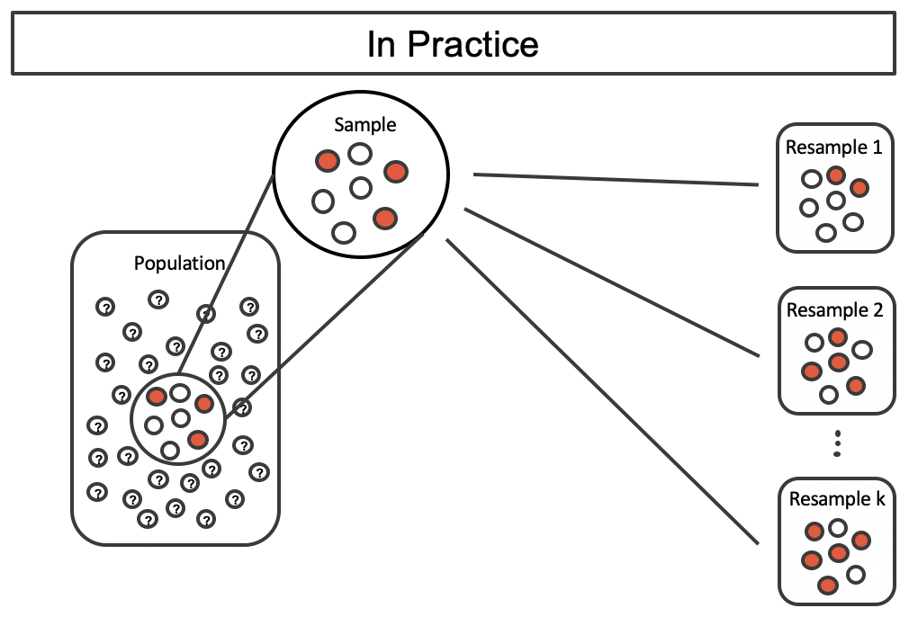

```{r setup, include=FALSE}
knitr::opts_chunk$set(echo = TRUE)
```

```{r message=FALSE, warning=FALSE, include=FALSE, paged.print=FALSE}
knitr::opts_chunk$set(echo=TRUE, message=FALSE, warning=FALSE, collapse=TRUE, highlight=TRUE, paged.print=FALSE, prompt=TRUE, strip.white=FALSE, tidy = TRUE)
```

***
Este texto se basa en los siguientes materiales:

- Capítulos 24 del libro [Introduction to Modern Statistics](https://openintro-ims.netlify.app/index.html) de Mine Çetinkaya-Rundel y Johanna Hardin 
- Capitulo 4 del libro [Introduction to Statistical Learning](https://www.statlearning.com/) de Gareth James, Daniela Witten, Trevor Hastie y Rob Tibshirani

***

```{r}
library(tidyverse)
library(broom)
library(car)
library(patchwork)

```
## Introducción 
Ahora unimos ideas de análisis inferenciales con los modelos descriptivos (regresión lineal y logística). En particular, usaremos la línea de regresión de mínimos cuadrados para probar si existe una relación entre dos variables continuas. Además, construiremos intervalos de confianza que cuantifican la pendiente de la línea de regresión lineal. La idea ahora ahora es predecir una variable de respuesta numérica (para modelos lineales) o una variable de respuesta binaria (para modelos logísticos). Vamos a seguir haciendo preguntas sobre la variabilidad del modelo de una muestra a otra. 

Muchas de las ideas inferenciales son notablemente similares a las cubiertas en la materia del cuatrimestre pasado. Los supuestos de los modelos lineales suelen evaluarse gráficamente, aunque la independencia de las observaciones sigue siendo de suma importancia.

En general, nos vamos a encontrar que estamos trabajando con datos muestrales. Esto quiere decir que nos vamos a encontrar con el bendito error muestral. Dicho de una forma simple: ya sabemos que la muestra que obtuvimos es solamente una de las muchas muestras posibles. Por lo tanto, todos los estadísticos y métricas que derivemos de esta única muestra 

En la materia anterior, trabajamos con esta idea para promedios, proporciones y tests de asociación entre variables. Pero el mismo razonamiento aplica a un modelo de regresión (o cualquier otro modelo). Así, los $\hat{\beta_{k}}$ de un modelo de regresión lineal son solamente estimaciones puntuales de los verderos $\beta_{k}$ poblacionales. Por lo tanto, va a ser necesario que generemos información sobre el error muestral. Vamos a hacerlo mediante dos instrumentos:

- intervalos de confianza
- pruebas de hipótesis

## Boostrap para IC de la pendiente
Como hemos visto en capítulos anteriores, podemos usar bootstrapping para estimar la distribución muestral del  estadístico de interés (aquí, la pendiente o $\beta_{i}$) sin la suposición nula de no relación. Debido a que nuestro interés está en crear un intervalo de confianza, estrictamente hablando, no hay una hipótesis nula.

Volvamos a nuestro caso inicial. ¿Es la altura un buen predictor del peso?


```{r}
df <- read_csv('./data/pesos.csv')


df <- df %>%
        mutate(male = as.factor(case_when(male == 0 ~ "No", TRUE ~ "Yes")))

df_mayores <- df %>%
        filter(age >= 18)


df_mayores %>% 
        ggplot(aes(x = height, y = weight)) + 
        geom_point() +
        geom_smooth(method = "lm", se = FALSE) + 
        theme_minimal()

```

Volvamos a nuestra regresión de la primera clase:

```{r}
lm <- lm(weight ~ height, data = df_mayores)
tidy(lm)
```


### Variabilidad del estadístico
Vamos a aplicar boostrap para aproximarnos a la variablidad del estadístico de interés que, en este caso, es la pendiente de la recta $\beta_{1}$. Vamos a remuestrear 352 observaciones con reemplazo. Recuerde que con boostrap, la nueva muestra siempre tiene la misma cantidad de observaciones que el conjunto de datos original para imitar el proceso de tomar una muestra de la población. Al muestrear en el caso del modelo lineal, considere cada observación como un solo punto. 

```{r}
set.seed(16)
df_mayores %>% 
        ggplot(aes(x = height, y = weight)) + 
        geom_point() +
        geom_smooth(method = "lm", se = FALSE) +
        xlim(130,180) + 
        theme_minimal() + 
        labs(title='Datos originales') +
        
df_mayores %>%
        sample_n(352, replace=TRUE) %>%
        ggplot(aes(x = height, y = weight)) + 
        geom_point() +
        geom_smooth(method = "lm", se = FALSE) + 
        xlim(130,180) + 
        theme_minimal() +
        labs(title='Datos remuestreados')
        
```

Podemos ver entonces que existen algunos puntos que se repiten en el remuestreo pero que, en realidad, muchos puntos no. Como resultado las pendientes de las dos rectas son diferentes. Recordemos brevemente la lógica del bootstrap:



- En general, partíamos de una muestra de la población.
- Luego, extraíamos una serie de remuestras aletaorias de esa muestra original con reemplazo y del mismo tamaño (n) que la muestra original
- Para cada remuestra, calculábamos el estadístico en cuestión (media, mediana, etc.)
- Finalmente, con cada estadístico de cada remuestra teníamos una aproximación a la distribución muestral de ese estadístico lo que nos habilitaba a hacer inferencias.

La idea general es la misma en este caso, solamente que, en lugar de calcular para cada remuestra una media, vamos a

- estimar una regresión
- extraer sus $\beta$.

Si generamos muchas remuestras, vamos a poder generar muchas pendientes y, por ende, muchas rectas diferentes.

```{r message=FALSE, warning=FALSE}
b <- ggplot()

for(i in 1:200){
      s <- df_mayores %>%
        slice_sample(n=352, replace=TRUE)
      
      b <- b + 
              geom_smooth(aes(x = height, y = weight), size=0.1, alpha=0.1, data=s, method="lm", se=FALSE) +
              theme_minimal()

}
print(b)
```

Se toman 200 remuestras de tamaño 352 de los datos originales. Cada uno de los modelos lineales estimados en cada una de las muestras bootstrap es ligeramente diferente.

Pero antes de eso... vamos a introducir una herramienta que va a ser sumamente útil. Los "loops".

Ok. Ya vimos que es un `for` loop. Vamos a usarlo para hacer bootstrap.

Recordemos que para crear un intervalo de confianza, necesitamos encontrar el rango de valores que toma el estadístico en cada una de las remuestras bootstrap. En nuestro caso es la pendiente de la recta (aquí la pendiente).

```{r}
cc1 <- tibble()

for (i in seq_along(1:2000)){
        c <- df_mayores %>%
                slice_sample(n=352, replace=TRUE) %>%
                lm(weight ~ height, data = .) %>%
                coef(.) %>%
                as_tibble_row() %>%
                mutate(id_sample = i)
        
        cc1 <- cc1 %>%
                bind_rows(c)
}
```

¿Qué hace el código anterior?

- En primer lugar, define el `output` donde vamos a guardar los resultados de la iteración. `cc1 <- tibble()` una tibble vacía, llamada `cc1`.
- Luego, genera un loop a partir de una secuencia que va de 1 a 2000 `for (i in seq_along(1:2000))`. En este caso, usamos el loop para repetir muchas veces una misma operación.
- Este es el pedazo de código más complejo. Vamos a dividirlo:

- `c <- df_mayores %>% slice_sample(n=352, replace=TRUE) %>%`: extrae una muestra con reposición del dataset original
- `lm(weight ~ height, data = .) %>%`: entrena un modelo de regresión sobre la remuestra
- `coef(.) %>%` extrae los $\beta_{k}$ de la regresión
- `as_tibble_row() %>%`: los transforma en una tibble
- `mutate(id_sample = i)` le agrega una columna con el número de muestra
- Los coeficientes beta quedan guardados en el objeto `c`.
- El último renglón, agrega `c` en la tibble `cc1`

Bien... ahora grafiquemos un histograma con todos los valores que obtuvimos de $\beta_{1}$, es decir, del "efecto" del peso sobre la altura.

```{r}
cc1 %>%
        ggplot(aes(x=height)) +
                geom_histogram(color='white') + 
                geom_vline(xintercept = quantile(cc1$height, probs=0.025), linetype="dashed") +
                geom_vline(xintercept = quantile(cc1$height, probs=0.975), linetype="dashed") +  
                theme_minimal()
```

La figura anteruir es un histograma de cada una de las pendientes en cuestión. Podemos ver que un intervalo de percentil de bootstrap del 95 % para la verdadera pendiente de la población está dado por (0.0569, 0.6874). 
En el código siguiente, calculamos los límites de los intervalos:
 
```{r}
cc1 %>%
  pivot_longer(cols=-id_sample) %>%
  group_by(name) %>%
  summarise(lim_inf = quantile(value, probs=0.025),
            lim_sup = quantile(value, probs=0.975))
```

Estamos 95% seguros de que para el modelo que describe la población en cuestión, un aumento de 1 kg en el peso promedio estará asociado con un aumento de entre 0.0569 kg. y 0.6874 kg. en la altura media. Como puede verse, el IC no se solapa con el cero.

Ahora, probemos la siguiente variable del dataset: `age_mother` que se refiere a la edad de la madre del sujeto en cuestión. ¿Es un buen predictor del peso de la persona? Veamos.

```{r}
cc2 <- tibble()
set.seed(123)
for (i in seq_along(1:2000)){
        c <- df_mayores %>%
                slice_sample(n=352, replace=TRUE) %>%
                lm(weight ~ age_mother, data = .) %>%
                coef(.) %>%
                as_tibble_row() %>%
                mutate(id_sample = i)
        
        cc2 <- cc2 %>%
                bind_rows(c)
}
        
cc2 %>%
        ggplot(aes(x=age_mother)) +
                geom_histogram(color='white') + 
                geom_vline(xintercept = quantile(cc2$age_mother, probs=0.025), linetype="dashed") +
                geom_vline(xintercept = quantile(cc2$age_mother, probs=0.975), linetype="dashed") +  
                theme_minimal()
```

---

*Actividad*
- Calculen los límites exactos del intervalo de confianza para `age_mother`

```{r}
###
```

- ¿Qué pueden decir de la relación entre edad de la madre y peso de la persona?

---


Ahora, hagamos una regresión múltiple e introduzcamos las dos variables.

```{r}
cc3 <- tibble()
set.seed(123)
for (i in (1:1000)){
        c <- df_mayores %>%
                slice_sample(n=352, replace=TRUE) %>%
                lm(weight ~ height + age_mother, data = .) %>%
                coef(.) %>%
                as_tibble_row() %>%
                mutate(id_sample = i)
        
        cc3 <- cc3 %>%
                bind_rows(c)
}
cc3 %>%
        ggplot(aes(x=height)) +
                geom_histogram(color='white') + 
                geom_vline(xintercept = quantile(cc3$height, probs=0.025), linetype="dashed") +
                geom_vline(xintercept = quantile(cc3$height, probs=0.975), linetype="dashed") +  
                labs(title='Distribución bootstrap `height`') +
                theme_minimal() +

cc3 %>%
        ggplot(aes(x=age_mother)) +
                geom_histogram(color='white') + 
                geom_vline(xintercept = quantile(cc3$age_mother, probs=0.025), linetype="dashed") +
                geom_vline(xintercept = quantile(cc3$age_mother, probs=0.975), linetype="dashed") +  
                labs(title='Distribución bootstrap `age_mother`') +
                theme_minimal()
```

Veamos los intervalos:

```{r}
cc3 %>%
  pivot_longer(cols=-id_sample) %>%
  group_by(name) %>%
  summarise(lim_inf = quantile(value, probs=0.025),
            lim_sup = quantile(value, probs=0.975))
```

---

*Actividad*
¿Qué pueden decir de estos resultados?

---

## Modelo matemático para hacer inferencia sobre la pendiente
Cuando se aplican ciertas condiciones técnicas, es conveniente utilizar aproximaciones matemáticas para probar y estimar el parámetro de pendiente. Las aproximaciones se basarán en la distribución t. El modelo matemático suele ser correcto y, por lo general, es fácil de implementar computacionalmente. 

En esta sección, analizamos la incertidumbre en las estimaciones de la pendiente y el intercepto en y para una línea de regresión. Así como identificamos los errores estándar para las estimaciones puntuales en capítulos anteriores, primero analizamos los errores estándar para estas nuevas estimaciones.

```{r}
df_mayores %>% 
        ggplot(aes(x = height, y = age_mother)) + 
        geom_point() +
        geom_smooth(method = "lm", se = FALSE) +
        xlim(130,180) + 
        theme_minimal()
```

Hay una pendiente negativa en la línea que se muestra en la figura anterior. Sin embargo, esta pendiente (y la intersección con el eje y) es solamente una estimación de los valores de los parámetros. Podríamos preguntarnos, ¿es esta evidencia convincente de que el modelo lineal "verdadero" tiene una pendiente negativa? Es decir, ¿los datos brindan evidencia sólida de que la edad de la madre tiene influencia sobre el peso de las personas? Podemos enmarcar esta investigación en una prueba de hipótesis estadística:

- $H_O: \beta_{1} = 0$ El valor real de la pendiente es diferente a cero
- $H_A: \beta_{1} \neq 0$ El valor real de la pendiente es cero

Rechazaríamos $H_O$ a favor de $H_A$ si los datos proporcionan una fuerte evidencia de que el parámetro de pendiente real es diferente de cero. Para evaluar las hipótesis, identificamos un error estándar para la estimación, calculamos un estadístico de prueba apropiado e identificamos el p-valor.

### Variabilidad de la estadística
Al igual que otras estimaciones puntuales que hemos visto antes, podemos calcular un error estándar y una estadística de prueba para $\beta_{1}$. Generalmente etiquetaremos el estadístico de prueba usando un estadistico $T$ que sigue una distribución T de Student

Nos apoyaremos en el software estadístico para calcular el error estándar y dejaremos la explicación de cómo se determina este error estándar para un segundo o tercer curso de estadística. La tabla siguiente muestra la salida del software para la línea de regresión de mínimos cuadrados . La fila etiquetada como unemp incluye toda la información relevante sobre la pendiente estimada (es decir, el coeficiente de la variable de desempleo).


```{r}
lm1 <- df_mayores %>%
  lm(weight ~ age_mother, data = .)

tidy(lm1)
```

¿Qué representan la primera y la segunda columna de la tabla?

Las entradas en la primera columna representan las estimaciones de mínimos cuadrados $\beta_{0}$ y $\beta_{1}$, y los valores de la segunda columna corresponden a los errores estándar de cada estimación. Usando las estimaciones, podríamos escribir la ecuación para la línea de regresión de mínimos cuadrados como

$$\hat{y} = 45.72 - 0.017 \times X$$

Puede usarse un estadístico t para la prueba de hipótesis en el contexto de datos numéricos. La regresión es muy similar. En las hipótesis que consideramos, el valor nulo de la pendiente es 0, por lo que podemos calcular el estadístico de prueba usando la fórmula de T:


$$T = \frac{estimacion - valor\ nulo}{SE} = \frac{-0.017 - 0}{0.0257} = -0.676$$
Esto corresponde a la tercera columna de la tabla.

Como paso final en una prueba de hipótesis matemática para la pendiente, usamos la información proporcionada para llegar a una conclusión sobre si los datos podrían provenir de una población donde la pendiente real era cero (es decir, $\beta_{1}=0$. Antes de evaluar la afirmación de la hipótesis formal, a veces es importante verificar la propia intuición. Con base en todo lo que hemos visto en los ejemplos anteriores que describen la variabilidad de una línea de una muestra a otra, es importante hacerse la pregunta acerca de si la relación lineal dada por los datos podría provenir de una población en la que la pendiente era realmente cero.

### Modelo matemático, intervalo para la pendiente
De manera similar a cómo podemos realizar una prueba de hipótesis para un coeficiente de modelo utilizando la salida de regresión, también podemos construir un intervalo de confianza para ese coeficiente.

Calculemos el intervalo de confianza del 95 % para el coeficiente utilizando el resultado de la regresión anterior.

La estimación puntual es -0.017 y el error estándar es $SE=0.0257$. Cuando construimos un intervalo de confianza para un coeficiente modelo, generalmente usamos una distribución t.  Los grados de libertad de la distribución se indican en el resultado de la regresión, $df=350$, permitiéndonos identificar $t=-1.96$ para su uso en el intervalo de confianza.

Ahora podemos construir el intervalo de confianza de la forma habitual:

$$IC(\beta_{1}, conf=0.05) = estimacion\ puntual \pm  t_{350} \times -1.96 \times SE = -0.017 \pm -1.96\times 0.0257$$

$$IC(\beta_{1}, conf=0.05) = (-0.0673, 0.0033)$$

Es decir que para un nivel de confianza de 95% el valor de $\beta_{1}$ está entre -0.06 y 0.0033. Dado que el intervalo contiene el cero, podemos decir que el efecto de $\beta_{1}$ no es relevante.

Podemos pedirle a R que calcule los intervalos de confianza por nosotros:

```{r}
confint(lm1)
```

Vemos que, más allá de algunas cuestiones de redondeo, los resultados son consistentes.
 
---

**Intervalos de confianza**

Los intervalos de confianza para los coeficientes del modelo (por ejemplo, la intersección o la pendiente) se pueden calcular utilizando el estadístico t:

$$\beta_{1} \pm t_{df} \times SE_{\beta_{1}}$$
dónde $t_{df}$ es valor t apropiado para el nivel de confianza y los grados de libertad del modelo.

Nos hemos centrado exclusivamente en los intervalos de confianza para los parámetros del modelo. Sin embargo, existen otros tipos de intervalos que pueden ser de interés, incluidos los intervalos de predicción para un valor de respuesta y los intervalos de confianza para un valor de respuesta medio en el contexto de la regresión.

---

## Chequeando los supuestos del modelo
En las secciones anteriores, utilizamos boostrap  para realizar inferencias cuando el modelo matemático no era válido debido al no cumplimineto de los supuestos del modelo. En esta sección, proporcionaremos detalles sobre cuándo es apropiado utilizar el modelo matemático y una discusión de las condiciones técnicas y supuestos necesarios para los procedimientos de boostrap.

### ¿Cuáles son las condiciones técnicas del modelo matemático?
Al ajustar una línea de mínimos cuadrados, generalmente requerimos

- *Linealidad:* los datos deben mostrar una tendencia lineal. Si hay una tendencia no lineal se debe aplicar un método de regresión avanzado de otro libro o curso posterior.

- *Observaciones independientes:* hay que tener  cuidado al aplicar la regresión a datos que son observaciones secuenciales en el tiempo (por ejemplo, una serie de precios o de salarios). Este tipo de datos pueden tener una estructura subyacente que debe ser considerada en un modelo y análisis. 

- *Residuos casi normales:* generalmente, los residuos deben ser casi normales. Cuando se encuentra que esta condición no es razonable, generalmente se debe a valores atípicos.

- *Variabilidad constante o igual:* la variabilidad de los puntos alrededor de la línea de mínimos cuadrados permanece aproximadamente constante. 


---

*Actividad* 
¿Qué supuesto se viola en cada uno de estos ejemplos?


---

Los supuestos a menudo se recuerdan usando el mnemotécnico LINE. Las condiciones de linealidad, normalidad e igualdad de varianza generalmente se pueden evaluar a través de gráficos de residuos. Se debe realizar una cuidadosa consideración del diseño experimental para confirmar que los valores observados son realmente independientes.

- L: modelo lineal
- I: observaciones independientes
- N: los puntos se distribuyen normalmente alrededor de la línea
- E: igual (equal en inglés) variabilidad alrededor de la línea para todos los valores de la variable explicativa


### ¿Por qué necesitamos condiciones técnicas?
Al igual que con otras técnicas inferenciales, si las condiciones técnicas anteriores no se cumplen, entonces no es posible hacer afirmaciones concluyentes sobre la población. Es decir, sin los supuestos, la puntuación T (o puntuación Z) no tendrá la distribución t asumida (o normal estándar). Dicho esto, casi siempre es imposible verificar las condiciones con precisión, por lo que buscamos grandes desviaciones de las condiciones. Si hay grandes desviaciones, no podremos confiar en el valor p calculado o en los puntos finales del intervalo de confianza resultante.

#### El modelo basado en la Linealidad
La condición de linealidad es una de las más importantes si su objetivo es comprender un modelo lineal entre $X$ e $y$. Por ejemplo, el valor de la pendiente no tendrá ningún significado si la verdadera relación entre
$X$ e $y$ es cuadrática. No solo debemos ser cautelosos con la inferencia, sino que el modelo en sí mismo tampoco es una representación precisa de la relación entre las variables.

Antes analizamos las modificaciones del modelo que a menudo pueden conducir a un excelente ajuste de relaciones sólidas distintas de las lineales. Sin embargo, una discusión extensa sobre los diferentes métodos para modelar formas funcionales que no sean lineales está fuera del alcance de este texto.

#### La importancia de la Independencia
La condición técnica que describe la independencia de las observaciones es a menudo la más crucial pero también la más difícil de diagnosticar. También es extremadamente difícil recopilar un conjunto de datos que sea una verdadera muestra aleatoria de la población de interés. 

Las observaciones dependientes pueden sesgar los resultados de manera que produzcan análisis fundamentalmente defectuosos. Es decir, si medimos el promedio de notas de estudiantes que conocemos, seguramente nuestro modelo lineal no va a ser una representación de todos los estudiantes de su universidad. En el mejor de los casos, es un modelo que describe a los estudiantes que conocemos.

En lugar de tratar de responder si las observaciones son una verdadera muestra aleatoria, podría centrarse en si cree que sus observaciones son representativas de las poblaciones. Los humanos son notoriamente malos para implementar procedimientos aleatorios, por lo que debe tener cuidado con cualquier proceso que use la intuición humana para equilibrar los datos con respecto, por ejemplo, a la demografía de los individuos en la muestra.

#### Algunas reflexiones sobre la Normalidad
La condición de normalidad requiere que los puntos varíen simétricamente alrededor de la línea, extendiéndose en forma de campana. Debe considerar que la "campana" de la distribución normal se encuentra en la parte superior de la línea (saliendo del papel en un sentido tridimensional) para indicar que los puntos son densos cerca de la línea y se dispersan gradualmente a medida que se alejan. 

La condición de normalidad es menos importante que la linealidad o la independencia por varias razones. En primer lugar, el ajuste del modelo lineal con mínimos cuadrados seguirá siendo una estimación no sesgada del verdadero modelo de población. Sin embargo, los errores estándar asociados con la variabilidad de la línea no serán bien estimados. Afortunadamente, el teorema del límite central nos dice que la mayoría de los análisis (p. ej., valores p, intervalos de confianza) realizados con el modelo matemático seguirán siendo válidos (incluso si los datos no se distribuyen normalmente alrededor de la línea) siempre que la muestra el tamaño es lo suficientemente grande. Un método de análisis que requiere normalidad, independientemente del tamaño de la muestra, es la creación de intervalos que predicen la respuesta de los resultados individuales en un determinado valor de $X$, utilizando el modelo lineal. Una razón adicional para preocuparse un poco menos por la normalidad es que boostrap no requiere que los datos sean normales alrededor de la línea.

#### Igual variabilidad para la predicción en particular
Al igual que con la normalidad, la condición de igualdad de variabilidad (que los puntos se distribuyen de manera similar alrededor de la línea para todos los valores de $X$) no causará problemas para la estimación del modelo lineal. Dicho esto, la inferencia sobre el modelo (p. ej., calcular valores p) será incorrecta si la variabilidad alrededor de la línea es heterogénea. Los datos que muestran una varianza desigual en el rango de valores de $X$ tendrán el potencial de estimar erróneamente seriamente la variabilidad de la pendiente, lo que tendrá consecuencias para los resultados de la inferencia (es decir, pruebas de hipótesis e intervalos de confianza).

En general, los resultados de la inferencia mediante boostrap de un intervalo de confianza son robustos a la condición de igualdad de variabilidad, por lo que le brindan al analista métodos para usar cuando los datos son heterocedásticos (es decir, muestran una variabilidad desigual alrededor de la línea de regresión). 

Aunque el bootstrap nos permite analizar datos utilizando menos condiciones, se requieren algunas condiciones técnicas para todos los métodos descritos en este texto (p. ej., observación independiente). Cuando se viola la condición de igualdad de variabilidad y se necesita un análisis matemático (p. ej., valor p de la puntuación T), existen otros métodos (fuera del alcance de este texto) que pueden manejar fácilmente la varianza desigual (p. ej., mínimos cuadrados ponderados).
