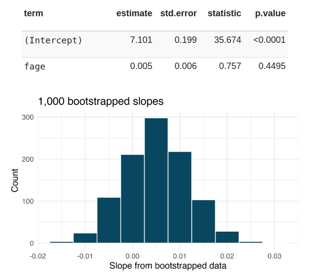

```{r setup, include=FALSE}
knitr::opts_chunk$set(echo = TRUE)
```

```{r message=FALSE, warning=FALSE, include=FALSE, paged.print=FALSE}
knitr::opts_chunk$set(echo=TRUE, message=FALSE, warning=FALSE, collapse=TRUE, highlight=TRUE, paged.print=FALSE, prompt=TRUE, strip.white=FALSE, tidy = TRUE)
```

```{r}
library(tidyverse)
library(broom)
library(leaps)
library(car)
```
## Ejercicio 1
El Departamento de Salud y Servicios Humanos, los Centros para el Control y la Prevención de Enfermedades recopilan información sobre los nacimientos registrados en el país. Los datos utilizados aquí son una muestra aleatoria de 1000 nacimientos de 2014. Aquí estudiamos la relación entre la edad del padre y el peso del bebé. (PIDSR 2014)

A continuación se muestran dos elementos. El primero es el resultado del modelo lineal estándar para predecir el peso del bebé (en libras) a partir de la edad del padre (en años). El segundo es la distribución de arranque de la estadística de pendiente de 1000 muestras de arranque diferentes de los datos.



- Usando el histograma, aproximen el error estándar de la pendiente (es decir, cuantifiquen la variabilidad de la estadística de pendiente de una muestra a otra).
- Encuentre un intervalo de confianza SE de bootstrap del 95 % para el parámetro de pendiente.
- Interprete el intervalo de confianza en el contexto del problema.

## Ejercicio 2
Vamos a volver a trabajar con los set de datos a nivel internacional. Solo para recordar, diremos que el primero, es un dataset (`.wb_bank_data_2019.csv`) con información construida por el Banco Mundial acerca de la distribución de la población ocupada según grandes sectores de actividad y categoría ocupacional:

- `SL.AGR.EMPL.ZS`: % total el empleo en agricultura: consistente en las actividades de agricultura, silvicultura, caza y pesca  
- `SL.IND.EMPL.ZS`: % total de empleo en industria:  en actividades de minas y canteras, manufacturas, construcción y energía, gas y agua.
- `SL.SERV.EMPL.ZS` % total de empleo el servicios comprende comercio al por mayor y menor y restaurantes y hoteles, transporte, almacenamiento y comunicaciones, finanzas, seguros, servicios inmobiliarios y a las empresas y servicios personales, sociales y comunales.
- `SL.FAM.WORK.ZS`: % total de trabajadores familiares
- `SL.EMP.MPYR.ZS`: % total de empleadores  
- `SL.EMP.SELF.ZS`: % total de independientes (cuenta propias)
- `SL.EMP.WORK.ZS`: % total de trabajadores asalariados


El segundo (`HDI_HDR2020_040722.csv`) son las componentes del Human Development Index (HDI) elaborado por UNDP para el período 1992-2019. El HDI es un promedio a nivel país de cuatro variables fundamentales:


Copiamos y pegamos el preprocesmiento de los datos:
```{r}
df <- read_csv('./data/wb_bank_data_2019.csv')
hdi <- read_csv('./data/HDI_HDR2020_040722.csv')

df <- df %>%
     pivot_wider(id_cols = c(iso3c, iso2c, country), names_from = indicatorID, values_from = value)


hdi <- hdi %>%
        select(iso3c, country, contains("_2019"))


final <- hdi %>%
            left_join(
              df %>% select(-country)
              )

final <- final %>% drop_na()

```

Estimar una regresión que tenga como variable dependiente al producto bruto por cápita y como variables predictoras la expectativa de vida, e, la proporción de trabaj

```{r}
lm_1 <- final %>%
          lm(gnipc_2019 ~ le_2019 + mys_2019 + SL.AGR.EMPL.ZS + SL.SRV.EMPL.ZS + SL.EMP.WORK.ZS, data = .)
summary(lm_1)
```

- Genere un intervalo de confianza del 95% mediante boostrap para cada una de las variables 
```{r}
cc1 <- tibble()

for (i in seq_along(1:2000)){
        c <- final %>%
            slice_sample(n=nrow(final), replace=TRUE) %>%
            lm(gnipc_2019 ~ le_2019 + mys_2019 + SL.AGR.EMPL.ZS + SL.SRV.EMPL.ZS + SL.EMP.WORK.ZS, data = .) %>%
                coef(.) %>%
                as_tibble_row() %>%
                mutate(id_sample = i)
        
        cc1 <- cc1 %>%
                bind_rows(c)
}
```

- ¿Cuáles son las variables que no contienen al cero en su intervalo de confianza? 
```{r}
cc1 %>%
  pivot_longer(cols=-id_sample) %>%
  group_by(name) %>%
  summarise(lim_inf = quantile(value, probs=0.025),
            lim_sup = quantile(value, probs=0.975))
```

- Analizando los p-valores, ¿qué variables presetan efectos significativamente diferentes a cero?

- Compare los resultados de las dos últimas pregutas. ¿Son coincidentes? ¿Las variables cuyos efectos son significativamente diferentes a cero y las variables cuyo IC no contiene a cero son las mismas?

