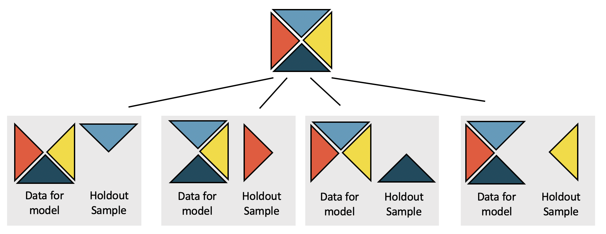
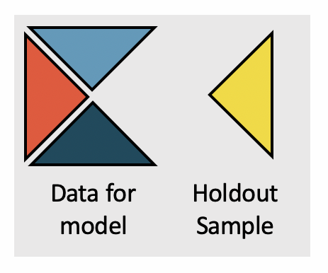

```{r setup, include=FALSE}
knitr::opts_chunk$set(echo = TRUE)
```

```{r message=FALSE, warning=FALSE, include=FALSE, paged.print=FALSE}
knitr::opts_chunk$set(echo=TRUE, message=FALSE, warning=FALSE, collapse=TRUE, highlight=TRUE, paged.print=FALSE, prompt=TRUE, strip.white=FALSE, tidy = TRUE)
```

***
Este texto se basa en los siguientes materiales:

- Capítulos 26 del libro [Introduction to Modern Statistics](https://openintro-ims.netlify.app/index.html) de Mine Çetinkaya-Rundel y Johanna Hardin 
- Capitulo 5 del libro [Introduction to Statistical Learning](https://www.statlearning.com/) de Gareth James, Daniela Witten, Trevor Hastie y Rob Tibshirani

***

```{r}
library(tidyverse)
library(broom)
library(car)
library(patchwork)

```
## Introducción 
En la clase pasada, los p-valores se calcularon en cada uno de los coeficientes del modelo. El valor p da una idea de qué variables son importantes para el modelo; sin embargo, se justifica un tratamiento más extenso de la selección de variables en un curso o libro de texto de seguimiento. Aquí, usamos el error de predicción de validación cruzada para centrarnos en qué variable(s) son importantes para predecir la variable de respuesta de interés. En general, los modelos lineales también se utilizan para hacer predicciones de observaciones individuales. Además de la construcción de modelos, la validación cruzada proporciona un método para generar predicciones que no se ajustan demasiado al conjunto de datos en particular. Continuamos alentándolo a que continúe estudiando el tema de la validación cruzada, ya que se encuentra entre las ideas más importantes en el análisis de datos moderno, y aquí solo podemos arañar la superficie.

La validación cruzada es una técnica computacional que elimina algunas observaciones antes de ejecutar un modelo y luego evalúa la precisión del modelo en la muestra reservada. Al eliminar algunas observaciones, nos proporcionamos una evaluación independiente del modelo (es decir, las observaciones eliminadas no contribuyen a encontrar los parámetros que minimizan la ecuación de mínimos cuadrados). La validación cruzada se puede usar de muchas maneras diferentes (como una evaluación independiente), y aquí solo rascaremos la superficie con respecto a una forma en que se puede usar la técnica para comparar modelos. 



Nuestro objetivo en esta sección es comparar dos modelos de regresión diferentes que buscan predecir los ingresos de la ocupación principal de las personas ocupadas. Vamos a trabajar, como de costumbre, con la ENES-PISCAC y la idea es retomar algunas de las preguntas que nos planteamos hace algunas clases sobre los procesos de determinación de los ingresos. Pero, a diferencia de los primeros intentos en los que trabajamos sobre todos los individuos del dataset, aquí vamos a trabajar con PSHs y cónyuges. Esto nos va a permitir utilizar algunas variables relevantes sobre el origen social (que Erik Olin Wright usaba en su modelo de determinación de ingresos). Vamos a empezar entrenando un modelo simple: uno que busca predecir el ingreso de la ocupación principal a partir de una variable 


---

**Error de predicción**

El error de preducción (también llamado anteriormente residuo) es la diferencia entre el valor observado y el valor pronosticado (del modelo de regresión).

$$error\_prediccion_{i} = e_{i} = y_{i} - \hat{y}_{i}$$

La presentación a continuación (ver la comparación de las Figuras 25.5 y 25.7) muestra que el modelo con más variables predice body_mass_g con errores mucho menores (previsto menos masa corporal real) que el modelo que usa solo bill_length_g. Hemos utilizado deliberadamente un modelo que intuitivamente tiene sentido (cuantas más medidas corporales, más predecible es la masa). Sin embargo, en muchos entornos, no es obvio qué variables o qué modelos contribuyen más a las predicciones precisas. La validación cruzada es una forma de obtener predicciones independientes precisas con las que comparar diferentes modelos.

```{r}
df <- read_rds('./data/ENES_psh_cony.rds')

df <- df %>%
  mutate(v109 = case_when(v109 == "Varón" ~ "Masculino", TRUE ~ "No masculino"))

df <- df %>%
  mutate(nivel_ed_agg = case_when(
    nivel_ed == 'Menores de 5 años' | 
    nivel_ed == 'Sin instrucción (incluye nunca asistió o sólo asistió a sala de 5)' |
    nivel_ed == 'Primaria/EGB incompleto' | nivel_ed == 'Primaria/EGB completo' | 
    nivel_ed == 'Educación especial' | nivel_ed == 'NS/NR'~ '0_Bajo',
    nivel_ed == 'Secundario/Polimodal incompleto' | 
    nivel_ed == 'Secundario/Polimodal completo' ~ '1_Medio',
    nivel_ed == 'Terciario incompleto' | nivel_ed == 'Terciario completo' | nivel_ed == 'Universitario incompleto' | nivel_ed == 'Universitario completo' ~ '2_Alto'
    )
)

df <- df %>%
        mutate(MS_CNO_calif = as.character(MS_CNO_calif)) %>%
        mutate(MS_CNO_calif = case_when(
                MS_CNO_calif %in% c("Profesional", "Técnica") ~ "Prof./tecn.",
                is.na(MS_CNO_calif) ~ 'Operativa',
                TRUE ~ MS_CNO_calif
        ))


df <- df %>%
  mutate(status_ocup = case_when(
            egp11 %in% levels(df$egp11)[1:2] ~ '1_Alto',
            egp11 %in% levels(df$egp11)[3:4] ~ '1_Alto',
            egp11 %in% levels(df$egp11)[5:7] ~ '2_Medio',
            egp11 %in% levels(df$egp11)[8:11] ~ '3_Bajo',
            is.na(egp11) ~ '9_Sin datos'
  ))

df <- df %>%
  mutate(MS_status_ocup = case_when(
            MS_egp11 %in% levels(df$MS_egp11)[1:2] ~ '1_Alto',
            MS_egp11 %in% levels(df$MS_egp11)[3:4] ~ '1_Alto',
            MS_egp11 %in% levels(df$MS_egp11)[5:7] ~ '2_Medio',
            MS_egp11 %in% levels(df$MS_egp11)[8:11] ~ '3_Bajo',
            is.na(MS_egp11) ~ '9_Sin datos'
  ))


df <- df %>%
  mutate(MS_ned_agg = case_when(
          is.na(MS_v240) ~ '1_Medio',
          MS_v240 == 'Ninguno' ~ '0_Bajo',
          MS_v240 %in% c('Primario', 'EGB', 'Educación especial') & MS_v241 == 'No' ~ '0_Bajo',
          MS_v240 %in% c('Primario', 'EGB', 'Educación especial') & MS_v241 == 'Sí' ~ '0_Bajo',
          MS_v240 %in% c('Secundario', 'Polimodal') & MS_v241 == 'No' ~ '1_Medio',
          MS_v240 %in% c('Secundario', 'Polimodal') & MS_v241 == 'Sí' ~ '1_Medio',
          MS_v240 %in% c('Terciario', 'Universitario', 'Posgrado Universitario') & MS_v241 == 'No' ~ '3_Alto',
          MS_v240 %in% c('Terciario', 'Universitario','Posgrado Universitario') & MS_v241 == 'Sí' ~ '3_Alto',
  ))

df <- df %>% mutate(MS_ned_agg = if_else(is.na(MS_ned_agg), '0_Bajo', MS_ned_agg))

df <- df %>%
  mutate(taman_empresa = case_when(
          v189 %in% c("Solo 1", "entre 2 y 5") ~ '1_H/5 pers.',
          v189 %in% c("entre 6 y10", "entre 11 y 25", "entre 26 y 49") ~ '2_6 y 49 pers.',
          v189 %in% c("50 y más") ~ '3_50 y más',
          v189 == 'NS/NR' ~ '1_H/5 pers.')
  )

df <- df %>%
        mutate(EOW_class_ = as.character(EOW_class)) %>%
        mutate(EOW_class_ = case_when(
                EOW_class_ %in% c("Managers", "Supervisores") ~ 'Manag./Superv.',
                TRUE ~ EOW_class_
        ))

```

## Validación cruzada desde cero
¿Cómo podemos implementar una validación cruzada? Veamos primero la lógica de este procedimiento. Queremos responder una pregunta similar a la que Erik Olin Wright plantea en el capítulo 5 de [Class structure and income determination](https://drive.google.com/file/d/1_uzxqlkOmx_AG6T1uqILvNZIK9hIS4mN/view), aunque más resumida. ¿Qué predicciones del ingreso son mejores: aquellas en un modelo con variables de "logro" o aquellas que surjen de un modelo con variables de clase? Para ello vamos a entrenar tres modelos diferentes.

- uno que vamos a llamar `model_full`: se va a tratar de un modelo que va a ser "completo", va a tener todas las variables. Podemos escribir su ecuación de la siguiente forma

$$\begin{aligned}
ing\_ocup_{i} = &\beta_{0}\\
+&\beta_{1} \times edad_{i}\\
+&\beta_{2} \times ned_{medio,i}\\
+&\beta_{3} \times ned_{alto,i}\\
+&\beta_{4} \times clase_{Manag\_superv, i}\\  
+&\beta_{5} \times clase_{Peq\_burg, i}\\
+&\beta_{6} \times clase_{Trabajadores, i}\\
+&\beta_{7} \times calif\_hogar_{Sin\_dato, i}\\ 
+&\beta_{8} \times calif\_hogar_{Operativa, i}\\
+&\beta_{9} \times calif\_hogar_{Profesional, i}\\ 
+&\beta_{10} \times calif\_hogar_{Tecnica, i}
\end{aligned}$$

La idea en este caso es entrenar un modelo "completo" con todas las variables. A partir de este modelo vamos a tratar de ver qué ocurre si eliminamos algunas de las variables.

- otro que vamos a llamar `model_sin_clases`

$$\begin{aligned}
ing\_ocup_{i} = &\beta_{0}\\
+&\beta_{1} \times edad_{i}\\
+&\beta_{2} \times ned_{medio,i}\\
+&\beta_{3} \times ned_{alto,i}\\
+&\beta_{7} \times calif\_hogar_{Sin\_dato, i}\\ 
+&\beta_{8} \times calif\_hogar_{Operativa, i}\\
+&\beta_{9} \times calif\_hogar_{Profesional, i}\\ 
+&\beta_{10} \times calif\_hogar_{Tecnica, i}
\end{aligned}$$

- el último que se va a llamar `model_sin_ned`

$$\begin{aligned}
ing\_ocup_{i} = &\beta_{0}\\
+&\beta_{1} \times edad_{i}\\
+&\beta_{4} \times clase_{Manag\_superv, i}\\  
+&\beta_{5} \times clase_{Peq\_burg, i}\\
+&\beta_{6} \times clase_{Trabajadores, i}\\
+&\beta_{7} \times calif\_hogar_{Sin\_dato, i}\\ 
+&\beta_{8} \times calif\_hogar_{Operativa, i}\\
+&\beta_{9} \times calif\_hogar_{Profesional, i}\\ 
+&\beta_{10} \times calif\_hogar_{Tecnica, i}
\end{aligned}$$

Veamos, entonces, el modelo completo para tener una idea de lo que nos está diciendo.

```{r}
df_ocupados <- df %>% 
                  filter(estado=='Ocupado') %>%
                  drop_na(v213b)

tidy(df_ocupados %>%
    lm(v213b ~ v108 + nivel_ed_agg + EOW_class_ + MS_CNO_calif , data = .))
```
En el modelo anterior, podemos ver que todos los predictores presentan p-valores bajos. Esto sugiere que sugiere que cada variable es un predictor estadísticamente significativo del ingreso de la ocupación principal. Sin embargo, en esta sección, iremos más allá del uso de p-valores y vamos a tratar de considerar predicciones independientes del ingreso de la ocupacion principal como una forma de comparar diferentes modelos.

### Comparando modelos (y variables)
Para comparar modelos diferetnes en términos de su capacidad para predecir el ingreso, necesitamos construir modelos que puedan proporcionar predicciones independientes basadas en las personas en las muestras reservadas creadas por validación cruzada. Para reiterar, cada una de las predicciones que (cuando se combinan) nos permitirán distinguir entre las más pequeñas y las más grandes son independientes de los datos que se usaron para construir el modelo. En este ejemplo, mediante la validación cruzada, eliminamos una quinta parte de los datos antes de ejecutar los cálculos de mínimos cuadrados. Luego, se utiliza el modelo de mínimos cuadrados para predecir el ingreso de los cónyuges y PSH ocupados en la muestra reservada. Aquí usamos una validación cruzada de 4 grupos (lo que significa que una cuarta parte de los datos se elimina cada vez) para producir cuatro versiones diferentes de cada modelo (otras veces puede ser más apropiado usar 2 veces o 10 veces o incluso ejecute el modelo por separado después de eliminar cada punto de datos individual de uno en uno).

Aquí está el código completo para realizar la validación cruzada. Enseguida volveremos sobre el mismo. Pero antes es imporante entender qué está pasando en cada iteración a nivel conceptual.

```{r}
# Mezclamos los datos
set.seed(753)
df_ocupados <- df_ocupados %>%
        slice_sample(n=nrow(df_ocupados), replace=FALSE)

# Definimos la cantidad de grupos
k <- 4

# Creamos k grupos del mismo tamaño
folds <- seq(1, nrow(df_ocupados)) %>%
          cut_interval(., n=k) %>%
          as.numeric()

# Hacemos cross validation
errores <- tibble(full=numeric(),
                  sin_clase=numeric(),
                  sin_ned=numeric())

for(i in 1:k){
  #Segement your data by fold using the which() function 
  test_index <-  which(folds==i, arr.ind=TRUE)
  test <- df_ocupados %>% slice(test_index)
  train <- df_ocupados %>% slice(-test_index)
  
  model_full <- train %>%
          lm(v213b ~ v108 + nivel_ed_agg + EOW_class_ + MS_CNO_calif , data = .)
  
  model_sin_clase <- train %>% 
          lm(v213b ~ v108 + nivel_ed_agg + MS_CNO_calif, data = .)
  
  model_sin_ned <- train %>%
          lm(v213b ~ v108 + EOW_class_ + MS_CNO_calif, data = .)

  y_pred_full <- predict(model_full, test)
  y_pred_sin_clase <- predict(model_sin_clase, test)
  y_pred_sin_ned <- predict(model_sin_ned, test)
  
  err <- tibble(
                full=sqrt(mean((test$v213bi - y_pred_full)**2)),
                sin_clase=sqrt(mean((test$v213bi - y_pred_sin_clase)**2)),
                sin_ned=sqrt(mean((test$v213bi - y_pred_sin_ned)**2))           
                )
  
  errores <- errores %>% add_row(err)
  
}
```

La figura siguiente muestra cómo se ajusta el modelo completo a 3/4 de los datos (observe las ligeras diferencias en los coeficientes en comparación con la tabla del modelo completo), y luego se hacen predicciones en la muestra reservada.



```{r}
tidy(model_full)
```

Veamos ahora el modelo sin clases:

```{r}
tidy(model_sin_clase)
```

Y el modelo sin nivel educativo:

```{r}
tidy(model_sin_ned)
```

Cada uno de estos modelos fue entrenado en 3/4 del dataset y las predicciones fueron hechas en el 1/4 restante. Ahora, podemos comparar cómo performa cada modelo en ese 1/4 que NO fue utilizado para entrenar cada modelo. Simplemente tenemos que comparar las predicciones hechas en el 1/4 restante con los valores reales de ese mismo 1/4. 

Para eso vamos a usar la media de la suma de los errores al cuadrado como métrica de validación de las predicciones (MSE). 

$$MSE = \frac{1}{n}\sum_{i=1}^n(y_{i} - \hat{y}_{i})^2$$

Más precisamente, dado que nos encontramos trabajando con ingresos y los valores elevados al cuadrado son muy grandes vamos a trabajar con la raíz cuadrada del MSE (RMSE).

$$RMSE = \sqrt{MSE} = \sqrt{\frac{1}{n}\sum_{i=1}^n(y_{i} - \hat{y}_{i})^2}$$

Entonces, en este fold, tenemos que 

```{r}
errores[4,]
```

el modelo full tiene un $CV\_RMSE_{k=4} = \$5758.6$, el modelo sin clases $CV\_RMSE_{k=4} = \$5954.1$ y el modelo sin nivel educativo, de $CV\_RMSE_{k=4} = \$5871.4$. ¿Qué podemos decir al respecto de estos valores?

Ahora bien, repetimos esta operación en cada uno de los 1/4 que vamos dejando "reservados" de forma iterativa. De esta forma, al finalizar el proceso de validación cruzada tenemos 4 estimaciones del error diferentes para cada uno de los modelos:

```{r}
errores
```

Para obtener una métrica agregada del error "cross validado", simplemente, promediamos para cada modelo cada una de las métricas de cada fold.

```{r}
errores %>%
  summarise(across(everything(), mean))
```


El RSSE de validación cruzada es la suma del error cuadrático asociado con las predicciones. Si $\hat{y}_{cv,i}$ es la predicción para la i-ésima observación donde la i-ésima observación formaba parte del "holdout fold" y las otras tres partes fueron las que se usaron para entrenar el modelo, entonces, el $CV\_RMSE$ del modelo completo es $5934.9


---

El error de predicción del modelo de validación cruzada se puede utilizar para calcular un único resumen numérico del modelo. El RMSE de validación cruzada es la suma de los errores de predicción de validación cruzada al cuadrado.

$$CV\_RMSE = \frac{1}{k}\sum_{1}^k(RMSE_{k})$$


---

Vemos, entonces, que si comparamos el modelo completo con los dos siguientes podemos ver que al eliminar la variable de clase social el error se incrementa un 3.3%. En cambio, al eliminar la variable de nviel educativo, el error se incrementa un 1.9%. Por esto, podemos decir que la variable `EOW_class` es más relevante que `ned_agg`. 

$$\begin{aligned}
&\frac{sin\_clase}{full} - 1 = \frac{6137.681}{5944.072} - 1 = 0.0326\\
&\frac{sin\_ned}{full} - 1 = \frac{6056.209}{5944.072} - 1 = 0.0189
\end{aligned}
$$

### Análisis del código
Ahora que ya entedimos conceptualmente qué estamos haciendo, podemos pasar a entender cómo lo hacemos, es decir, el código.

**1. "Mezclar" los datos**

```
set.seed(753)
df_ocupados <- df_ocupados %>%
        slice_sample(n=nrow(df_ocupados), replace=FALSE)
```
Para ello, usamos `slice_sample` que extrae una muestra aleatoria pero del mismo tamaño que nuestro dataset y sin reemplazo.

**2. Definimos la cantidad de folds (subgrupos) y generamos una variable**
```
k <- 4

folds <- seq(1, nrow(df_ocupados)) %>%
          cut_interval(., n=k) %>%
          as.numeric()

```

**3. Creamos una tibble donde guardar los errores**
```
errores <- tibble(full=numeric(),
                  sin_clase=numeric(),
                  sin_ned=numeric())

```

**4. Iteramos por cada uno de los valores de k (grupo 1, grupo 2, grupo 3, grupo 4)**
```
for(i in 1:k){
  ####
  }
  
``` 
Usamos un loop para iterar de 1 a 4 (que es la cantidad de folds/grupos que definimos en `k`)

**4.1. Dividimos el dataset total en un test set (1/4 de los datos) y un train set (3/4)**
```
  test_index <-  which(folds==i, arr.ind=TRUE) 
  test <- df_ocupados %>% slice(test_index)
  train <- df_ocupados %>% slice(-test_index)
``` 

`test_index` es un vector que para cada iteración del for loop nos da los índices posicionales del 1/4 de datos que forma parte del test set en cada iteración. Luego, usando esos índices generamos dos objetos el `test` set (el 1/4 de observaciones que vamos a usar para testear el modelo) y el `train` set (los 3/4 restantes que vamos a usar para entrenar cada modelo).

**4.2. Entrenamos cada modelo (full, sin clases, sin ned) en el `train` set**
```
  model_full <- train %>%
          lm(v213b ~ v108 + nivel_ed_agg + EOW_class_ + MS_CNO_calif , data = .)
  
  model_sin_clase <- train %>% 
          lm(v213b ~ v108 + nivel_ed_agg + MS_CNO_calif, data = .)
  
  model_sin_ned <- train %>%
          lm(v213b ~ v108 + EOW_class_ + MS_CNO_calif, data = .)
``` 

**4.3. Generamos las predicciones en el `test` set**
```
  y_pred_full <- predict(model_full, test)
  y_pred_sin_clase <- predict(model_sin_clase, test)
  y_pred_sin_ned <- predict(model_sin_ned, test)
  
```

**4.4. Calculamos los residuos (sobre el `test` set) y los guardamos en la tibble `errores`**
```
err <- tibble(
                full=sqrt(mean((test$v213bi - y_pred_full)**2)),
                sin_clase=sqrt(mean((test$v213bi - y_pred_sin_clase)**2)),
                sin_ned=sqrt(mean((test$v213bi - y_pred_sin_ned)**2))           
                )
  
  errores <- errores %>% add_row(err)
``` 
En este pedazo de código genearmos una tibble chiquitita (`err`) que va a contener los residuos de cada modelo. ¿De cuántas filas y columnas es `err`?. Cada elemento de `err` se calcula mediante esta fórmula `sqrt(mean((test$v213bi - y_pred_[modelo])**2))`. ¿Qué hace esta fórmula?

**5. Repetimos hasta terminar el for loop**

## Comentarios finales
Hemos proporcionado una descripción general muy breve y un ejemplo utilizando la validación cruzada. La validación cruzada es un enfoque computacional para la construcción y validación de modelos como una alternativa a la confianza en los valores p. Si bien los p-valores tienen un papel que desempeñar en la comprensión de los coeficientes del modelo, a lo largo de este texto hemos seguido presentando métodos computacionales que amplían los enfoques estadísticos para el análisis de datos. La validación cruzada se utilizará nuevamente la clase que viene con regresión logística. La idea es alentar a que puedan evaluar tanto el uso de los métodos inferenciales estándar (como los p-valores) como los enfoques computacionales (como la validación cruzada) a medida que creen y usen modelos multivariables de todas las variedades.

