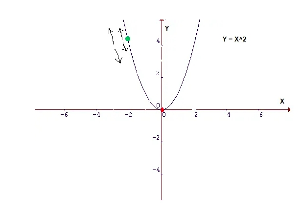

### Objetivos

La idea de este notebook es poder dar una intuición acerca de cómo funcionan los métodos basados en Gradient Boosting. Para ello, utilizaremos un dataset de juguete.


### Gradient Descent en una carilla

Recordemos: ¿cuáles son los principales elementos de un algoritmo de Machine Learning?

- datos ($X$ e $y$)
- algoritmo o hipótesis ($\hat{y}=f(X)$) que contiene 
- parámetros (por ejemplo, $\beta_{0}, \beta_{1}, ..., \beta_{p}$ de un modelo de regresión lineal)
- métrica de costo o _cost function_, una medida que sirve para evaluar la performance del modelo $\ell(y_{i} - \hat{y_{i}})$

La función de costo debería servirnos para poder seleccionar cuál es el mejor set de parámetros. En líneas generales, queremos __miniminzar__ la función de costo. Por eso, los problemas de machine learnin (y en buena medida, los de estadística) son problemas de __optimización__.

Pensemos en una regresión lineal simple 

- tenemos nuestros datos $x$ e $y$
- la hipótesis: $\hat{y_{i}} = \beta_{0} + \beta_{1}X_{1}$
- los parámetros: $(\beta_{0}, \beta_{1})$
- función de costo: $MSE = \frac{1}{N} \sum_{i=1}^N(y_{i} - \hat{y_{i}})^2$

Una opción (poco recomendable) sería probar todos los valores posibles de $(\beta_{0},\beta_{1})$, digamos entre los infinitos negativos y los infitinos positivos, calcular las predicciones para cada uno, calcular $MSE$ para cada uno y elegir el $\beta_{1}$ que logra un valor mínimo en $MSE$, o dicho en lenguaje matemático: $\underset{\beta_{0},\beta_{1}}{\operatorname{argmax}}(\frac{1}{N} \sum_{i=1}^N(y_{i} - \hat{y_{i}})^2)$  

En este punto, el problema se tranforma en un problema de optimización. Dado que en general, no es computacionalmente posible probar todos los valores de un parámetro (y mucho menos de miles o millones) se recurren a otro tipo de métodos. El más utilizado en sus diversas variables es el llamado _Gradient Descent_ o _Descenso de gradiente_.

Si bien, no entraremos en sus sutilezas, solamente diremos que se trata de un procedimiento iterativo que hace uso de las propiedades de las derivadas (algo así como el ratio de cambio de la función de costo al cambiar el valor del parámetro) para ir actualizando los valores de los parámetros hasta llegar al mínimo:



Calculando derivadas de la función de costo, llegamos a la siguente fórmula que permite ir actualizando los valores de $(\beta_{0}, \beta_{1})$ en un número fijo de iteraciones:

$\beta_{0}^1 = \beta_{0}^0 - (y_{i} - \hat{y_{i}})  \times \gamma \times X$

$\beta_{1}^1 = \beta_{1}^0 - (y_{i} - \hat{y_{i}}) \times \gamma$

Cuán pequeños (o grandes) son los cambios, dependerán del parámetro $\gamma$. también llamada _learning rate_.

[Aquí hay un tutorial](https://towardsdatascience.com/understanding-the-mathematics-behind-gradient-descent-dde5dc9be06e?gi=d241039b3a71) sobre el tema, sumamente intuitivo.

### Gradient Boosting Machines... ¿qué son?

Ahora bien, la idea general detrás de los Gradient Boosting Machines (GBM, a partir de ahora), es igual a la de los métodos de Boosting en general: entrenar modelos fuertes a partir de un ensamble de modelos débiles. Se hace, igualmente, entrenando clasificadores de manera secuencia, en dónde cada uno de los clasificadores posteriores se centra en los errores del clasificador anterior.

La principal diferencia con AdaBoost es que, en lugar de jugar con los pesos de cada instancia en cada iteración, GBM trata de fitear un modelo sobre los residuos del modelo anterior.

Así, se trata de modelos de tipo aditivo. La idea general es que la predicción final es generada por la suma de diversos modelos parciales:

$\hat{y} =  h_{1}(X) + h_{2}(X) + h_{3}(X) + ... + h_{m}(X)$

$\hat{y} = \sum_{m=1}^M h_{m}(X)$

Puede pensarse de forma análoga a la descomposición de una serie temporal, donde la series es pensada como una composición aditiva de una componente de tendencia $T_{t}$, una de ciclo $C_{y}$, una estacional $S_{t}$ y otra de ruido $\mu_{t}$:

$y_{t} = T_{t} + C_{t} + S_{t} + \mu_{t}$

Para seguir profundizando [aquí](https://explained.ai/gradient-boosting/index.html) hay un tutorial de carácter sumamente intuitivo. También pueden consultar el [libro de Aurelien Geron](https://www.amazon.com/Hands-Machine-Learning-Scikit-Learn-TensorFlow-ebook/dp/B06XNKV5TS) del cual tomamos y tradujimos a R este ejemplo, escrito originalmente en Python.


### Un ejemplo para construir la intuición

Veamos un ejemplo usando árboles de decisión, recordando que se trata de un meta-algoritmo por lo cual podríamos usar (casi) cualquier otro método.

Generamos nuestros datos

```{r message=FALSE, warning=FALSE}
library(tidyverse)
library(rpart)

set.seed(42)
X <- runif(100, 0, 1) - 0.5
y <- 3*X**2 + 0.05 * runif(100,0,4)

df <- cbind(X,y) %>% as_tibble()

rm(X,y)

```

En primer lugar, entrenemos un árbol de decisión sobre nuestro dataset y agreguemos las predicciones como columnas en el dataset:

```{r}
tree_1 <- rpart(y~X, data=df, method='anova', control=list(cp=0.0000001, maxdepth=2))                

df <- df %>% mutate(h_1 = predict(tree_1, df),
                p_1 = h_1,
                y_1 = y - p_1)

```

Ahora, entrenemos un segundo árbol pero sobre los residuos del anterior, es decir, sobre $y_{i} - \hat{y_{i}}$ o más precisamente: `y - predict(tree_1, df)` y agreguemos, una vez más, los resultados al dataset:


```{r}
tree_2 <- rpart(y_1~X, data=df, method='anova', control=list(cp=0.0000001, maxdepth=2))                
df <- df %>% mutate(h_2 = predict(tree_2, df),
                    p_2 = p_1 + h_2,
                    y_2 = y - p_2)
```

Repitamos el proceso una tercera vez... y una cuarta y una quinta y una sexta...


```{r}
tree_3 <- rpart(y_2~X, data=df, method='anova', control=list(cp=0.0000001, maxdepth=2))                

df <- df %>% mutate(h_3 = predict(tree_3, df),
                    p_3 = p_2 + h_3,
                    y_3 = y - p_3)

tree_4 <- rpart(y_3~X, data=df, method='anova', control=list(cp=0.0000001, maxdepth=2))                

df <- df %>% mutate(h_4 = predict(tree_4, df),
                    p_4 = p_3 + h_4,
                    y_4 = y - p_4)

tree_5 <- rpart(y_4~X, data=df, method='anova', control=list(cp=0.0000001, maxdepth=2))                

df <- df %>% mutate(h_5 = predict(tree_5, df),
                    p_5 = p_4 + h_5,
                    y_5 = y - p_5)

tree_6 <- rpart(y_5~X, data=df, method='anova', control=list(cp=0.0000001, maxdepth=2))                

df <- df %>% mutate(h_6 = predict(tree_6, df),
                    p_6 = p_5 + h_6,
                    y_6 = y - p_6)

```

Ahora tenemos un ensable que consiste en seis árboles de decisión. Podemos hacer una predicción sobre una instancia nueva simplemente agregando las predicciones de nuestros seis árboles.

```{r fig.height=15, fig.width=10}
ggpubr::ggarrange(ncol=2, nrow=3,
                  ggplot(df) + 
                          geom_point(aes(x=X, y=y), color='blue') + 
                          geom_line(aes(x=X, y=h_1), color='green'),
                  ggplot(df) + 
                          geom_point(aes(x=X, y=y), color='blue') + 
                          geom_line(aes(x=X, y=p_1), color='red'),
                  ggplot(df) + 
                          geom_point(aes(x=X, y=y_1), color='blue') + 
                          geom_line(aes(x=X, y=h_2), color='green') +
                          scale_y_continuous(limits=c(-0.4,1)),
                  ggplot(df) + 
                          geom_point(aes(x=X, y=y), color='blue') + 
                          geom_line(aes(x=X, y=p_2), color='red'),
                  ggplot(df) + 
                          geom_point(aes(x=X, y=y_2), color='blue') + 
                          geom_line(aes(x=X, y=h_3), color='green') +
                          scale_y_continuous(limits=c(-0.4,1)),
                  ggplot(df) + 
                          geom_point(aes(x=X, y=y), color='blue') + 
                          geom_line(aes(x=X, y=p_3), color='red')
)
```

El plot muestra cómo va evolucionando el modelo a medida que vamos agregando una mayor cantidad de iteraciones. A la izquierda tenemos el ajuste de cada modelo con su propia variable dependiente (es decir, los residuos del modelo anterior) y a la derecha, el ajuste del ensamble global sobre $X$ e $y$.

Puede verse cómo el ensamble se va haciendo cada vez más preciso a medida que vamos agregando modelos.
