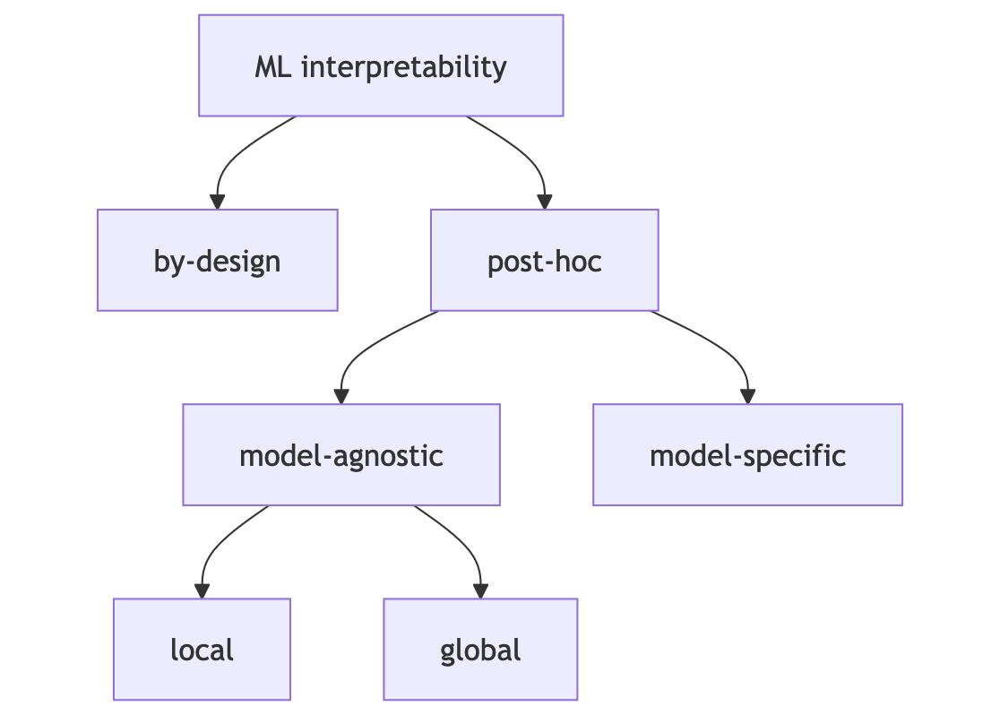

## Objetivos
-   Mostrar la implementación de algunos métodos de interpretación para
    modelos de Machine Learning

## Disclaimer
Mucho del contenido de este tutorial está basado en [Interpretable
Machine Learning. A Guide for Making Black Box Models
Explainable](https://christophm.github.io/interpretable-ml-book/) de
Cristpher Molnar, un texto súper recomendable.

## Interpretabilidad
Hasta aquí hemos venido tratando a los modelos vistos como cajas negras.
Hemos priorizado capacidad predictiva por sobre interpretabilidad. No
obstante, el problema de extraer conocimiento de los modelos que hemos
llamado de "caja negra" no es una cuestión trivial. En ese sentido, si
bien la performance predictiva de un modelo es sumamente importante, no
otorga la información completa sobre el problema abordado. Si bien, en
muchos casos es posible que nos interese apoyarnos en un modelo con
mayor capacidad predictiva, en otros, también podría ser necesario
entender qué nos dice dicho modelo sobre el dataset en cuestión.
Entender los "por qué" del funcionamiento de un modelo, además, nos
puede dar información valiosa para entender cuándo y cómo el mismo puede
fallar. Los modelos de machine learning pueden tomar sesgos de los datos
sobre los que se entrenan, es por ello, que la "interpretabilidad" puede
ser un buen insumo para entender dichos sesgos.

Hay varias ideas y definiciones alrededor del concepto de interpretabilidad aplicado a un modelo de aprendizaje automático**:

- El grado en que un humano puede **comprender la causa** de una decisión ([Miller (2019)](https://linkinghub.elsevier.com/retrieve/pii/S0004370218305988)).
- Una perspectiva relacionada sugiere que un método es interpretable si un usuario puede predecir sus resultados de manera **correcta y eficiente** [Kim, Khanna, y Koyejo (2016)](https://papers.nips.cc/paper_files/paper/2016/hash/5680522b8e2bb01943234bce7bf84534-Abstract.html)).

En esencia, cuanto más interpretable es un modelo de aprendizaje automático, más fácil resulta para una persona entender **por qué** se hicieron ciertas decisiones o predicciones.

Aunque a menudo se usan indistintamente, a veces  señalan una distinción entre interpretabilidad y explicabilidad: la **interpretabilidad** se relaciona con mapear un concepto abstracto de los modelos a una forma comprensible, mientras que la **explicabilidad** es un término más fuerte que requiere interpretabilidad *y* contexto adicional, a menudo utilizado para métodos locales que "explican" una predicción específica. Sin embargo, los términos son "difusos" y pueden verse como un término paraguas que captura la "extracción de conocimiento relevante de un modelo de aprendizaje automático sobre las relaciones contenidas en los datos o aprendidas por el modelo".

La necesidad de interpretabilidad surge porque, aunque un modelo tenga un buen rendimiento predictivo, una única métrica de rendimiento (como la precisión) es a menudo una descripción incompleta de una tarea del mundo real. Para ciertas tareas, no es suficiente solo obtener la predicción (el *qué*), sino que el modelo también debe explicar *cómo* llegó a ella (el *por qué*).

### Tipos de métodos de interpretabilidad
En líneas generales, podemos pensar que existen modelos qué son
interpretables intrínsecamente: una regresión lineal, un árbol de
decisión son métodos que no requieren de aproximaciones complicadas para
entender qué nos dicen sobre un problema. En estos casos, los parámetros
del modelo o ciertos estadísticos resumen suelen ser suficientes para
extraer la información que nos brindan.

**Taxonomía simple de diferentes métodos de interpretabilidad**

Fuente: [Molnar (2023)](https://christophm.github.io/interpretable-ml-book/)

En algunos casos, existen *herramientas de interpretación específicas*:
se limitan a clases de modelo específicas. La interpretación de los
pesos de regresión en un modelo lineal es una interpretación específica
del modelo, ya que, por definición, la interpretación de modelos
intrínsecamente interpretables siempre es específica del modelo. Las
redes neuronales son específicas del modelo.

Las herramientas *agnósticas de modelo* se pueden usar en cualquier
modelo de aprendizaje automático y se aplican después de que el modelo
haya sido entrenado (post hoc). Estos métodos agnósticos generalmente
funcionan analizando los pares de entrada y salida de características.
Por definición, estos métodos no pueden tener acceso a los componentes
internos del modelo, como los pesos o la información estructural.

Veamos estas ideas con un poco más de detalle:

### Interpretabilidad por Diseño
Este enfoque implica entrenar modelos que son **inherentemente interpretables** desde el principio. La decisión de hacer el modelo interpretable se toma a nivel del *algoritmo* de aprendizaje automático, el cual restringe la búsqueda de modelos a aquellos que ya poseen interpretabilidad. Estos modelos también se conocen como modelos **intrínsecamente interpretables**. Veamos algunas características:

* El algoritmo mismo asegura que la estructura resultante del modelo sea fácil de entender para los humanos.
* Ejemplos: regresión lineal, regresión logística, extensiones de modelos lineales (con penalizaciones, interacciones, términos no lineales), árboles de decisión, reglas de decisión y RuleFit. También existen enfoques más avanzados como redes neuronales basadas en prototipos o conjuntos de árboles interpretables.

La interpretabilidad de estos modelos puede variar en su alcance. Podemos tener **modelos completamente interpretables:** Modelos muy simples que pueden entenderse en su totalidad (ej. regresión lineal dispersa, árboles muy cortos). A su vez, pueden existeir **partes del modelo son interpretables:** Se pueden interpretar componentes individuales aunque el modelo completo sea grande (ej. coeficientes individuales en un modelo grande, reglas individuales en una lista de decisiones). Finalmente, las **predicciones del modelo son interpretables:** Se puede entender cómo se llegó a una predicción específica (ej. mostrando los k vecinos más cercanos en un enfoque similar a k-NN, o la ruta de decisión en un árbol).

**Fortalezas:**
 
- Suelen ser más fáciles de **depurar y mejorar** al proporcionar información interna.
- Son buenos para **justificar modelos y predicciones** porque explican fielmente el proceso.
- Facilitan la **verificación de la coherencia** con el conocimiento de dominio de expertos.
- Permiten obtener información sobre los modelos mismos.

**Debilidades:**

- Puede ser más difícil obtener información sobre los *datos* a menos que se asuma que la estructura del modelo refleja la realidad.
- Existe el problema del **Efecto Rashomon**, donde múltiples modelos con rendimiento similar pueden tener interpretaciones diferentes.
 - A veces, modelos con mayor interpretabilidad pueden tener menor rendimiento predictivo en comparación con modelos "caja negra".

### Interpretabilidad Post-hoc
Este enfoque aplica métodos de interpretabilidad *después* de que el modelo ha sido entrenado. Los métodos post-hoc pueden ser **agnósticos del modelo** o **específicos del modelo**.

#### Métodos Post-hoc Agnósticos del Modelo
Estos métodos ignoran la estructura interna del modelo y solo analizan cómo cambia la salida del modelo (predicción) en respuesta a cambios en las características de entrada.

- Se basan el principio (SIPA): **Muestrear** (Sample) los datos, realizar una **Intervención** (Intervention) en ellos, obtener las **Predicciones** (Predictions) para los datos manipulados y **Agregar** (Aggregate) los resultados. La Permutated Feature Importance es un ejemplo.

Ofrecen flexibilidad tanto en la elección del modelo como en la del método de interpretación. Se puede cambiar el modelo subyacente sin tener que cambiar el método de interpretación post-hoc, o viceversa.

Se dividen en métodos locales y globales.

Los locales explican predicciones individuales. Proporcionan una vista detallada útil para depurar casos extremos o estudiar predicciones inusuales. Un ejemplo que veremos son las curvas de expectativa condicional individual (ICE).

A su vez, son útiles para depuración local. Su utilidad para justificar predicciones individuales es mixta; algunos métodos (como ceteris paribus o contrafactuales) reflejan fielmente las predicciones del modelo, mientras que los métodos de atribución (como LIME o SHAP) son más complejos y quizás menos adecuados para justificaciones de alto riesgo. Pueden ser útiles para obtener información sobre los datos comparando predicciones con subconjuntos de datos.
Lo globales, describen cómo las características afectan las predicciones **en promedio** en un conjunto de datos. Los gráficos de dependencia parcial (PDP) y los gráficos de efectos locales acumulados (ALE), son ejemplos. Proporcionan trazos generales sobre qué características fueron relevantes para intentar explicar modelos a las partes interesadas. Son útiles también para comprender mecanismos generales en los datos ya que se basan en valores esperados sobre la distribución de los datos. 

#### Métodos Post-hoc Específicos del Modelo
Estos métodos también se aplican después del entrenamiento, pero solo funcionan para modelos de aprendizaje automático específicos. Analizan partes internas del modelo para comprenderlo.

- Requieren conocimiento de la arquitectura o los parámetros internos de un tipo de modelo particular (ej. pesos en una red neuronal, importancia Gini en un bosque aleatorio). Los métodos de Gini o los odds ratio

Es importante notar que **las líneas entre estas categorías son difusas** en la práctica. Algunos métodos pueden caer en múltiples categorías dependiendo de cómo se apliquen, o pueden calcularse de maneras que se asemejan a otros enfoques (ej. los valores de Shapley para una regresión lineal se parecen a la interpretación de coeficientes). La interpretabilidad es un concepto intrínsecamente difuso, y es útil ser flexible y mezclar enfoques.

## Carga de librerías y datos
```{r, message=FALSE}
library(tidymodels)
library(tidyverse)
library(rpart)
```

## Datos
Vamos a trabajar con un dataset nuevo y "foráneo": está incluido en la
librería `MASS` y que es ampliamente utilizado para ilustrar y testear
modelos de Machine Learning y afines:

```{r echo=TRUE}
df <- MASS::Boston %>% 
        mutate(
        chas=factor(chas, labels=c('No','Si')),
        var_rand=rnorm(n())
)
head(df)
```

Cada fila es un distrito del estado de Boston y cada variable mide
diferentes atributos:

-   `CRIM`: per capita crime rate by town
-   `ZN`: proportion of residential land zoned for lots over 25,000
    sq.ft.
-   `INDUS`: proportion of non-retail business acres per town.
-   `CHAS`: Charles River dummy variable (1 if tract bounds river; 0
    otherwise)
-   `NOX`: nitric oxides concentration (parts per 10 million)
-   `RM`: average number of rooms per dwelling
-   `AGE`: proportion of owner-occupied units built prior to 1940
-   `DIS`: weighted distances to five Boston employment centres
-   `RAD`: index of accessibility to radial highways
-   `TAX`: full-value property-tax rate per \$10,000
-   `PTRATIO`: pupil-teacher ratio by town
-   `B`: 1000(Bk - 0.63)\^2 where Bk is the proportion of blacks by town
-   `LSTAT`: % lower status of the population
-   `MEDV`: Median value of owner-occupied homes in \$1000's

El objetivo será predecir el valor mediano de las propiedades en el
condado -`MEDV`- según el resto de las varibles.

Como habrán observado, hemos agregado una variable aleatoria en nuestro
dataset, el objetivo es observar el nivel de importancia que cada método
le asigna.

## Random Forest
Entrenemos un modelo Random Forest con este dataset:

```{r}
set.seed(123)
boston_split <- initial_split(df, prop = 0.8)
boston_train <- training(boston_split)
boston_test  <- testing(boston_split)

```


```{r}
# Especificación del modelo Random Forest
rf_spec <- rand_forest(
  mtry = tune(),         # Número de variables a considerar en cada split
  trees = 500,           # Cantidad de árboles
  min_n = tune()         # Mínima cantidad de observaciones en nodos terminales
) %>%
  set_engine("ranger", importance = "permutation") %>%
  set_mode("regression")


# Definición de la receta (sin preprocesamiento adicional en este caso)
boston_recipe <- recipe(medv ~ ., data = boston_train)

# Crear workflow
rf_workflow <- workflow() %>%
  add_recipe(boston_recipe) %>%
  add_model(rf_spec)


# Validación cruzada para ajustar hiperparámetros
set.seed(123)
cv_folds <- vfold_cv(boston_train, v = 5)

# Grid de búsqueda
rf_grid <- grid_regular(
  mtry(range = c(2, 7)),
  min_n(range = c(2, 10)),
  levels = 4
)

# Ajuste del modelo con tuning
rf_tuned <- tune_grid(
  rf_workflow,
  resamples = cv_folds,
  grid = rf_grid,
  metrics = metric_set(rmse)
)


# Seleccionar los mejores hiperparámetros
best_params <- select_best(rf_tuned, metric="rmse")

# Finalizar el workflow con esos parámetros
final_rf <- finalize_workflow(rf_workflow, best_params)

# Entrenamiento final
final_fit <- fit(final_rf, data = boston_train)

```


## Variable Importance
Un primer instrumento para comenzar a entender e interpretar los modelos
de "caja negra" es preguntarnos por la importancia de las variables.
Esta pregunta en modelos de regresión tienen una respuesta más bien
evidente: aquellos $\beta_{p}$ más grandes definirán las variables de
mayor importancia, es decir, las que más "influyen" en $y$.

Hay algunos modelos que proveen una manera específica de medir la
importancia de cada variable. En el caso de ciertos modelos de ensamble
podemos utilizar una métrica conocida como Gini importance, la cual
puede ser definida como la sumatoria de la información ganada en cada
split para una variable en cuestión.

El método **ranger** nos permite calcularla con mucha facilidad:

```{r}
# Cargar paquete necesario
library(vip)

# Importancia de variables usando vip()
final_fit %>%
  extract_fit_parsnip() %>%
  vip()

```

Se puede observar como la variable **var_rand** posee poca importancia,
esto es esperado, pero en algunas implementaciones de esta métrica (por
ejemplo en sklearn), se le asigna mucha importanta a las variables
aleatorias continuas. Es por eso que es muy importante utilizar varios
métodos de interpretación, para poder reconocer comportamientos no
esperados.

Este método es específico para algoritmos de ensamble con árboles de
decisión. Existen otros procedimientos que son agnósticos al algoritmo
utilizado, los cuales veremos a continuación.

## Permutation Feature Importance
Una variable es importante si "mezclando" sus valores el error de
predicción se incrementa. Si una variable no es importante, entonces,
mezclar sus valores no debería alterar el error. Un método para lograr
esto es el siguiente:

1.  Calcular el error original $e^\text{orig}=\ell(y, f(X))$
2.  Para cada feature $j=1,..., p$:
    1.  Generar una matriz nueva permutando $X_{j}$. Esto rompe la
        asociación entre $X_{j}$ e $y$.

    2.  Caclular $e^\text{perm}=\ell(y, f(X^\text{perm}))$ sobre los
        datos permutados

    3.  Calcular la *permutation feature importance*
        $FI_{j}=\frac{e^\text{perm}}{e^\text{orig}}$. También podría
        calcularse $FI_{j}=e^\text{perm}-e^\text{orig}$
3.  Ordenar las variables según $FI_{j}$

Veamos. Usemos un paquete llamado `iml`. 

```{r}
# Cargar librería
library(iml)

# Extraer modelo ajustado (de ranger) desde final_fit
rf_model <- extract_fit_parsnip(final_fit)$fit

# Crear objeto Predictor para iml
predictor <- Predictor$new(
  model = rf_model,
  data = boston_train %>% select(-medv),
  y = boston_train$medv
)

# Calcular importancia de variables por permutación
feature_imp <- FeatureImp$new(predictor, loss = "rmse")

```

Veamos paso a paso qué ocurrió hasta acá. 

```{r, eval=FALSE, echo=TRUE}
rf_model <- extract_fit_parsnip(final_fit)$fit
```
Primero, extrajimos el modelo “puro” (como un `ranger`, `xgboost`, etc.) del objeto `workflow` entrenado por `tidymodels`. 
- `final_fit` es un `workflow` entrenado con `tidymodels` (por ejemplo, con un modelo Random Forest de ranger).
- `extract_fit_parsnip(final_fit)` extrae el componente del modelo entrenado.
- El `$fit` accede al objeto interno del modelo (en este caso, el ranger puro), que es lo que espera `iml`.

```{r, eval=FALSE, echo=TRUE}
predictor <- Predictor$new(
  model = rf_model,
  data = boston_train %>% select(-medv),
  y = boston_train$medv
)
```
Este comando crea un objeto de clase Predictor, que es la interfaz principal de iml.
- `model:` el modelo base (en este caso, el Random Forest).
- `data:` el conjunto de features (X), sin la variable objetivo (medv).
- `y:` la variable objetivo real (medv) correspondiente a cada observación.

Internamente, `Predictor` define una función de predicción que le permite a iml tratar cualquier modelo como una caja negra.

```{r, eval=FALSE, echo=TRUE}
feature_imp <- FeatureImp$new(predictor, loss = "rmse")
```

Este comando calcula la importancia de cada variable mediante el método de permutación:

- Desordena una variable a la vez.
- Evalúa cuánto aumenta el error del modelo (en este caso, RMSE).
- `FeatureImp$new(...)` genera un objeto con los resultados listos para graficar (`plot(feature_imp)`) o inspeccionar (`feature_imp$results`).
- `loss = "rmse"` especifica la métrica usada para medir el deterioro del desempeño (puede ser "mse", "mae", "ce", etc. dependiendo de si es regresión o clasificación).

Cuanto más suba el error al permutar una variable, más importante es.

Ahora podemos graficar:

```{r}
plot(feature_imp)
```

Dado que dentro del objeto `feature_imp` hay una matriz,

```{r}
feature_imp$results
```
podemos hacer un gráfico más bonito...


```{r}
# Graficar
feature_imp$results %>%
        ggplot(aes(x =, y = importance)) +
        geom_segment(aes(x= reorder(feature, importance),
                         xend= reorder(feature, importance), 
                         y=importance.05, yend=importance.95 ), 
                     color="grey") + 
        geom_point(aes(x= reorder(feature, importance), 
                       y=importance.05), color=rgb(0.2,0.7,0.1,0.5), size=3) +
        geom_point( aes(x= reorder(feature, importance), y=importance.95),
                    color=rgb(0.7,0.2,0.1,0.5), size=3) +
        geom_point(aes(x= reorder(feature, importance), y=importance), 
                   color="grey", size=3 ) +
    coord_flip() +
    labs(
      title = "Importancia de variables por permutación",
      x = "Variable",
      y = "Importancia"
    ) +
    theme_minimal()
```

### Ejercicio
Calculen la feature imporatnce del modelo sobre los datos de test...
```{r}
####
```

### Ventajas
Se trata de una métrica sumamente intuitiva e interpretable: la
importancia de una variable está definida como el incremento en el error
cuando "desaparece" la información de la variable. Da una visión
bastante resumida del modelo.

Es comparable entre diferentes modelos, algoritmos y problemas,

Incorpora en el análisis la interacción con otros features. Al romper la
información de la variable analizada, también se rompen las
interacciones entre esa variable y el resto. Esto puede ser visto como
un problema también...

No requiere reentrenar todo el modelo. De esta forma, se reduce el
tiempo de cómputo.

### Desventajas
No está claro si debe usarse en el train set o el test set.

Dado que utiliza un proceso de randomización, es necesario tener en
cuenta que los resultados pueden variar si la randomización cambia.
Suele ser bueno repetir la randomización y chequear los resultados pero
esto incrementa el tiempo de cómputo.

Si existe una correlación fuerte entre dos o más features la métrica
puede engañosa. Al permutar las variables pueden generarse ejemplos
"irreales". Por ejemplo, si tuviéramos como variables `peso` y `edad`,
al permutar una de las dos, podría encontrar un caso en el que hay una
persona de 2 años y 75 kg.

Por una razón parecida, incorporar features muy correlacionadas puede
hacer que la importancia de un feature muy relevante se "divida" entre
ellos.

## Partial Dependence Plots
Los gráficos de dependencia parcial permiten visualizar el efecto
marginal de una o dos variables independientes sobre la variable
predicha de un modelo de Machine Learning. Un plot de dependencia
parcial puede mostrar si la relación entre $X$ e $y$ es lineal,
monotónica, o algún patrón más complejo. Si aplicáramos un pdp a una
regresión lineal, ¿cuál sería el patrón del gráfico?

Los PDP ayudan a visualizar la relación entre un subconjunto de las
características (generalmente 1-3) y la respuesta al tiempo que explican
el efecto promedio de los otros predictores en el modelo. Son
particularmente efectivos con modelos de caja negra.

Una forma intuitiva (no necesariamente eficiente) de construir un PDP es
la siguiente:

Para un predictor $X_{p}$, cuyos valores van de $X_{p}^1, ..., X_{p}^k$
su PDP puede ser construido de la siguiente forma:

1.  Para cada valor de $X_{p}^i$, tal que $i \in \{1,2,3,...,k\}$:
    1.  Copiar los datos de entrenamiento y reemplazar los valores
        originales de $X_{p}$ por la constante $X_{p}^i$
    2.  Hacer las predicciones del modelo sobre este dataset modificado
    3.  Calcular la predicción promedio
2.  Graficar los pares $\{X_{p}^i, \hat{f}(X_{p}^i)\}$ para cada valor

La lógica usando `iml`es la misma. Vamos a reutilizar el `Predictor()`que generamos antes.

```{r}
# Calcular PDP para una variable (por ejemplo, "lstat")
pdp_lstat <- FeatureEffect$new(
  predictor,
  feature = c("lstat"),
  method = "pdp"
)

plot(pdp_lstat)
```

Si quisiéramos editar un poco el gráfico, podemos extraer los datos y usar `ggplot`:

```{r}
pdp_lstat$results %>%
  ggplot(aes(x = lstat, y = .value)) +
  geom_line(color = "steelblue", linewidth = 1) +
  labs(
    title = "Partial Dependence Plot (PDP)",
    x = "lstat",
    y = "Predicción media"
  ) +
  theme_minimal()
```

Podemos pedirle que calcule los pdps de todas las variables al mismo tiempo:
```{r}
all_pdps <- FeatureEffects$new(predictor,
                               method="pdp")

all_pdps
```
Esto devuelve una lista de diferentes tablas, una por cada variable en la que se calcula el efecto parcial. Podemos graficarla:

```{r}
plot(all_pdps)
```

Podemos ver, también dos variables al mismo tiempo:

```{r message=FALSE, warning=FALSE}
pdp_rm_lstat <- FeatureEffects$new(predictor,
                                   feature = c("rm", "lstat"),
                               method="pdp")
plot(pdp_rm_lstat)
```

O, incluso la interacción entre dos variables:

```{r}
pdp_2d <- FeatureEffect$new(
  predictor,
  feature = c("lstat", "rm"),
  method = "pdp"
)

plot(pdp_2d)
```

Nótar la diferencia entre `FeatureEffect()`y `FeatureEffects()`...

Veamos ahora qué pasa si ploteamos una variable cualitativa como
predictor:
```{r}
pdp_chas <- FeatureEffects$new(predictor,
                                   feature = "chas",
                               method="pdp")

pdp_chas$results[[1]] %>%
        ggplot(aes(x=.borders, y=.value, fill=.borders)) +
                geom_col(stat="identity") + 
                ylim(0,100) +
                theme_minimal()
```

Exploremos el comportamiento de nuestra variable aleatoria:

```{r}
pdp_rand <- FeatureEffects$new(
        predictor,
        feature = "var_rand",
        method="pdp")

plot(pdp_rand)
```

Pero no nos dejemos engañar por los límites del eje vertical:

```{r}
pdp_rand$results[[1]] %>%
        ggplot(aes(x=.borders, y=.value)) +
                ylim(20, 40) +
                geom_line() +
                theme_minimal()
```

Este valor constante coincide con la media de nuestra variable objetivo,
lo cual tiene sentido, ya que PDP es el promedio de todas las
predicciones:

```{r}
mean(boston_train$medv)
```

### Ventajas
El cálculo de las PDP es sumamente intuitivo: la función de dependencia
parcial en una feature particular es algo así como la predicción
promedio si forzamos a que todos los puntos asuman el mismo valor en esa
feature.

Si la feature para la cual se ha computado la PDP no está correlacionada
con el resto, entonces, las PDS representan perfectamente cómo es la
influencia de $X_{p}$ en promedio. En este caso la interpretación es
clara: el plot muestra cómo cambia la predicción promedio en el dataset
cuando el j-ésimo feature cambia. Si los features están correlacionados,
entonces, es más complicado.

Son fáciles de implementar.

### Desventajas
Hay un límite claro a la cantidad de features que pueden plotearse: 2.

En algunos PDP no se muestra la distribución de los features. Esto puede
ser engañoso porque es posible que se "sobreinterprete" alguna región
sin datos. Por eso, suele agregarse el "rug" a los PDPs.

El supuesto de independencia es el mayor problema con los PDP. Sucede
algo parecido al caso de las $FI$: al asumir independencia y "promediar"
sobre el resto del feature, incluimos ciertos valores que pueden ser
irreales para los valores del feature que estamos ploteando. En otras
palabras: cuando las características están correlacionadas, creamos
nuevos puntos de datos en áreas de la distribución de características
donde la probabilidad real es muy baja (por ejemplo, es poco probable
que alguien mida 2 metros de altura pero pese menos de 50 kg). Una
solución a este problema son las gráficas de efecto local acumulado o
ALE cortas que funcionan con la distribución condicional en lugar de la
marginal.

Cierto tipo de efectos pueden quedar ocultos porque los PDP solo
muestran el efecto marginal promedio. Supongamos que la mitad de los
datos tienen una relación positiva con el feature -a mayor feature,
mayor es la predicción- y la otra mitad, una relación inversa. El PDP va
a mostrar una curva horizontal, porque muestra el promedio y los efectos
se cancelan. Podría concluirse que el feature en cuestión no tiene
efectos. Una solución a esto son los Individual Conditional Expectation
Curves que plotean cada efecto individual, en lugar de los agregados.

## Individual Conditional Expectation (ICE)
El gráfico de dependencia parcial para el efecto promedio de una
característica es un método global porque no se enfoca en instancias
específicas, sino en un promedio general. El equivalente a un PDP para
instancias de datos individuales se llama gráfico de expectativa
condicional individual (ICE). Un gráfico ICE visualiza la dependencia de
la predicción en una característica para cada instancia por separado, lo
que da como resultado una línea por instancia, en comparación con una
línea general en los gráficos de dependencia parcial.

Un PDP es el promedio de las líneas de un diagrama ICE. Los valores para
una línea (y una instancia) se pueden calcular manteniendo todas las
otras características iguales, creando variantes de esta instancia
reemplazando el valor de la característica con valores de una cuadrícula
y haciendo predicciones con el modelo de caja negra para estas
instancias recién creadas. El resultado es un conjunto de puntos para
una instancia con el valor de la característica de la cuadrícula y las
predicciones respectivas.

¿Cuál es el punto de mirar las expectativas individuales en lugar de las
dependencias parciales? Los plots de dependencia parcial pueden
oscurecer una relación heterogénea creada por las interacciones. Los PDP
pueden mostrarle cómo se ve la relación promedio entre una
característica y la predicción. Esto solo funciona bien si las
interacciones entre las características para las cuales se calcula el
PDP y las otras características son débiles. En caso de interacciones,
la trama ICE proporcionará mucha más información.

Veamos un ICE plot para las dos variables con mayor $FI$ y otras dos con
poca importancia:

```{r}
ices <- FeatureEffects$new(
        predictor,
        feature = c("rm", "lstat", "var_rand", "dis"),
        method="pdp+ice"
        )


plot(ices)
```

Podemos ver que en el primer plot, en la mayoría de los casos nos
encontramos con que se mantiene la pauta original: a mayor `rm` -mayor
cantidad promedio de ambientes por hogar- se observa un mayor precio
mediano en los condados. Y, de hecho, parece haber un salto hacia los 7
ambientes. No obstante, existen algunos casos en los que esto no es así:
de hecho, el precio mediano en algunos condados cae a partir de los 7
ambientes por hogar.

En el segundo gráfico, y más allá de algunas diferencias menores, puede
verse que todos los casos parecen cumplir la pauta original.

Los últimos dos gráficos no muestran ninguna relación importante con la
variable objetivo, ambos corresponden a variables de baja importanta en
los métodos anteriormente vistos.

## Acumulated Local Effects (ALE)
Sin ahondar en detalles, exploramos la manera de utilizar este método,
que busca sobrepasar algunas limitaciones de PDP con respecto al
supuesto de independencia y correlación entre las variables:
```{r}
ales <- ices <- FeatureEffects$new(
        predictor,
        feature = c("rm", "lstat", "var_rand", "dis"),
        method="ale")

plot(ales)
```
