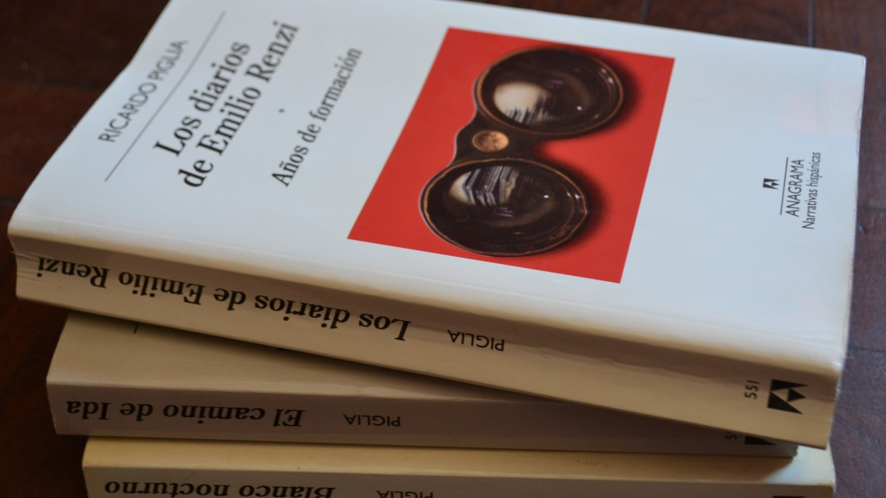

## Introducción
En esta parte vamos a aplicar algunas de las herramientas que vimos recién a una tarea bastante clásica en Procesamiento de Lenguaje Natural: el análisis de sentimento, también conocido como minería de opiniones. Esta actividad nos va a servir también para tener una primera aproximación a una forma de trabajar en NLP: el uso de lexicones (o diccionarios).

Supongamos que tenemos un conjunto de comentarios de Facebook o de lectores en un foro. Y queremos tener una idea del "tono" general de los comentarios. Es decir, queremos tener una idea si los comentarios son positivos, negativos, si expresan cierto tipo de emociones, etc. Esta es, básicamente, la esencia del análisis de sentimiento: dado un texto (oración, párrafo, un tuit, etc.) queremos poder clasificarlo en términos de su "tono" o sus "emociones".

Una defincion un poco más formal diría algo así como identificar y extraer información subjetiva de los recursos. Desde el punto de vista de la minería de textos, el análisis de sentimientos es una tarea de clasificación masiva de documentos de manera automática, en función de la connotación positiva o negativa del lenguaje ocupado en el documento.

Una subtarea básica (la que vamos a encarar aquí) es el análisis de polaridad: o sea, analizar un texto en función de si su tono "positivo" o "negativo". La clasificación del sentimiento más avanzada, "más allá de la polaridad" busca, por ejemplo, estados emocionales tales como "enfado", "tristeza", o "felicidad". [Acá hay una buena reseña](https://ieeexplore.ieee.org/document/6468032?arnumber=6468032) de estos métodos.

### Polaridad
En este caso, vamos a trabajar con la "polaridad", es decir, con el carácter positivo o negativo de un texto. Existen dos formas básicas de abordar este problema. La primera es tan simple como contar palabras. A partir de un diccionario o lexicón de palabras clasificadas como positivas / negativas, procedemos a contar cuántas aparecen de cada categoría y vincularlas de alguna forma (una resta o un ratio). Si las palabras positivas exceden a las negativas, entonces, el texto tendrá un carácter positivo.

La segunda forma, que no vamos a tocar hoy, supone entrenar algún modelo que haga esa clasificación por nosotros. Este enfoque es utilizable para cualquier tarea de análisis de sentimiento.

### Analizando los diarios de Emilio Renzi
En esta clase, vamos a tomar nuetro dataset con los tres tomos de os diarios de Renzi (aka Ricardo Piglia... o al revés...) y vamos a implementar uno de estos análisis de sentimiento.



Acá hay un lindo esquema del flujo de trabajo:

![https://www.tidytextmining.com/images/tmwr_0201.png]

Primero, cargamos nuestro dataset:
```{r}
library(tidyverse)
library(tidytext)
```

```{r}
renzi <- read_csv('../data/renzi.csv')
renzi
```

Ya tenemos organizado los tres tomos en un dataset con información sobre el tomo, el captítulo y la entrada del diario. Vamos a mejorar un poco las cateogrías de los tomos:

```{r}
renzi <- renzi %>%
        mutate(tomo = case_when(
                tomo == '1_diarios_renzi_años_de_formacion.txt' ~ 'I-Años de formación',
                tomo == '2_diarios_renzi_los_años_felices.txt' ~ 'II-Los años felices',
                tomo == '3_diarios_renzi_un_dia_en_la_vida.txt' ~ 'III-Un día en la vida',
        ))
```

Ahora, dado que vamos a contar palabras, vamos a tokenizar el corpus. En este caso, los tokens van a ser las palabras individuales. Recordemos: estamos en el formato `tidy`: cada fila va a ser una palabra y vamos a generar una columna que numere cada una de las entradas.

```{r}
tidy_renzi <- renzi %>%
        mutate(entry_number = row_number()) %>%
        unnest_tokens(output = word, 
                      input = entry)
tidy_renzi
```

Ahora, tenemos que cargar los lexicones. Pero primero, tenemos que eliminar las palabras muy frecuentes... las que llamamos stopwords. Cargamos, entonces, este listado de stopwords:

```{r}
stop_words <- read_csv('../data/stop_words_complete.csv')

tidy_renzi <- tidy_renzi %>%
        anti_join(stop_words)
```

Y hacemos un "anti_join" (es decir, lo opuesto de un join): lo que nos va a devolver son todas las palabras que están en `tidy_renzi` pero no en `stop_words`. Nótese que pasamos de unas 386.500 palabras a unas 192.300.

Ahora sí estamos en condiciones de avanzar en el análisis de sentimiento. Vamos a cargar dos lexicones. El primero, viene de [este sitio de Kaggle](https://www.kaggle.com/rtatman/sentiment-lexicons-for-81-languages). Este fue generado  este  a través de un "grafo de conocimiento", una representación gráfica de entidades del mundo real y los vínculos entre ellas. La intuición general es que las palabras que están estrechamente vinculadas en un grafo de conocimiento probablemente tengan polaridades de sentimiento similares. Particularmente, si les interesa el proceso de construcción de este lexicon (que forma parte de un proyecto que generó diccionarios para 81 lenguajes) pueden consultar [el paper original](https://aclanthology.org/P14-2063.pdf)

```{r}
sentiment_words_kaggle <- read_csv('../data/sentiment_lexicon_kaggle.csv')
sentiment_words_kaggle %>%
  group_by(sentiment) %>%
  summarise(n=n())
```

El segundo fue elaborado por Agustín Gravano del Laboratorio de Inteligencia Artificial Aplicada de la UBA. Se trata de un diccioario llamado "SDAL" (por el acrónimo de "Spanish Dictionary of Affects in Language") de unos 2880 palabras que fueron clasificadas manualmente (a través de una especie de "encuesta web" en la que participaron unas 600 personas) en tres dimensiones: 

- agrado (agradable / neutra / desagradable)
- activación (activa / neutra / pasiva)
- imaginabilidad (fácil de imaginar / neutra / difícil de imaginar)

Nosotros vamos a trabajar con la primera dimmensión.
El paper original con más detalles está [acá](https://bibliotecadigital.exactas.uba.ar/download/technicalreport/technicalreport_n00001.pdf).


```{r}
sentiment_words_liia <- read_csv('../data/sentiment_lexicon_liia.csv')
sentiment_words_liia
```

Como puede verse, este lexicon difiere respecto del anterior en que no tiene una clasificación de palabras en "positivas" o "negativas" sino que tiene un promedio de los votos de cada persona en una escala de 1 a 3. Así "amor" es ua palabra totalmente positiva porque tiene un promedio de 3. Vamos a aprovechar esta característica de ese lexicon pero vamos, también, a recodificar los datos para clasificarlos en positivos, negativos y neutros, redondeando los decimales.

```{r}
sentiment_words_liia <- sentiment_words_liia %>% 
        mutate(sentiment = case_when(
                round(mean_likeness) == 1 ~ 'negativo',
                round(mean_likeness) == 2 ~ 'neutral',
                round(mean_likeness) == 3 ~ 'positivo',
        ))

sentiment_words_liia
```

### Los sentimientos de Renzi a lo largo de su vida
Ahora sí, estamos en condiciones de avanzar. La lógica del procesamiento va a ser la siguiente: vamos a buscar qué palabras de nuestro corpus aparecen en los listados de términos. Para eso, vamos a hacer un `inner_join`. Pero, además, vamos a contar cuántas veces aparece cada palabra con un `count`.

```{r}
tidy_renzi_sent_kag <- tidy_renzi %>%
        inner_join(sentiment_words_kaggle) %>%
        group_by(tomo, sentiment, word) %>%
        summarise(n = n()) %>%
        ungroup() %>%
        arrange(desc(n))

tidy_renzi_sent_kag
```

Y, por si fuera poco, vamos a cambiarle el formato a la tabla para que nos quede una columna por sentimiento y, finalmente... vamos a calcular la resta entre la cantidad de términos positivos y la cantidad de términos negativos:

```{r}
tidy_renzi_sent_kag <- tidy_renzi %>%
        inner_join(sentiment_words_kaggle) %>%
        group_by(tomo, entry_number, sentiment) %>%
        summarise(n = n()) %>%
        ungroup() %>%
        pivot_wider(names_from=sentiment, 
                    values_from=n,
                    values_fill=0) %>%
        mutate(sentiment = positivo - negativo)

tidy_renzi_sent_kag
```

Ahora ya podemos hacer un primer gráfico de la evolución de los "sentimientos" de Renzi a lo largo de su vida (al menos, a lo largo de las entradas de su diario)

```{r}
tidy_renzi_sent_kag %>%
ggplot(aes(x=entry_number, y=sentiment, color=tomo)) +
        geom_line(show.legend = TRUE) +
        #geom_smooth(aes(index, sentiment, color=tomo)) +
        labs(x='Entrada del diario',
             y= 'Sentimiento (palabras positivas-palabras negativas)',
             title='Análisis de sentimiento por palabras (lexicon Kaggle)') +
        theme_minimal() +
        scale_color_viridis_d() +
        theme(
                axis.title.x=element_blank(),
                axis.text.x=element_blank(),
                axis.ticks.x=element_blank(),
                legend.position = 'bottom')
```

¿Qué se puede ver acá? Se ve cómo los primeros años tienen unas cuántas entradas muy negativas. "Los años felices" parecen estar más equilibrados. Por último, el tomo III que abarca los años de la dictadura y la enfermedad de Piglia tiene unas cuantas entradas sumamente negativas.

### Ejercicio
Replicar el análisis de sentimento con el lexicon construido por el LIIA. Comparar los resultados.

```{r}
###
```
