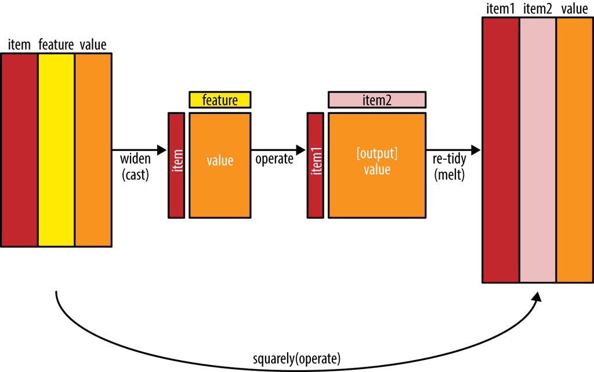

### Introducción
Hasta este punto, hemos considerado las palabras como unidades individuales y hemos examinado sus relaciones con los sentimientos o los documentos. Sin embargo, muchos análisis de texto interesantes se basan en las relaciones entre palabras, ya sea al examinar qué palabras tienden a seguir a otras inmediatamente, o qué palabras tienden a co-ocurrir dentro de los mismos documentos.

En este capítulo, exploraremos algunos de los métodos que ofrece `tidytext` para calcular y visualizar relaciones entre palabras en tu conjunto de datos de texto. Esto incluye el argumento `token = "ngrams"`, que realiza una tokenización de pares de palabras adyacentes en lugar de palabras individuales. También introduciremos dos paquetes nuevos: `ggraph`, que extiende `ggplot2` para construir gráficos de red, y `widyr`, que calcula correlaciones y distancias entre pares dentro de un marco de datos ordenado. Estas herramientas amplían nuestra caja de herramientas para explorar el texto dentro del marco de datos ordenado.

```{r}
library(tidyverse)
library(tidytext)
```

Ya tenemos organizado los tres tomos en un dataset con información sobre el tomo, el captítulo y la entrada del diario. Vamos a mejorar un poco las cateogrías de los tomos:

```{r}
renzi <- read_csv('../data/renzi.csv')
renzi <- renzi %>%
        mutate(tomo = case_when(
                tomo == '1_diarios_renzi_años_de_formacion.txt' ~ 'I-Años de formación',
                tomo == '2_diarios_renzi_los_años_felices.txt' ~ 'II-Los años felices',
                tomo == '3_diarios_renzi_un_dia_en_la_vida.txt' ~ 'III-Un día en la vida',
        ))

```

Vamos a eliminar acentos:

```{r}
renzi <- renzi %>%
        mutate(entry = stringi::stri_trans_general(str = entry, 
                                   id = "Latin-ASCII"))
```

### Tokenización por n-gramas
Hasta ahora, hemos estado utilizando la función `unnest_tokens` para tokenizar por palabra, o a veces por oración, lo cual es útil para los tipos de análisis de sentimiento y frecuencia que hemos estado haciendo hasta este punto. Pero también podemos utilizar esta función para tokenizar en secuencias consecutivas de palabras, lo que llamamos n-gramas. Al observar con qué frecuencia la palabra X es seguida por la palabra Y, podemos construir un modelo de sus relaciones.

Para lograr esto, agregamos la opción `token = "ngrams"` a la función `unnest_tokens()`, y establecemos el valor de `n` en el número de palabras que deseamos capturar en cada n-grama. Cuando establecemos `n` en 2, estamos examinando pares de dos palabras consecutivas, a menudo llamadas "bigramas".

```{r}
renzi_bigrams <- renzi %>%
  unnest_tokens(bigram, entry, token = "ngrams", n = 2) %>%
  filter(!is.na(bigram))

renzi_bigrams
```

Esta estructura de datos sigue siendo una variación del formato de texto ordenado. Está estructurada con un token por fila (con metadatos adicionales, como el libro, todavía conservados), pero cada token representa un bigrama.

Es importante notar que estos bigramas se superponen: "el umbral" es un token, mientras que "umbral desde" es otro.

### Conteo y filtrado de n-gramas
Nuestras herramientas habituales de tidy data se aplican igualmente bien al análisis de n-gramas. Podemos examinar los bigramas más comunes utilizando la función `count()` de dplyr:

```{r}
renzi_bigrams %>%
  count(bigram, sort = TRUE)
```

Como uno podría esperar, muchas de las bigramas más comunes son pares de palabras comunes (poco interesantes), como "de la" y "en el": lo que llamamos "stopword".

Este es un momento adecuado para usar la función `separate()` de `tidyr`, que divide una columna en varias basadas en un delimitador. Esto nos permite separarla en dos columnas, "palabra1" y "palabra2", momento en  el cual podemos eliminar los casos en los que cualquiera de ellas sea una stopword.

Para ello, cargamos nuestro diccionario de stopwords y eliminamos acentos:

```{r}
stop_words <- read_csv('../data/stop_words_complete.csv')
stop_words <- stop_words %>%
  mutate(word = stringi::stri_trans_general(str = word, 
                                   id = "Latin-ASCII")) %>%
  add_row(word=c("capitulo", "uno", "dos", "tres", "cuatro", "cinco",
                 "seis", "siete", "ocho", "nueve", "diez", "siempre", "solo"), 
          lexicon=c(rep("custom", 13)))

bigrams_separated <- renzi_bigrams %>%
  separate(bigram, c("word1", "word2"), sep = " ")

bigrams_filtered <- bigrams_separated %>%
  filter(!word1 %in% stop_words$word) %>%
  filter(!word2 %in% stop_words$word)

# new bigram counts:
bigram_counts <- bigrams_filtered %>% 
  count(word1, word2, sort = TRUE)

bigram_counts
```

Podemos ver que hay bastantes nombres de lugares (buenos_aires), de personas (jorge_alvarez), números (mil_pesos), etc.

En otros análisis, es posible que deseemos trabajar con las palabras recombinadas. La función `unite()` de `tidyr` es el inverso de `separate()`, y nos permite combinar las columnas en una sola. Así, "separate/filter/count/unite" nos permite encontrar las bigramas más comunes que no contienen stopwords.

```{r}
bigrams_united <- bigrams_filtered %>%
  unite(bigram, word1, word2, sep = " ")

bigrams_united
```

En otros análisis, es posible que estés interesado en los trigramas más comunes, que son secuencias consecutivas de 3 palabras. Podemos encontrar esto estableciendo `n = 3`:

```{r}
renzi %>%
  unnest_tokens(trigram, entry, token = "ngrams", n = 3) %>%
  filter(!is.na(trigram)) %>%
  separate(trigram, c("word1", "word2", "word3"), sep = " ") %>%
  filter(!word1 %in% stop_words$word,
         !word2 %in% stop_words$word,
         !word3 %in% stop_words$word) %>%
  count(word1, word2, word3, sort = TRUE)
```

### Analizando bigramas
Este formato de un bigrama por fila es útil para análisis exploratorios del texto. Como ejemplo sencillo, podríamos estar interesados en la forma en que Renzi menciona la palabra "literatura":

```{r}
bigrams_filtered %>%
  filter(word1 == "literatura" | word2 == "literatura") %>%
  count(tomo, chapter,word1, word2, sort = TRUE)
```

Un bigrama también puede ser tratado como un término en un documento de la misma manera que tratamos palabras individuales. Por ejemplo, podemos analizar el tf-idf de bigramas en los diarios de Piglia. Estos valores de tf-idf pueden visualizarse dentro de cada tomo, al igual que hicimos para las palabras.

```{r}
bigram_tf_idf <- bigrams_united %>%
  count(tomo, bigram) %>%
  bind_tf_idf(bigram, tomo, n) %>%
  arrange(desc(tf_idf))

bigram_tf_idf
```

Similar a lo que descubrimos las clases anteriores, aparecen muchos nombres propios. También aparecen cuestiones monetarias, libros y revistas.

Existen ventajas y desventajas en examinar el tf-idf de bigramas en lugar de palabras individuales. Pares de palabras consecutivas pueden capturar estructuras que no están presentes cuando solo se cuentan palabras individuales, y pueden proporcionar contexto que hace que los tokens sean más comprensibles (por ejemplo, "serie negra" en "II - Los años felices" es más informativo que "serie"). 

Sin embargo, las métricas por bigrama también son más dispersas: un par de palabras típico es más raro que cualquiera de sus palabras componentes. Por lo tanto, los bigramas pueden ser especialmente útiles cuando tienes un conjunto de datos de texto muy grande.

### Uso de bigramas para proporcionar contexto en el análisis de sentimiento
Nuestro enfoque de análisis de sentimiento que vimos la clase pasada simplemente contó la aparición de palabras positivas o negativas, de acuerdo con un léxico de referencia. Uno de los problemas con este enfoque es que el contexto de una palabra puede ser tan importante como su presencia. Por ejemplo, las palabras "feliz" y "gustar" serán contadas como positivas, incluso en una frase como "¡No estoy feliz y no me gusta!"

Ahora que tenemos los datos organizados en bigramas, es fácil determinar con qué frecuencia las palabras están precedidas por una palabra como "no":

```{r}
bigrams_separated %>%
  filter(word1 == "no") %>%
  count(word1, word2, sort = TRUE)
```

Realizando análisis de sentimiento en los datos de bigramas, podemos examinar con qué frecuencia las palabras asociadas al sentimiento son precedidas por "no" u otras palabras negadoras. Esto nos permitiría ignorar o incluso revertir su contribución al puntaje de sentimiento.

Utilizaremos el lexicon elaborado por el LIIA-UBA  para el análisis de sentimiento, que recordarás otorga un valor numérico entre 1 y 3 de "likeness" para cada palabra.

```{r}
sentiment_words_liia <- read_csv('../data/sentiment_lexicon_liia.csv')
sentiment_words_liia <- sentiment_words_liia %>% 
        mutate(sentiment = case_when(
                round(mean_likeness) == 1 ~ 'negativo',
                round(mean_likeness) == 2 ~ 'neutral',
                round(mean_likeness) == 3 ~ 'positivo',
        ))

sentiment_words_liia <- sentiment_words_liia %>%
  mutate(word = stringi::stri_trans_general(str = word, 
                                   id = "Latin-ASCII"))
```

Luego podemos examinar las palabras más frecuentes que fueron precedidas por "no" y estaban asociadas con un sentimiento.

```{r}
not_words <- bigrams_separated %>%
  filter(word1 == "no") %>%
  inner_join(sentiment_words_liia, by = c(word2 = "word")) %>%
  count(word2, mean_likeness, sort = TRUE)

not_words
```

Por ejemplo, la palabra asociada con el sentimiento más común que sigue a "no" es "solo", que normalmente tendría una puntuación neutral.

"No" no es el único término que proporciona algún contexto para la palabra siguiente. Podríamos elegir cuatro palabras comunes (o más) que nieguen el término subsiguiente, y utilizar el mismo enfoque de unión y conteo para examinar todas ellas a la vez.

```{r negation_analysis}
negation_words <- c("no", "sin", "nunca", "jamas")

negated_words <- bigrams_separated %>%
  filter(word1 %in% negation_words) %>%
  inner_join(sentiment_words_liia, by = c(word2 = "word")) %>%
  count(word1, word2, mean_likeness, sort = TRUE)

negated_words
```

Luego podríamos visualizar cuáles son las palabras más comunes que siguen a cada negación en particular. Si bien "no solo" y "no era" siguen siendo los dos ejemplos más comunes, también podemos ver combinaciones como "sin saber" y "sin plata". 

Podríamos combinar esto con los enfoques de la clase pasada para revertir los valores del lexicon de cada palabra que sigue a una negación. Estos son solo algunos ejemplos de cómo encontrar palabras consecutivas puede proporcionar contexto a los métodos de minería de texto.

### Visualización de una Red de Bigramas con `ggraph`
Podríamos estar interesados en visualizar todas las relaciones entre palabras de manera simultánea, en lugar de solo las principales algunas veces. Como una visualización común, podemos organizar las palabras en una red o "grafo". En este caso, nos referiremos a un "grafo" no en el sentido de una visualización, sino como una combinación de nodos conectados. Un grafo puede construirse a partir de un objeto tidy, ya que tiene tres variables:

*- from*: el nodo desde el cual parte un borde
*- to*: el nodo hacia el cual se dirige un borde
*- weight*: un valor numérico asociado con cada borde

El paquete `igraph` tiene muchas funciones poderosas para manipular y analizar redes. Una forma de crear un objeto igraph a partir de datos tidy es la función `graph_from_data_frame()`, que toma un data frame de bordes con columnas para "from", "to" y atributos de los bordes (en este caso, n):

```{r}
library(igraph)

# Recuentos originales
bigram_counts

# Filtrar solo combinaciones relativamente comunes
bigram_graph <- bigram_counts %>%
  filter(n > 15) %>%
  graph_from_data_frame()

bigram_graph
```

`igraph` tiene funciones de graficación incorporadas, pero muchos otros paquetes han desarrollado métodos de visualización para objetos de grafo. El paquete `ggraph` implementa estas visualizaciones en términos de la gramática de gráficos, con la que ya estamos familiarizados por `ggplot2`.

Podemos convertir un objeto igraph en un ggraph con la función `ggraph`, después de lo cual agregamos capas a él, de manera similar a cómo se agregan capas en `ggplot2`. Por ejemplo, para un gráfico básico necesitamos agregar tres capas: nodos, bordes y texto.

```{r}
library(ggraph)
set.seed(2017)

ggraph(bigram_graph, layout = "fr") +
  geom_edge_link() +
  geom_node_point() +
  geom_node_text(aes(label = name), vjust = 1, hjust = 1)
```
Más arriba, podemos visualizar algunos detalles de la estructura del texto. Aparecen algunos clústers con claro sentido sintáctico: (parece/debe/puede-se). Luego, el término "tiempo" aparece como el centro de un nodo importante.

Una vez más, aparecen numerosos nombres propios que son nombres de autores y/o de personajes ("fierro-martín-san") y nodos de palabras asociadas a la "teoría literaria": "novola-policial-género".

Concluimos con algunas operaciones de pulido para hacer un gráfico de mejor apariencia:

- Agregamos el atributo edge_alpha a la capa de enlaces para hacer los enlaces transparentes según la frecuencia del bigrama (común o raro)

- Agregamos direccionalidad con una flecha, construida usando `grid::arrow()`, incluyendo la opción `end_cap` que indica que la flecha debe terminar antes de tocar el nodo

- Jugamos con las opciones de la capa de nodos para hacer los nodos más atractivos (puntos más grandes y azules)

- Agregamos un tema útil para trazar redes, `theme_void()`

```{r}
set.seed(2020)

a <- grid::arrow(type = "closed", length = unit(.15, "inches"))

ggraph(bigram_graph, layout = "fr") +
  geom_edge_link(aes(edge_alpha = n), show.legend = FALSE,
                 arrow = a, end_cap = circle(.07, 'inches')) +
  geom_node_point(color = "lightblue", size = 5) +
  geom_node_text(aes(label = name), vjust = 1, hjust = 1) +
  theme_void()
```

Puede requerir algo de experimentación con `ggraph` para lograr que las redes tengan un formato presentable como este, pero la estructura de red es una forma útil y flexible de visualizar datos relacionales tidy.

Para hacer que la visualización sea interpretable, elegimos mostrar solo las conexiones más comunes de palabra a palabra, pero uno podría imaginar un grafo enorme que represente todas las conexiones que ocurren en el texto.

### Conteo y correlación de pares de palabras con el paquete widyr
La tokenización por n-grama es una forma útil de explorar pares de palabras adyacentes. Sin embargo, también podríamos estar interesados en palabras que tienden a coocurrir dentro de documentos particulares o capítulos particulares, **incluso si no ocurren una al lado de la otra**.

Los datos tidy son una estructura útil para comparar entre variables o agrupar por filas, pero puede ser desafiante comparar entre filas: por ejemplo, contar la cantidad de veces que dos palabras aparecen en el mismo documento o ver cuán correlacionadas están. La mayoría de las operaciones para encontrar recuentos o correlaciones por pares necesitan convertir los datos en una matriz primero.

Examinaremos algunas de las formas en que el texto tidy se puede convertir en una matriz dispersa más adelante, pero en este caso no es necesario. El paquete `widyr` facilita operaciones como calcular recuentos y correlaciones, al simplificar el patrón de "expandir datos, realizar una operación y luego reorganizar datos". Nos centraremos en un conjunto de funciones que hacen comparaciones por pares entre grupos de observaciones (por ejemplo, entre documentos o secciones de texto).



### Conteo y Correlación entre entradas del diario
Consideremos el primer tomo de los diarios de Renzi, "I-Años de formación", dividido en entradas. Es posible que estemos interesados en las palabras que tienden a aparecer dentro de la misma sección.

```{r}
renzi_section_words <- renzi %>%
  filter(tomo == "I-Años de formación") %>%
  mutate(entry_code = row_number()) %>%
  #filter(section > 0) %>%
  unnest_tokens(word, entry) %>%
  filter(!word %in% stop_words$word)

renzi_section_words
```

Una función útil de widyr es `pairwise_count()`. El prefijo `pairwise_` significa que esta función resultará en una fila por cada par de palabras en la variable "word". Esto nos permite contar pares comunes de palabras que coaparecen en la misma sección:

```{r}
library(widyr)

# cuenta palabras que co-ocurren en cada entrada
word_pairs <- renzi_section_words %>%
  pairwise_count(word, entry_code, sort = TRUE)

word_pairs
```

Es importante notar que mientras la entrada tenía una fila por cada par de un documento (una entrada) y una palabra, la salida tiene una fila por cada par de palabras. Esto también es un formato tidy, pero de una estructura muy diferente que podemos usar para responder nuevas preguntas.

Por ejemplo, podemos ver que el par de palabras más común en una sección es "mismo" y "tiempo". También podemos encontrar fácilmente las palabras que más a menudo ocurren con "tiempo":

```{r}
word_pairs %>%
  filter(item1 == "tiempo")
```

### Correlación por pares
Pares como "siempre" y "solo" son las palabras que más comúnmente coocurren, pero eso no es particularmente significativo ya que también son las palabras individuales más comunes. En cambio, es posible que deseemos examinar la correlación entre palabras, lo que indica con qué frecuencia aparecen juntas en comparación con cuántas veces aparecen por separado.

En particular, aquí nos centraremos en el coeficiente phi, una medida común para la correlación binaria. El foco del coeficiente phi es cuánto más probable es que tanto la palabra X como la palabra Y aparezcan, o que ninguna aparezca, en comparación con que una aparezca sin la otra.

Considera la siguiente tabla:

|                       | Tiene la palabra Y | No iene la palabra Y | Total  |
|-----------------------|--------------------|----------------------|--------|
| Tiene la palabra X    | $n_{11}$             | $n_{10}$               | $n_{1.}$ |
| No tiene la palabra X | $n_{01}$             | $n_{00}$               | $n_{0.}$ |
| Total                 | $n_{.1}$             | $n_{.0}$               | $n$      |


Por ejemplo, que $n_{11}$, representa la cantidad de documentos en los que tanto la palabra X como la palabra Y aparecen, $n_{00}$ es el número en el que ninguna de las dos aparece, y
$n_{10}$ y $n_{01}$ son los casos en los que una aparece sin la otra. 

En términos de esta tabla, el coeficiente phi es:

$$\phi=\frac{n_{11}n_{00}-n_{10}n_{01}}{\sqrt{n_{1\cdot}n_{0\cdot}n_{\cdot0}n_{\cdot1}}}$$

El coeficiente phi es equivalente a la correlación de Pearson, que tal vez hayas escuchado en otros contextos cuando se aplica a datos binarios.

La función `pairwise_cor()` en widyr nos permite encontrar el coeficiente phi entre palabras basado en cuán frecuentemente aparecen juntas en la misma sección. Su sintaxis es similar a `pairwise_count()`.

```{r}
# we need to filter for at least relatively common words first
word_cors <- renzi_section_words %>%
  group_by(word) %>%
  filter(n() >= 20) %>%
  pairwise_cor(word, entry_code, sort = TRUE)

word_cors
```

Este ouput es útil para hacer un análisis exploratorio. Por ejemplo, podemos encontrar las palabras mas correlaciones con una palabra como "vinas", referida a David Viñas, usando una operación de filtrado:

```{r}
word_cors %>%
  filter(item1 == "vinas")
```

Esto nos permite elegir palabras específicas interesantes y encontrar las otras palabras más asociadas con ellas.

```{r}
word_cors %>%
  filter(item1 %in% c("novela", "literatura", "escritor", "libro")) %>%
  group_by(item1) %>%
  slice_max(correlation, n = 10) %>%
  ungroup() %>%
  mutate(item2 = reorder(item2, correlation)) %>%
  ggplot(aes(item2, correlation)) +
  geom_bar(stat = "identity") +
  facet_wrap(~ item1, scales = "free") +
  coord_flip() +
  theme_minimal()
```
Así como utilizamos ggraph para visualizar los bigrams, podemos usarlo para visualizar las correlaciones y agrupaciones de palabras que fueron encontradas por el paquete `widyr`:

```{r}
set.seed(2016)

word_cors %>%
  filter(correlation > .39) %>%
  graph_from_data_frame() %>%
  ggraph(layout = "fr") +
  geom_edge_link(aes(edge_alpha = correlation), show.legend = FALSE) +
  geom_node_point(color = "lightblue", size = 2) +
  geom_node_text(aes(label = name), repel = TRUE) +
  theme_void()
```
Es importante destacar que, a diferencia del análisis de bigramas, las relaciones aquí son simétricas en lugar de direccionales (no hay flechas). También podemos observar que, aunque las combinaciones de nombres y títulos que dominaban las parejas de bigrams son comunes, como 'buenos_aires', también podemos ver combinaciones de palabras que aparecen cerca una de la otra, como 'cartas', 'abuelo', 'guerra' o 'adrogué'.

### Resumen
Este clase demostró cómo el enfoque de texto ordenado es útil no solo para analizar palabras individuales, sino también para explorar las relaciones y conexiones entre palabras. Tales relaciones pueden involucrar n-gramas, que nos permiten ver qué palabras tienden a aparecer después de otras, o coocurrencias y correlaciones, para palabras que aparecen en proximidad una de la otra. La clase también demostró el paquete ggraph para visualizar ambos tipos de relaciones como redes. Estas visualizaciones de redes son una herramienta flexible para explorar relaciones.