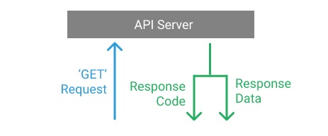

```{r, include=FALSE}
knitr::opts_chunk$set(echo = TRUE, warning =FALSE)
```

## APIS
Una API es un servidor que nos provee acceso a la data de alguna aplicación o servicio. Las APIs dependen de los dueños de las aplicaciones, y estos pueden ofrecer acceder a ellas de manera gratis, cobrar por ellas parcial o totalmente o no ofrecerlas. Algunos servicios populares que cuentan con APIs son Facebook, Instagram, Twitter o Spotify. Estos no tienen las APIs completamente abiertas: hay que crearse una cuenta developer en estos servicios y generar un código para acceder a sus datos. Además, algunos, como Twitter, tienen una parte de sus datos abiertos y otros son pagos. 

- Las API siguen una lógica bastante simple: se hace un pedido al servidor con el comando `GET`, y el servidor devuelve una respuesta. Para usar la función `GET` vamos a necesitar el paquete `httr`. 

 

- Devuelven la información en formato JSON. Consiste en objetos ordenados por pares de `nombre:valor` separados por comas y puestos entre llaves `{}`. Para leer este formato vamos a necesitar el paquete `rjson`.

```{r}
library(httr)
library(rjson)
library(tidyverse)
```

## Un ejemplo mínimo: estadísticas mundiales de pobreza
[PIP](https://pip.worldbank.org/) es un proyecto del Banco Mundial. Se trata de una herrmienta que permite replicar los cálculos que el organismo realiza sobre la llamada "Pobreza Absoluta" para una gran grupo de paises en el mundo. No nos vamos a meter en detalles pero la cosa es que hay dos grandes formas de medir la pobreza: la absoluta y la relativa. La pobreza absoluta define un cierto umbral de ingresos por medio del cual puede adquirirse una canasta mínima de bienes y servicios. Aquellos hogares que se encuentren por debajo de ese umbral serán clasificados omo "pobres". Ahora bien, las canastas varían notablemente entre países por diversos motivos (históricos, culturales, metodológicos) es por ello que el Banco Mundial definió el criterio de los "2 dólares diarios": cualquier persona que no llegue a ese ingreso es considerado como "pobre extremo".

### La API de `PIP`
Lo interesante (entre otras cosas) de este proyecto es que no te hace bajar un mamotreto de datos sino que... tiene una API, bastante completa para trabajar. De hecho, podemos jugar con diferentes umbrales de pobreza absoluta. Si U$S nos parece demasiado bajo podemos utilizar otro umbral más alto y la API nos va a devolver cálculos de pobreza para dichos umbrales.

```{r}
#povcalnet <- GET("http://iResearch.worldbank.org/PovcalNet/PovcalNetAPI.ashx?C0=CHN&PL0=2.5&Y0=All&format=#json")

api<-GET("https://api.worldbank.org/pip/v1/pip?country=CHN&year=all&povline=2.5&fill_gaps=false&format=csv")
```

La búsqueda tiene varias partes:

- el protocolo: `http://`,
- el nombre del servidor: `api.worldbank.org`,
- el nombre del sitio: `pip`,
- el string de la query (esta es la parte importante):`country=CHN&year=all&povline=2.5&fill_gaps=false&format=csv`

Vamos a descomponer esta última parte:

- `country=CHN`: es el parámetro de país... en este caso, China
- `year=all`: pide todos los años de estimación disponibles
- `povline=2.5`: refiere al umbral de los "dólares diarios". Quienes ganen menos (en este caso de U$S2.5 por día serán considerados como pobres
- `fill_gaps=false`: parámetro para rellenar o no los perdidos
- `format=csv`: el formato de respuesta requerido

Hay muchos más 

```{r}
api
```

### De csv a una `tibble`
Hasta acá la data todavía está en un formato que no nos sirve. La información está en formato Unidecode en el objeto `content` de nuestra lista,  Por eso vamos a usar la funcion `rawtoChar` para convertir este formato a un string que se vea en formato csv Luego, vamos a leerlo como si fuera una `tibble` 

```{r}
api <- read_csv(rawToChar(api$content))
```

Hagamos un gráfico breve para ver la evolución de la pobreza en este umbral según zonas urbanas y rurales:
```{r}
api %>% 
        ggplot(aes(x=survey_year, y=headcount, color=reporting_level))+
        geom_line() +
        labs(x='Año',
             y='% población c/ menos de 2.5 U$S diarios') +
        theme_minimal() +
        facet_wrap(~reporting_level)
```

## Actividad

Traer las estimaciones de pobreza de Brasil con un umbral de pobreza de U$S2 para todos los años disponibles y graficarlo. 

```{r}

```

## Autenticación 

Muchas veces las API requieren algún mecanismo de registro para poder usarlas. Esto puede ser por mera seguridad o para cobrar por su uso.

La gran mayoría de los métodos de autenticación de API generalmente usan algún tipo de token que se pasa al servidor web con cada llamada API realizada. El token es proporcionado al usuario cuando el usuario se registra y es un elemento permanente de la llamadas del usuario (generalmente en aplicaciones de baja seguridad), o puede cambiar con frecuencia, y se recupera del servidor utilizando una combinación de nombre de usuario y contraseña.

Por ejemplo, para hacer una consulta al Sistema Integrado de Información Sanitaria Argentina del Ministerio de Salud sobre los establecimientos de salud, deberíamos escribir algo como esto:

`https://sisa.msal.gov.ar/sisa/services/rest/establecimiento/buscar?provincia=1&redEstablecimiento=5Post:{"usuario":"jperez","clave":"xxxx"}`

Existen varias librerías hechas para hacer pedidos a APIS que requieren autenticación de manera simple (spotifyr, instaR, twitteR).