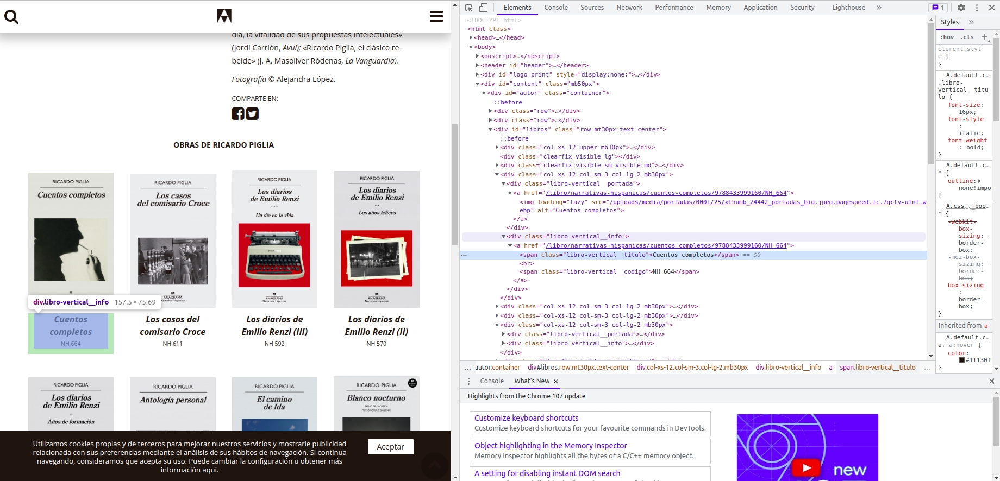

```{r, include=FALSE}
knitr::opts_chunk$set(echo = TRUE, warning =FALSE)
```

## Introducción
Ya sabemos que en Internet hay una cantidad masiva de información la cual e puede ser una gran fuente para los campos de estudio que querramos abordar. Ahora bien, para poder recolectar esta información es necesario aplicar herramientas de web scraping.

Esta técnica busca lograr la automatización de la recolección de datos de un sitio. En líneas generales, la lógica del proceso es la siguiente:

1. entrar a una página
2. buscar en el código HTML la información que nos interesa y
3. pasarla a algún formato tabular (filas y columas)

Antes de empezar a armar un scraper, es una buena práctica inspeccionar la estructura del sitio del que vamos a construir la información, para tener una idea de dónde está dicha información.

Supongamos que queremos sistematizar los libros de cada autor que están disponibles en la editorial Anagrama. Podríamos ir a la librería de barrio... o extraer los títulos de la [página web](https://www.anagrama-ed.es/autores/a?p=2). Para este ejemplo, vamos a scrapear los títulos de [Ricardo Piglia](https://www.anagrama-ed.es/autor/piglia-ricardo-856). 

## HTML + CSS
El contenido y la estructura de una página web está escrita en código HTML. El HTML está compuesto por diferentes objetos llamados tags (por ejemplo `div`, `a`, `body`, `head`) que están rodeados por el símbolo `<>`. Cada tag cumple una función diferente -y los conjuntos de tags dan forma a la página.

A su vez, tienen atributos indicados por CSS que "estilizan" la página. Los más importantes para scrapear son `class`, `href` e `id`. 

Para ver cómo está compuesto este código, hay que ir a la página que queremos y hacer clic derecho + inspeccionar. Identificar la ubicación de estos elementos html es necesario para ver dónde está la información que queremos conseguir y pensar la lógica de por qué lado la vamos a atacar. 



En nuestro caso, necesitamos conseguir de esta página un listado de los links de cada libro. Si se fijan, el tag `<span>` con el título del libro está “adentro” del tag `<div>` cuya `class` tiene `libro-vertical__info` . El link está dentro del mismo `div` pero en el atributo `a`. Los elementos están *anidados*. Clarísimo, ¿no? Vamos a ver en detalle...

## La herramienta: `rvest`
Para hacer el scrapeo vamos a usar la librería `rvest`. La importamos a ella y otras librerías auxiliares que nos van a servir. 

```{r,results='hide'}
library(rvest)
library(tidyverse)
```

Lo primero que hay que hacer es "leer" la página html para importarla a R. 

```{r}
piglia <- read_html("https://www.anagrama-ed.es/autor/piglia-ricardo-856")

piglia
```

La función `read_html()` parsea y devuelve una lista que contiene la estructura arbolada de HTML que mencionamos antes. Por suerte `rvest` usa la lógica de los pipes para acceder a estos elementos, por lo que para encontrar lo que queremos podemos usar la funcion `html_elements()`. Esta identifica los elementos que buscamos según XPath o [selectores CSS](https://www.w3schools.com/cssref/css_selectors.asp). Como podemos encontrar lo que queríamos identificándolo por una clase única, vamos a usar CSS. 

```{r}
libros <- piglia %>% 
          #html_elements("w-1-x-hidden") %>% 
          html_elements("a") %>%
          html_attr("href")

libros <- libros[libros %>% str_detect("/libro/")]
```

¿Qué se está haciendo acá? 

1. le pedimos al paquete que traiga todos los elementos cuyo atributo class es `<libro-vertical__info>`;
2. siguiendo la lógica de árbol y elementos anidados, con un pipe le puedo indicar que -dentro de esos elementos que encontró- me traiga aquellos elementos `<a>`; 
3. dinalmente, de esos elementos, le pido que me traiga el atributo href que es el que contiene el link 

Esto nos devuelve un listado de los links de los libros. Vamos a tener que pegarle el resto del texto para completar la URL:

```{r}
libros_links <- paste0("https://www.anagrama-ed.es", libros)

libros_links
```

Ahora que tenemos el listado sobre el cual queremos iterar, hay que revisar la página de cada libro para ver la información que tiene. En principio, podemos destacar varios elementos que nos interesan: 

1. el título
2. el resumen
3. el identificador del libro
4. el precio
5. la cantidad de páginas
6. la colección a la que pertenece
7. la fecha de publicación

Siguiendo la lógica anterior, podemos observar que el título está en el elemento `<h1>`. ¿Qué pasa cuando lo seleccionamos únicamente por el? 

```{r}
libro <- read_html(libros_links[1])

libro %>% html_elements("h1")
```

La página nos trae también el botón para suscribirse. Por eso, vamos a especificar la búsqueda pidiéndole a RVest que nos traiga los elementos `<h2>` con `<class titulo-libro>`. 

Con `html_text2()` extraemos el texto del elemento. 

```{r}
libro %>% 
        html_elements("h1") %>% 
        html_text2()
```

Vamos a hacer lo mismo para el resumen: este lo identificamos porque está en el elemento div con clase textContent. 

```{r}
libro %>% html_element("div.") %>%
        html_text2() %>%
        str_squish() #Borramos los espacios en blanco de más

```

Finalmente, podemos ver que hay un compilado de información que nos interesa (cantidad de páginas, fecha de publicación, colección, identificador) en una tabla debajo de la imagen de la tapa. Podríamos extraer los elementos uno por uno como veníamos haciendo, pero RVest tiene una función para traer directamente los elementos `<table>` en formato tibble. 

```{r}
tabla_info <- libro %>% 
        html_element("table.no-print") %>% 
        html_table()

tabla_info
```

Pivoteamos para darle formato. 

```{r}
tabla_info %>%
        pivot_wider(names_from = "X1", values_from = "X2") %>%
        rename("isbn" = "ISBN",
               "ean" = "EAN",
               "precio" = "PVP CON IVA",
               "paginas" = "NÚM. DE PÁGINAS",
               "fecha_publicacion" = "PUBLICACIÓN",
               "coleccion" = "COLECCIÓN") %>%
        select(-CÓDIGO)
```

### Sistematizando el scrapeo
Ahora que identificamos cómo buscar estos elementos uno por uno en la página hay que sistematizar una función que loopee el listado de links que tenemos para encontrar esos elementos. Probemos esta función a ver qué pasa:

```{r echo=FALSE, message=FALSE, warning=FALSE, eval=FALSE}

scrapeo_anagrama <- function(listado_links){

        #Creo listas y dataframes auxiliares donde voy a ir guardando la data. 
        titulos <- c()
        resumenes <- c()
        info_extra <- data.frame(isbn = numeric(), 
                                 ean  = numeric(), 
                                 precio = character(), 
                                 paginas  = numeric(), 
                                 fecha_publicacion = character(), 
                                 coleccion = character())
        
        for (l in listado_links){
                
                libro <- read_html(l)
                
                print(paste0("Voy por libro ", l))
                
                titulo <- libro %>% html_elements("h1.titulo-libro") %>% 
                        html_text2()
                
                titulos <- append(titulos, titulo)
                
                resumen <- libro %>% html_element(".textContent")%>%
                        html_text()%>%
                        str_squish()%>%
                        str_replace("Título descatalogado.", "")
                
                resumenes <- append(resumenes, resumen)
                
                tabla_info <- libro %>% 
                        html_element("table.no-print") %>% 
                        html_table() 
                
                tabla_info <- tabla_info%>%
                        pivot_wider(names_from = "X1", values_from = "X2") %>%
                        rename("isbn" = "ISBN",
                               "ean" = "EAN",
                               "precio" = "PVP CON IVA",
                               "paginas" = "NÚM. DE PÁGINAS",
                               "fecha_publicacion" = "PUBLICACIÓN",
                               "coleccion" = "COLECCIÓN") %>%
                        select(isbn, ean, precio, paginas, fecha_publicacion, coleccion)
                
                info_extra <- rbind(info_extra, tabla_info)
                
        }
        
        df <- data.frame(cbind(titulos, resumenes, info_extra)) #Junto en un dataframe la info conseguida
        
        return(df)
}

scrapeo_anagrama(listado_links=libros_links)
```

Nos encontramos con algo que suele pasar bastante en el scrapeo: hay una página que rompe el formato que veníamos usando. En este caso, Crítica y Ficción no tiene el número de páginas en la tabla. Por eso vamos a usar la función tryCatch(), que nos sirve para indicar qué hacer en caso de toparnos con un error sin que se rompa la función. 

```{r}
scrapeo_anagrama <- function(listado_links){

        #Creo listas y dataframes auxiliares donde voy a ir guardando la data. 
        titulos <- c()
        resumenes <- c()
        info_extra <- data.frame(isbn = numeric(), ean  = numeric(), precio = character(), 
                                 paginas  = numeric(), fecha_publicacion = character(), coleccion = character())
        
        for (l in listado_links){
                
                libro <- read_html(l)
                
                print(paste0("Voy por libro ", l))
                
                titulo <- libro %>% html_elements("h1.titulo-libro") %>% 
                        html_text2()
                
                titulos <- append(titulos, titulo)
                
                resumen <- libro %>% html_element(".textContent")%>%
                        html_text()%>%
                        str_squish()%>%
                        str_replace("Título descatalogado.", "")
                
                resumenes <- append(resumenes, resumen)
                
                tabla_info <- libro %>% 
                        html_element("table.no-print") %>% 
                        html_table() 
                
                tabla_info <-  tryCatch(
                    {
                    tabla_info%>%
                        pivot_wider(names_from = "X1", values_from = "X2") %>%
                        rename("isbn" = "ISBN",
                               "ean" = "EAN",
                               "precio" = "PVP CON IVA",
                               "paginas" = "NÚM. DE PÁGINAS",
                               "fecha_publicacion" = "PUBLICACIÓN",
                               "coleccion" = "COLECCIÓN") %>%
                        select(isbn, ean, precio, paginas, fecha_publicacion, coleccion)
                        },
                    error = function(e){
                    tabla_info %>%
                        pivot_wider(names_from = "X1", values_from = "X2") %>%
                        rename("isbn" = "ISBN",
                               "ean" = "EAN",
                               "precio" = "PVP CON IVA",
                               "fecha_publicacion" = "PUBLICACIÓN",
                               "coleccion" = "COLECCIÓN") %>%
                        select(isbn, ean, precio, fecha_publicacion, coleccion)%>%
                        mutate(paginas = "No disponibles")
                        }
                    )
                info_extra <- rbind(info_extra, tabla_info)
                
        }
        
        df <- data.frame(cbind(titulos, resumenes, info_extra)) #Junto en un dataframe la info conseguida
        
        return(df)
}

libros_piglia <- scrapeo_anagrama(libros_links)
```

```{r}
libros_piglia
```


### Actividad
Traer de la página de Anagrama el listado de todos los autores que tienen disponibles. 
```{r}
links_letras_autores <- paste0("https://www.anagrama-ed.es/autores/", letters)

autores <- tibble(autor=character(),
                  link=character())

for (l in links_letras_autores[1]){
        autor <- read_html(l)
        nombre <- autor %>% html_elements("div.autor") %>% html_text2() 
        link_autor <- autor %>% html_elements("div.autor") %>% html_elements("a") %>% html_attr("href")
        
        a <- tibble(cbind(nombre, link_autor))
        
        autores <- bind_rows(a)
        
}
```