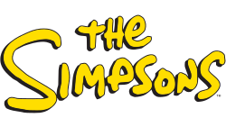
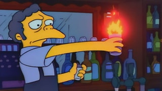
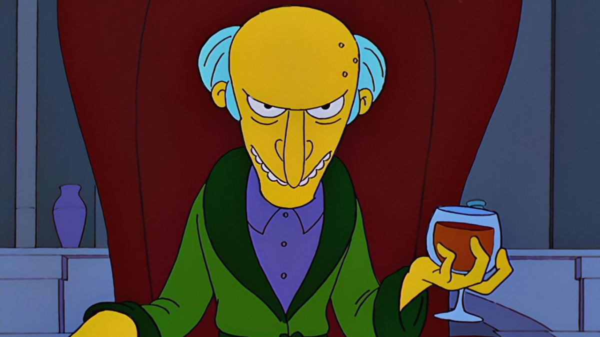

```{r echo=TRUE, results='hide'}
library(tidyverse)
library(tidytext)
library(tictoc)
library(word2vec)
library(textclean)
library(textstem)
library(Rtsne)
library(plotly)
```



## Introducción
En este notebook vamos a entrenar un modelo de Word embeddings con datos de Los Simpsons (guiones de varias temporadas, cerca de 150 mil lineas de dialogo para unos 600 episodios) y tratar de entender los resultados.

La idea va a ser tratar de entrenar un [modelo word2vec](https://jalammar.github.io/illustrated-word2vec/) sobre la base de esos diálogos e inferir algunas relaciones solamente con los textos.

## Detectando relaciones con Los Simpsons
```{r}
dialogos <- read_csv('../data/simpsons_script_lines.csv') %>%
        select(id, episode_id, raw_character_text, spoken_words) %>%
        arrange(episode_id, id)
```

```{r}
head(dialogos)
```


Hay valores faltantes en la primera columna que tienen que ver con dialogo que no es provisto por ninguno de los personajes, por ejemplo, voces en off, etc. Podemos removerlo como sigue:
```{r}
dialogos <- dialogos %>%
                drop_na()
```

Ahora, vamos a limpiar el texto. Pero hay una diferencia: en el idioma inglés, el símbolo ' se usa para contracciones, y si lo removemos sin expandir las contracciones perdemos informacion. Por lo tanto, antes vamos a lidiar con las contracciones usando una función del paquete `textclean`:

```{r}
dialogos <- dialogos %>%
        mutate(spoken_words=replace_contraction(spoken_words))

head(dialogos$spoken_words)
```

Ahora si, podemos remover la puntuacion, pasar todo a minúscula, reempalzar dígitos por espacios y transformar caracteres que no sean ascii.
```{r}
dialogos <- dialogos %>%
        mutate(spoken_words = str_replace_all(spoken_words, "'\\[.*?¿\\]\\%'", " ")) %>%
        mutate(spoken_words = str_replace_all(spoken_words, "[[:punct:]]", " ")) %>%
        mutate(spoken_words = tolower(spoken_words)) %>%
        mutate(spoken_words = str_replace_all(spoken_words, "[[:digit:]]+", "")) %>%
        mutate(spoken_words = replace_non_ascii(spoken_words))

head(dialogos)
```

A continuación, podemos eliminar stopwords. Para ello, vamos a pasar el dataset a formato tidy, luego eliminamos los stopwords con un antijoin y finalmente volvemos a rearmar la columna sin los stopwords:

```{r}
# Tokenizamos
unigramas <- dialogos %>%
                unnest_tokens(word, spoken_words)

# Cargamos una lista de stowords en inglés
data(stop_words)

# Agregamos algunas stopwords ad-hoc
stop_words <- stop_words %>%
                add_row(word=c('hey','ho'), lexicon=c('adhoc','adhoc'))


# stop_words <- stop_words %>%
#                 mutate(word = lemmatize_words(word))

# Eliminamos stopwords
unigramas <- unigramas %>%
                anti_join(stop_words)

# Rearmamos la columna
unigramas <- unigramas %>%
        group_by(id, episode_id, raw_character_text) %>%
        summarize(text = str_c(word, collapse = " ")) %>%
        ungroup()

```

Lematizamos:
```{r}
unigramas <- unigramas %>%
        mutate(text = lemmatize_strings(unigramas$text))
```

Volvemos a tokenizar pero ahora usando uni y bigramas:
```{r}
uni_bigramas <- unigramas %>%
                        unnest_ngrams(bigram, text, n_min=1, n=2)
```

Unimos los bigramas con "_":
```{r}
uni_bigramas <- uni_bigramas %>%
        mutate(text = str_replace_all(bigram, " ", "_"))
```

Y volvemos a rearmar la línea del diálogo.
```{r}
uni_bigramas <- uni_bigramas %>%
        group_by(id, episode_id, raw_character_text) %>%
        summarize(text = str_c(text, collapse = " ")) %>%
        ungroup()


uni_bigramas
```

Bueno, el siguiente paso consta de entrenar el modelo word2vec con los datos. Para eso, le pasamos una serie de parametros que estan explicados en el codigo siguiente. 

```{r}
# word2vec_s <- word2vec(x=uni_bigramas$text, # Pasamos la columna con texto
#                        type='skip-gram', #Elegimos el método de ventana
#                        hs=FALSE,
#                        min_count=20, # Ignora palabras cuya frecuencia es menor a esta
#                       window=2, # Fijamos el tamaño de la ventana de contexto
#                       dim=300, # Definimos en cuántas dimensiones queremos el embedding
#                       sample=0.00006, # Umbral para downsamplear palabras muy frecuentes
#                       lr=0.005, #  Tasa de aprendizaje inicial (param. de la red neuronal)
#                       negative=20, # penalidad de palabras poco informaitvas
#                       iter=50, # Iteraciones del modelo
#                       split=c(" \n,.-!?:;/\"#$%&'()*+<=>@[]\\^`{|}~\t\v\f\r",
#                               ".\n?!")
#                       )
# write.word2vec(word2vec_s, '../models/w2v_uni_bigrams3.bin')         
```

Como el tiempo es tirano, hacemos la gran "Narda Lepes" y sacamos un modelo ya pre-entrenado para abreviar un poco:
```{r}
word2vec_s <- read.word2vec('../models/w2v_uni_bigrams3.bin')
```


## Detectando relaciones a partir del texto

Ya tenemos todas las palabras en los guiones mapeadas a un espacio de dimension 300. Podemos calcular la similitud semantica entre estas palabras usando la distancia coseno entre ellas.

Esto nos permite hacer queries como por ejemplo, buscar las palabras mas cercanas a alguna en particular.



```{r warning=FALSE, echo=FALSE}
predict(word2vec_s, newdata = c("moe"), type = "nearest", top_n = 10)
```


{width=30%}

```{r}
predict(word2vec_s, newdata = c("burn"), type = "nearest", top_n = 30)
```

También podemos jugar con las clásicas analogías:
¿Qué es al reverendo Alegría lo que Marge es a Homero?
```{r}
wv <- predict(word2vec_s, newdata = c("marge", "reverend_lovejoy", "homer"), type = "embedding")
wv <- wv["marge", ] - wv["homer", ] + wv["reverend_lovejoy", ]

predict(word2vec_s, newdata = wv, type = "nearest", top_n = 3)
```

¿Qué es a Flanders lo que Marge es a Homero?
```{r}
wv <- predict(word2vec_s, newdata = c("marge", "flanders", "homer"), type = "embedding")
wv <- wv["marge", ] - wv["homer", ] + wv["flanders", ]
predict(word2vec_s, newdata = wv, type = "nearest", top_n = 3)
```
¿Qué es a "mujer" lo que "Homero" es a "muchacho"? O lo mismo pero con "Bart"
```{r}
wv <- predict(word2vec_s, newdata = c("woman", "homer", "guy"), type = "embedding")
wv <- wv["homer", ] - wv["guy", ] + wv["woman", ]
predict(word2vec_s, newdata = wv, type = "nearest", top_n = 3)
```

```{r}
wv <- predict(word2vec_s, newdata = c("woman", "bart_simpson", "guy"), type = "embedding")
wv <- wv["bart_simpson", ] - wv["guy", ] + wv["woman", ]
predict(word2vec_s, newdata = wv, type = "nearest", top_n = 3)
```

Ahora vamos a visualizar el embedding usando TSNE, una tecnica no lineal de reducción de dimensionalidad. Primero, transformamos en un formato manejable el embedding y lo reproyectamos en dos ejes con TSNE:
```{r}
word2vec_s_tidy <- word2vec_s %>% 
        as.matrix() %>%
        as_tibble(rownames = "word")
tictoc::tic()
tsne_w2v <- Rtsne(word2vec_s_tidy %>% select(-word),
                  theta=0.1,
                  pca_scale=TRUE,
                  )
tictoc::toc()
```


```{r}
 pl<-tsne_w2v$Y %>%
                as_tibble() %>%
                bind_cols(word2vec_s_tidy %>% select(word)) %>%
        ggplot() + 
                geom_text(aes(x=V1, y=V2, label=word), size=2) +
                theme_minimal()

pl
```

No pareciera verse demasiado claro... veamos si podemos hacer algo al respecto usando `ggplotly`:

```{r}
ggplotly(pl)
```


Ahora vamos a armar una funcion que plotea una palabra (target), las palabras más cercanas (near), las más lejanas (far) y una muestra aleatoria (random).

```{r}
plot_wv <- function(cw, w2v_matrix=word2vec_s_tidy, tsne_matrix=tsne_w2v, n_words=8){
        dist <- predict(word2vec_s, 
                             newdata = cw, 
                             type = "nearest", 
                             top_n = nrow(word2vec_s_tidy))[[1]] %>%
                as_tibble() %>%
                janitor::clean_names()%>%
                arrange(desc(similarity))
        
        nearest <- c(cw, 
             dist %>%
                     head(n_words) %>%
                     select("term2") %>% pull()
             )
        
        
        farest <- c( 
             dist %>%
                     tail(n_words) %>%
                     select("term2") %>% pull()
             )
        
        random <- sample_n(word2vec_s_tidy %>% select(word), size = n_words) %>% pull()

        filters <- c(nearest, farest, random)
        
        tsne_w2v$Y %>%
                as_tibble() %>%
                bind_cols(word2vec_s_tidy %>% select(word)) %>%
                filter(word %in% filters) %>%
                mutate(type = case_when(
                        word == cw ~ '0_target',
                        word %in% nearest ~ '1_near',
                        word %in% farest ~'3_far',
                        word %in% random ~ '2_random'
        )) %>%
        ggplot() + 
                geom_text(aes(x=V1, y=V2, label=word, color=type), size=3) +
                theme_minimal() +
                scale_color_viridis_d(direction=-1)
}


ggplotly(plot_wv("moe"))

```

```{r}
ggplotly(plot_wv("marge"))

```


