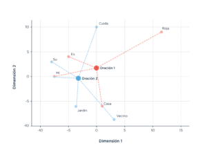

## Introducción
El objetivo de la clase de hoy es avanzar en el entrenamiento de un modelo de clasificación de texto. Para ello, vamos a utilizar un dataset de reseñas que hicieron diferentes usuarios luego de una experiencia de compras en Amazon.

Se trata de un conjunto de datos de revisiones de productos de Amazon para la clasificación de texto multilingüe. Contiene reseñas en inglés, japonés, alemán, francés, chino y español, recopiladas entre el 1 de noviembre de 2015 y el 1 de noviembre de 2019. Cada registro en el conjunto de datos contiene el texto de la revisión, el título de la revisión, la calificación por estrellas, un ID de revisor anonimizado, un ID de producto anonimizado y la categoría de producto de grano grueso (por ejemplo, 'libros', 'electrodomésticos', etc.). El corpus está equilibrado en estrellas, de modo que cada calificación por estrellas constituye el 20% de las revisiones en cada idioma.

Para cada idioma, hay 200,000 reseñas en los conjuntos de entrenamiento, desarrollo y prueba, respectivamente. El número máximo de revisiones por revisor es 20 y el número máximo de revisiones por producto es 20. Todas las revisiones se truncaron después de 2,000 caracteres, y todas las revisiones tienen al menos 20 caracteres de longitud.

Es importante tener en cuenta que el idioma de una revisión no necesariamente coincide con el idioma de su mercado (por ejemplo, las revisiones de amazon.de están principalmente escritas en alemán, pero también podrían estar escritas en inglés, etc.). Se aplicó un algoritmo de detección de idioma para determinar el idioma del texto de la revisión y eliminamos las revisiones que no estaban escritas en el idioma esperado.

De ese dataset original, vamos a trabajar con una muestra del 10%, es decir, de 20.000 reseñas y solamente nos vamos a quedar con los siguientes campos:

- `review_id`: Un character que identifica la reseña
- `stars`: Este campo fue trabajado, eliminando las reseñas de puntaje 3 (neutrales) y considerando las reseñas de 1 y 2 estrellas como "negativas" y las de 4 y 5 como "positivas".
- `review_body`: El texto de la reseña
- `product_category`: Un character que representa la categoría del producto

Vamos, entonces, a entrenar un modelo de clasificación que es una variación de la regresión logística (y lineal) que se llama "regresión regularizada por LASSO". Si bien no vamos a entrar en detalles solo diremos que Lla precisión predictiva de un modelo de regresión puede ser incrementada a través del encogimiento de los valores de los coeficientes o, incluso, haciéndolos cero. 

Haciendo esto, se introduce algún sesgo pero se reduce la variancia de los valores pre-dichos y, por lo tanto, se incrementa la precisión predictiva total. En muchos casos, cuando existen muchos predictores puede ser necesario identificar un subconjunto más pequeño de estos predictores que muestren los efectos más grandes.Es por ello que resulta útil imponer restricciones en el proceso de estimación. A esta operación se la define como “regularización”. 

Existen varios métodos de regularización  de  modelos  lineales:  non negative  garrotte  (Breiman,1995);  ridge  regression  (Hoerl y Kennard, 1970). Este trabajo se centrará en el LASSO. Este método utiliza la norma l1 como medida de penalización para definir las restricciones al modelo lineal. LASSO busca minimizar la siguiente expresión:

$$\sum_{i=1}^{n} (Y_{i} - \beta_{0} - \sum_{j=1}^{p} \beta_{j})^2 + \lambda  \sum_{j=1}^{p} |\beta_{j}| = RSS + \lambda  \sum_{j=1}^{p} |\beta_{j}|$$

Se parte de la minimización de la RSS clásico de la regresión y se agrega una restricción: el segundo término $\lambda  \sum_{j=1}^{p} |\beta_{j}|$ se hace pequeño cuando los coeficientes son pequeños y, por lo tanto, tiene el efecto de reducir los coeficientes $\beta$ estimados. $\lambda$ constituye un parámetro de tunning y su función es controlar el impacto relativo de ambos términos. Cuando el coeficiente es igual a cero ($\lambda=0$), LASSO es equivalente a un modelo lineal estimado por MCO. Por el contrario, a medida que el parámetro se hace más grande ($\lambda$), el término de restricción lo hace en igual proporción y todos los coeficientes se reducen para po-der satisfacer dicha restricción. En el límite, cuando λ es lo suficientemente grande todos los coeficientes se hacen igual a cero y solamente queda como parámetro el intercepto ($\beta_{0}$), es decir, algo casi equivalente a predecir y  solamente con la media de la distribución.

En nuestro caso, se trata de una regresión logística, pero cambia solamente la función de pérdida.

Vamos a analizar dos casos: uno, utilizando como features o predictores las variables generadas por una vectorización tipo TF-IDF. En el segundo caso, lo haremos con el uso de features derivadas de embeddings pre-entrenados.

## LASSO con TF-IDF
Veamos primero un poco nuestro dataset:

```{r}
library(tidyverse)
library(tidytext)
library(tidymodels)
library(textrecipes)
library(textclean)
```

```{r}
reviews <- read_csv('../data/amazon_reviews_train_sample.csv') %>%
        select(-product_category)
reviews <- reviews %>%
        mutate(stars=as_factor(stars))

reviews %>%
        select(review_body, stars)
```

Se observa que, entonces, el input que vamos a utilizar será el campo `review_body` y la variable dependiente `stars`.

### Preprocesamiento TF-IDF
Vamos a aplicar un preprocesamiento simple:

```{r}
reviews_idf <- reviews %>%
        mutate(review_body = str_replace_all(review_body, "'\\[.*?¿\\]\\%'", " ")) %>%
        mutate(review_body = str_replace_all(review_body, "[[:punct:]]", " ")) %>%
        mutate(review_body = tolower(review_body)) %>%
        mutate(review_body = str_replace_all(review_body, "[[:digit:]]+", "DIGITO")) %>%
        mutate(review_body = replace_non_ascii(review_body))
```

Luego, dividimos los datos en conjuntos de entrenamiento y prueba. Podemos utilizar la función `initial_split()` de `rsample` para crear esta división binaria de los datos. El argumento strata garantiza que la distribución del producto sea similar en el conjunto de entrenamiento y el conjunto de prueba. Dado que la división utiliza un muestreo aleatorio, establecemos una semilla para poder reproducir nuestros resultados.

```{r}
## Split
set.seed(664)
reviews_split_idf <- initial_split(reviews_idf, strata = stars)

train_idf <- training(reviews_split_idf)
test_idf <- testing(reviews_split_idf)
```

A continuación, necesitamos preprocesar estos datos para prepararlos para el modelado; tenemos datos de texto y necesitamos construir características numéricas para el aprendizaje automático a partir de ese texto.

El paquete `recipes`, que forma parte de `tidymodels`, nos permite crear una especificación de los pasos de preprocesamiento que queremos realizar. Estas transformaciones se estiman (o "entrenan") en el conjunto de entrenamiento para que puedan aplicarse de la misma manera en el conjunto de prueba o en nuevos datos durante la predicción, sin fuga de datos. Inicializamos nuestro conjunto de transformaciones de preprocesamiento con la función `recipe()`, utilizando una expresión de fórmula para especificar las variables, nuestra variable de resultado junto con nuestro predictor, junto con el conjunto de datos.

```{r}
reviews_rec_idf <- recipe(stars ~ ., data = train_idf) %>% # definimos las variables y sus roles
        update_role("review_id", new_role = "ID") %>% # actualizamos el rol del ID
        step_tokenize(review_body) %>% #Tokenizamos
        step_tokenfilter(review_body, max_tokens=5000) %>% # filtramos los 5000 tokens más frecuentes
        step_tfidf(review_body)
```

Como puede verse, a partir del código anterior generamos la matriz TF-IDF en la que cada fila es un documento (una reseña) y cada columna, un token.

```{r}
reviews_rec_idf %>% prep() %>% bake(train_idf[1:10,])
```

### Generando un esquema de validación cruzada
El parámetro `penalty`, es el equivlaente al $lambda$, es decir, se usa para la regularización es un hiperparámetro del modelo. No podemos conocer su mejor valor durante el entrenamiento del modelo, pero podemos estimar el mejor valor entrenando muchos modelos en conjuntos de datos remuestreados y explorando qué tan bien funcionan todos estos modelos. Construyamos una nueva especificación de modelo para la sintonización del modelo.

```{r}
lasso_spec <- logistic_reg(
        penalty = tune(),
        mixture = 1) %>%
        set_mode("classification") %>%
        set_engine("glmnet")
```

Al finalizar el proceso de tuneo, vamos a poder seleccionar el mejor valor numérico para $lambda$.

Luego, podemos crear una grilla para tunear los valores:

```{r}
#grid_lasso <- tibble(penalty=seq(0,0.2, 0.01))
grid_lasso <- grid_regular(penalty(), levels = 30)
grid_lasso
```

La función `grid_regular()` pertenece al paquete `dials`. Permite elegir valores para probar en un parámetro como la penalización de regularización; aquí, solicitamos 30 valores posibles diferentes.

Luego, seteemos un esquema de validación cruzada:

```{r}
## Seteo de validación cruzada
set.seed(234)
idf_folds <- vfold_cv(train_idf, v = 5)
```

### Entrenamiento
¡Ahora es el momento de sintonizar! Usemos `tune_grid()` para ajustar un modelo en cada uno de los valores para la penalización de regularización en nuestra cuadrícula regular.

En tidymodels, el paquete para el tuneo se llama `tune`. Tunear un modelo utiliza una sintaxis similar a la de un fiteo de un modelo a un conjunto de datos remuestreados con fines de evaluación (`fit_resamples()`), porque las dos tareas son muy similares. La diferencia es que, al tunear, cada modelo tiene parámetros diferentes y se busca encontrar el mejor.

Agregamos nuestra especificación de modelo tuneable (`tune_lasso`) a un workflow con la  recipe de preprocesamiento que definimos antes, y luego lo fiteamos a cada parámetro posible en `lambda_grid` y en cada remuestreo en `idf_folds` con `tune_grid()`.

```{r}
wf_idf <- workflow() %>% 
        add_recipe(reviews_rec_idf) %>%
        add_model(lasso_spec)

tictoc::tic()
tune_lasso_idf <- tune_grid(
        wf_idf,
        idf_folds,
        grid = grid_lasso,
        control = control_resamples(save_pred = TRUE)
)
tictoc::toc()
```

Ahora, en lugar de un conjunto de métricas, tenemos un conjunto de métricas para cada valor de la penalización de regularización.

### Evaluación
Usemos la función `collect_metrics(tune_lasso)` para recopilar y examinar las métricas obtenidas durante el proceso de tuneo. Esto proporcionará información sobre el rendimiento del modelo para cada valor específico del parámetro de penalización de regularización. Esta recopilación de métricas es útil para comparar y seleccionar el mejor modelo en función de los resultados obtenidos en diferentes configuraciones de hiperparámetros.

```{r}
collect_metrics(tune_lasso_idf)
```

Podemos ver los mejores resultados utilizando show_best() y seleccionando una métrica, como el área bajo la curva ROC (ROC AUC).

Por ejemplo, puedes utilizar la siguiente sintaxis para ver los mejores resultados en términos de ROC AUC:

```{r}
show_best(tune_lasso_idf, "roc_auc", n=2)
```

El mejor valor para el área bajo la curva ROC (ROC AUC) de esta ejecución de tuneo es 0.922. Podemos extraer el mejor parámetro de regularización para este valor de ROC AUC de nuestros resultados de sintonización con `select_best()`, o podemos elegir un modelo más simple con una regularización más alta utilizando `select_by_pct_loss()` o `select_by_one_std_err()`.

Vamos a elegir el modelo con el mejor ROC AUC dentro de un error estándar del mejor modelo numéricamente.

```{r}
chosen_auc_idf <- tune_lasso_idf %>%
  select_by_one_std_err(metric = "roc_auc", -penalty)

chosen_auc_idf
```

### Estimación final
A continuación, finalicemos nuestro flujo de trabajo sintonizable con este penalizador de regularización en particular. Este es el término de penalización de regularización que nuestros resultados de sintonización indican que nos proporciona el mejor modelo.

```{r}
final_params_lasso_idf <- finalize_workflow(wf_idf, chosen_auc_idf)

final_params_lasso_idf
```

En lugar de `penalty = tune()` como antes, ahora nuestro worflow tiene valores finales para todos los argumentos. La receta de preprocesamiento ha sido evaluada en los datos de entrenamiento, y sintonizamos la penalización de regularización para que tengamos un valor de penalización de 0.00385662042116347. ¡Este flujo de trabajo está listo para funcionar! Ahora puede ajustarse a nuestros datos de entrenamiento.

```{r}
fitted_lasso_idf <- fit(final_params_lasso_idf, train_idf)
fitted_lasso_idf
```

### Evaluación sobre test-set
Podemos utilizar la función `last_fit()` para ajustar nuestro modelo una última vez en nuestros datos de entrenamiento y evaluarlo en nuestros datos de prueba. Solo necesitamos pasarle esta función nuestro modelo/flujo de trabajo finalizado y nuestra división de datos.

```{r}
final_fitted <- last_fit(final_params_lasso_idf, reviews_split_idf)

collect_metrics(final_fitted)
```

O de forma equivalente:
```{r}
preds_idf <- test_idf %>%
        select(stars) %>%
        bind_cols(predict(fitted_lasso_idf, test_idf, type="prob")) %>%
        bind_cols(predict(fitted_lasso_idf, test_idf, type="class"))

roc_auc(preds_idf, stars, .pred_Negativa) %>%
bind_rows(accuracy(preds_idf, stars, .pred_class)) %>%
bind_rows(precision(preds_idf, stars, .pred_class)) %>%
bind_rows(recall(preds_idf, stars, .pred_class)) %>%
bind_rows(f_meas(preds_idf, stars, .pred_class))
```

## Word embeddings como features
Vimos que el uso del modelo BoW y su ponderación mediante TF-IDF tenían un rendimiento razonable al momento de hacer predicciones. Veamos cómo hacerlo.

Vamos a tener que trabajar de forma diferente algunas etapas. En primer lugar, el preprocesamiento. No vamos a pasar a minúscula nada y atmpoco vamos a eliminar caracteres no ascii.

```{r}
reviews_embed <- reviews %>%
        mutate(review_body = str_replace_all(review_body, "'\\[.*?¿\\]\\%'", " ")) %>%
        mutate(review_body = str_replace_all(review_body, "[[:digit:]]+", "DIGITO"))
```

### Carga del embedding
Vamos a usar un embedding entrenado mediante el algoritmo wor2vec por C. Cardelino. Está entrenado sobre un corpus grande en español. Pueden encontrar los detalles [aquí](https://crscardellino.ar/SBWCE/).

Escribamos una función que cargue el embedding y ejecutémosla:

```{r}
load_embeddings <- function(path=NULL, type=c("w2v", "ft")){
        if (type=="w2v"){
                embedding <- word2vec::read.wordvectors(path, 
                                                        type = "bin", 
                                                        normalize = TRUE) %>%
                        as_tibble(rownames="word")
        }
        else if (type=="ft"){
                model <- fastTextR::ft_load(path)
                words <- fastTextR::ft_words(model)
                embedding <- fastTextR::ft_word_vectors(model,
                                                        words) %>%
                        as_tibble(rownames="word")
        }
        
        return(embedding)
}


embedding <- load_embeddings(path = "../../../../WordEmbeddings/Word2Vec/sbw_vectors.bin",
                             type = "w2v")
```
 
Como puede verse, es necesario previamente descargar el archivo .bin (con la información en formato binario) del embedding para poder cargarlo . La función también permite cargar (si quisieran hacerlo) un .bin entrenado mediante [FastText](https://fasttext.cc/docs/en/crawl-vectors.html).

### Tokenización y construcción de features mediante el embedding
Si bien existe un método `step_word_embeddings()` análogo al `step_tfidf()` que realizaría la vectorización, vamos a hacer "a mano" para tratar de entender qué pasa (y porque además, el método tiene algunos comportamientos raros).

La secuencia de operaciones que vamos a realizar es la siguiente:

1. Tokenización pero sin pasar todo a minúscula y sin eliminar la puntuación.
```{r}
reviews_tidy <- reviews_embed %>%
                unnest_tokens(word, review_body, 
                              to_lower=TRUE,
                              strip_punct=TRUE)
```

2. Left-join de la tabla tokenizada de cada review con el embedding. De esta forma, cada palabra va a estar representada por un vector de 300 dimensiones, que se corresponde con un vector del embedding pre-entrenado.
```{r}
reviews_tidy <- reviews_tidy %>%
        left_join(embedding) %>%
        drop_na()
```

3. Por último, agrupamos por cada review y calculamos el promedio para cada dimensión de cada palabra que forma parte de una review.
```{r}
tictoc::tic()
reviews_embed <- reviews_tidy %>%
        group_by(review_id, stars) %>%
        summarise(across(V1:V300, ~mean(.x, na.rm=TRUE))) %>%
        ungroup()
tictoc::toc()
```

De esta forma, reemplazamos cada palabra de una review por sus coordenadas en el embedding. Luego, calculamos algo así como el centroide, es decir, la coordenada promedio. Así, una reseña que era una lista de palabras ahora es lista de coordenadas en 300 dimensiones.


Fuente: [El Gato y la Caja](https://elgatoylacaja.com/psiquiatriapp)

Ahora tenemos todo listo para repetir el flujo anterior.
```{r}
## Split
set.seed(664)
reviews_split <- initial_split(reviews_embed, strata = stars)

train_embed <- training(reviews_split)
test_embed <- testing(reviews_split)

## especifico el modelo
lasso_spec <- logistic_reg(
        penalty = tune(),
        mixture = 1) %>%
        set_mode("classification") %>%
        set_engine("glmnet")

# especifico la receta
reviews_rec_embed <-
        recipe(stars ~ ., data = train_embed) %>%
        update_role("review_id", new_role = "ID")

# especifico el flujo
wf_embed <- workflow() %>% 
        add_recipe(reviews_rec_embed) %>%
        add_model(lasso_spec)

# espefico la grilla
grid_lasso <- grid_regular(penalty(), levels = 30)

## Seteo de validación cruzada
set.seed(234)
embed_folds <- vfold_cv(train_embed, v = 5)
```

### Entrenamiento
```{r}
# Entreno el modelo
tictoc::tic()
tune_lasso_embed <- tune_grid(
        wf_embed,
        embed_folds,
        grid = grid_lasso,
        control = control_resamples(save_pred = TRUE)
)
tictoc::toc()
```

### Evaluación
Veamos los dos mejores modelos en términos de ROC:
```{r}
show_best(tune_lasso_embed, "roc_auc", n=2)
```

Veamos el mejor modelo dentro de 1 error estándar:
```{r}
chosen_auc_embed <- tune_lasso_embed %>%
  select_by_one_std_err(metric = "roc_auc", -penalty)

chosen_auc_embed
```
### Entrenamiento final
Elegimos el mejor modelo...
```{r}
final_params_lasso_embed <- finalize_workflow(wf_embed, chosen_auc_embed)
final_params_lasso_embed
```

Fiteemos el mejor modelo sobre el total del traning set:
```{r}
fitted_lasso_embed <- fit(final_params_lasso_embed, train_embed)
```

Hagamos su evaluación sobre el test-set
```{r}
preds_embed <- test_embed %>%
        select(stars) %>%
        bind_cols(predict(fitted_lasso_embed, test_embed, type="prob")) %>%
        bind_cols(predict(fitted_lasso_embed, test_embed, type="class"))
```

Comparemos ahora ambos modelos... ¿qué pueden decir al respecto?

**Embeddings**
```{r}
roc_auc(preds_embed, stars, .pred_Negativa) %>%
bind_rows(accuracy(preds_embed, stars, .pred_class)) %>%
bind_rows(precision(preds_embed, stars, .pred_class)) %>%
bind_rows(recall(preds_embed, stars, .pred_class)) %>%
bind_rows(f_meas(preds_embed, stars, .pred_class))
```

**TF-IDF**
```{r}
roc_auc(preds_idf, stars, .pred_Negativa) %>%
bind_rows(accuracy(preds_idf, stars, .pred_class)) %>%
bind_rows(precision(preds_idf, stars, .pred_class)) %>%
bind_rows(recall(preds_idf, stars, .pred_class)) %>%
bind_rows(f_meas(preds_idf, stars, .pred_class))
```
